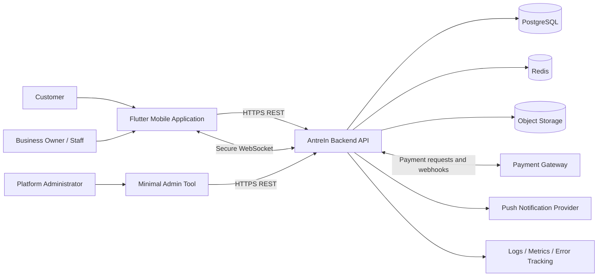
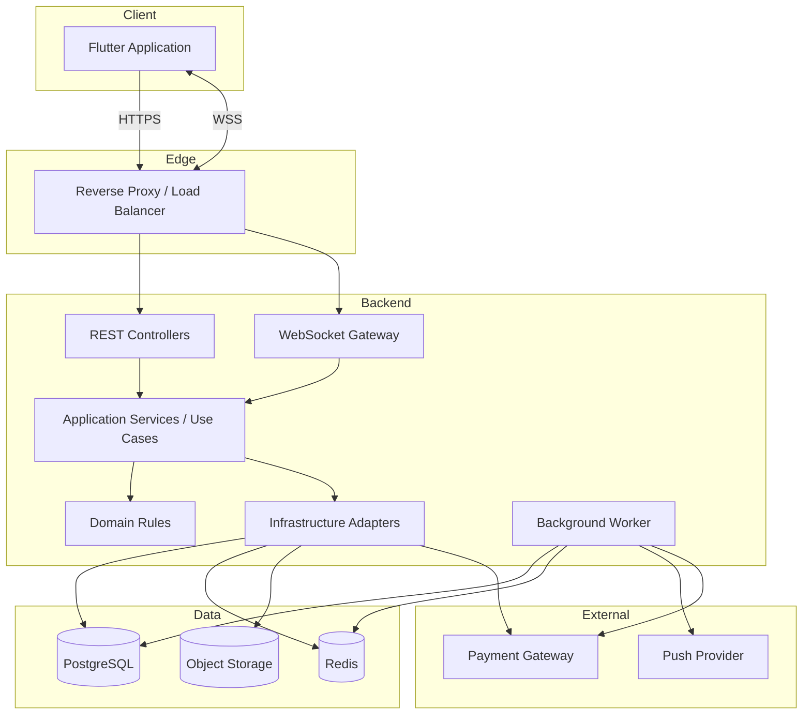
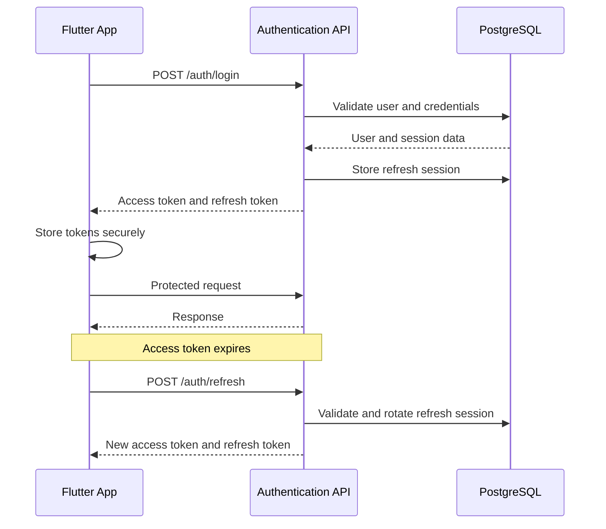
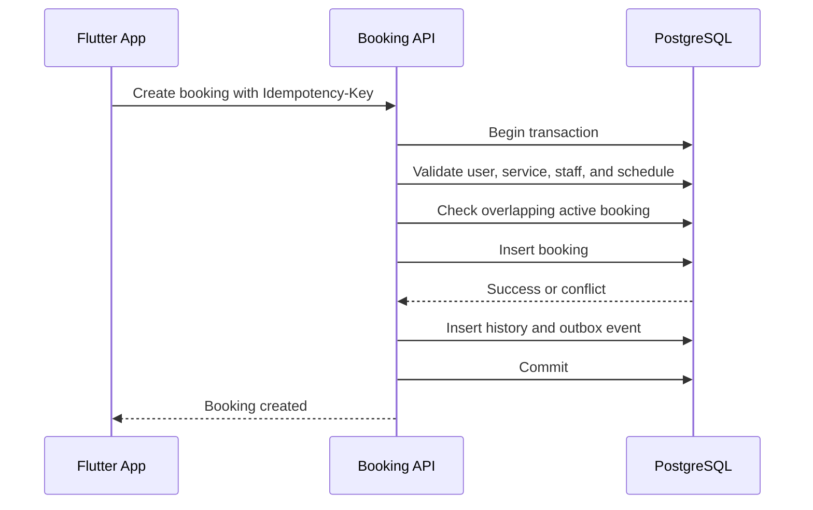
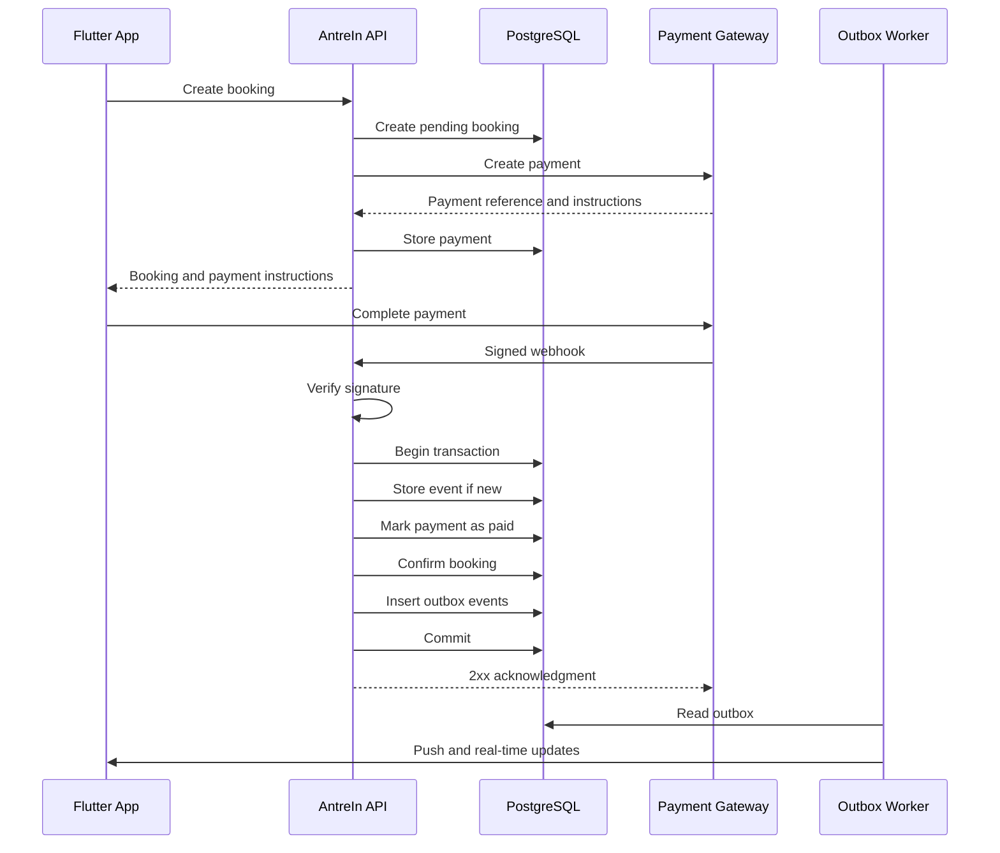
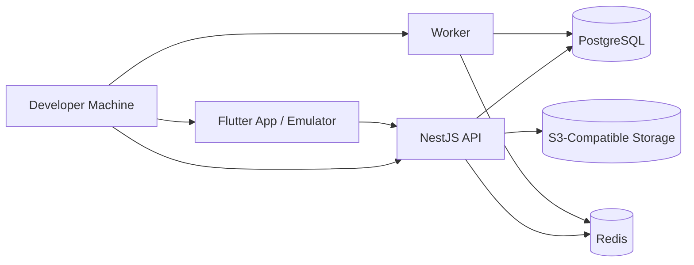

# AntreIn — System Architecture

> **Document:** `docs/01-system-architecture.md`  
> **Status:** Draft v1.1  
> **Product:** AntreIn  
> **Initial Vertical:** Barbershop booking and real-time queue management  
> **Repository Strategy:** Monorepo  
> **Architecture Style:** Modular Monolith  
> **Primary Mobile Client:** Flutter  
> **Backend Framework:** NestJS  
> **Primary Database:** PostgreSQL  
> **Document Language:** English  
> **Last Updated:** 2026-07-21

---

## 1. Document Purpose

This document defines the system-level architecture for AntreIn, including application boundaries, data ownership, integration patterns, real-time communication, deployment, security, observability, reliability, and future evolution.

It connects the following documents:

- `docs/00-product-brief.md`
- `docs/02-api-contract.md`
- `docs/backend/backend-brief.md`
- `docs/frontend/flutter-brief.md`
- Domain-specific technical specifications
- Architecture Decision Records in `docs/adr/`

This document answers:

- How does Flutter communicate with the backend?
- Which components are required?
- Which component owns each type of data?
- How are booking, payment, and queue operations processed safely?
- How are real-time updates delivered?
- How is the system developed, tested, and deployed?
- How are module boundaries enforced?
- When should modules be extracted into separate services?

Detailed endpoints, schemas, error codes, pagination conventions, and WebSocket payloads are defined in `docs/02-api-contract.md`.

---

## 2. Architecture Goals

The architecture must:

1. Be understandable and maintainable by a solo developer.
2. Support vertical-slice delivery.
3. Keep business rules on the backend.
4. Prevent duplicate bookings and queue numbers.
5. Process payment webhooks idempotently.
6. Support live queues without treating WebSocket as the source of truth.
7. Be easy to run locally.
8. Be easy to test.
9. Be deployable with Docker.
10. Support future horizontal scaling.
11. Avoid unnecessary MVP complexity.
12. Provide a clear path toward separately deployed services.
13. Preserve data correctness during failures and concurrent requests.
14. Keep Flutter and backend contracts synchronized.

---

## 3. Architecture Principles

### 3.1 Backend as the Source of Truth

The backend is authoritative for:

- Service prices.
- Deposit requirements.
- Staff eligibility.
- Slot availability.
- Booking status.
- Payment status.
- Queue numbers.
- Queue ordering.
- Cancellation eligibility.
- Refund eligibility.
- Roles and permissions.
- Feature availability.

Flutter presents state and initiates actions but does not decide critical business outcomes.

### 3.2 Modular Monolith First

AntreIn begins as one backend application divided into domain-oriented modules.

Benefits:

- One deployment unit.
- Straightforward database transactions.
- Faster debugging.
- No distributed transaction requirement.
- No mandatory message broker.
- Lower operational overhead.
- Clear ownership boundaries remain possible.

Microservices are not part of the MVP.

### 3.3 REST for State, WebSocket for Events

REST is used for:

- Authoritative state retrieval.
- Mutations.
- Pagination.
- History.
- Retryable operations.
- State recovery after reconnecting.

WebSocket is used for:

- Queue updates.
- Booking updates.
- Payment updates.
- Notification events.
- Reducing polling.

WebSocket events inform clients that state changed. REST remains the authoritative recovery path.

### 3.4 PostgreSQL Owns Durable State

PostgreSQL stores:

- Users.
- Sessions.
- Businesses.
- Outlets.
- Staff.
- Services.
- Schedules.
- Bookings.
- Payments.
- Refunds.
- Queues.
- Notifications.
- Reviews.
- Audit logs.
- Idempotency records.
- Outbox events.

Redis does not own durable booking, payment, refund, or queue state.

### 3.5 Transactions and Constraints Protect Correctness

Correctness is enforced through both application logic and database guarantees:

- Unique constraints.
- Foreign keys.
- Check constraints.
- Transactions.
- Row locking where necessary.
- Conflict detection.
- Safe retry for selected transient database failures.

A read-before-write check alone is not enough under concurrency.

### 3.6 Persist Before Publish

Critical operations follow:

```text
Validate
→ Persist business state
→ Commit transaction
→ Publish integration event
→ Send real-time update
→ Send notification
```

External delivery failures must not roll back committed business state.

### 3.7 Idempotency for Retried Operations

Idempotency is required for actions that may be repeated:

- Booking creation.
- Payment creation.
- Payment webhooks.
- Refund webhooks.
- Check-in.
- Queue commands.
- Service completion.
- Device-token registration.

### 3.8 Secure by Default

Default security posture:

- Endpoints are protected unless explicitly public.
- Authorization includes role, membership, ownership, and outlet scope.
- Secrets are excluded from source control.
- Sensitive values are redacted from logs.
- Production traffic uses HTTPS and WSS.
- Administrative operations use least privilege.

### 3.9 Observable by Design

The system must provide:

- Structured logs.
- Request IDs.
- Correlation IDs.
- Error tracking.
- Health checks.
- Metrics.
- Audit records.
- Trace propagation where useful.

### 3.10 Prefer Measured Evolution

The architecture evolves based on measurable constraints, not trends.

Microservices, external queues, distributed tracing, search engines, and Kubernetes are introduced only when the current design no longer meets requirements.

---

## 4. Key Architecture Decisions

| Area | Decision |
|---|---|
| Backend topology | Modular monolith |
| API style | REST JSON over HTTPS |
| API documentation | OpenAPI generated by NestJS |
| Real-time communication | WebSocket using Socket.IO-compatible transport |
| Primary database | PostgreSQL |
| ORM | Prisma |
| Ephemeral coordination | Redis |
| File storage | S3-compatible object storage |
| Authentication | Short-lived access token and rotating refresh token |
| Authorization | RBAC plus ownership and membership policies |
| Mobile client | Flutter |
| Mobile architecture | Feature-first pragmatic Clean Architecture |
| Mobile state management | Cubit first; Bloc when event complexity justifies it |
| Mobile HTTP client | Dio |
| Mobile secure storage | Platform secure storage |
| Push notifications | Provider adapter; OneSignal may be used initially |
| Payment integration | Provider adapter with verified webhook |
| Asynchronous delivery | Transactional outbox and worker |
| Deployment | Docker containers |
| CI | Path-based workflows |
| Environments | Local, development, staging, production |
| Repository | Single monorepo |
| Contract synchronization | OpenAPI and generated Dart client |
| Initial production topology | One API instance and one worker |

---

## 5. System Context



---

## 6. High-Level Runtime Architecture



---

## 7. Monorepo Structure

```text
antrein/
├── apps/
│   ├── api/
│   │   ├── src/
│   │   ├── prisma/
│   │   ├── test/
│   │   ├── Dockerfile
│   │   ├── package.json
│   │   └── tsconfig.json
│   │
│   └── mobile/
│       ├── android/
│       ├── ios/
│       ├── lib/
│       ├── test/
│       ├── integration_test/
│       └── pubspec.yaml
│
├── docs/
│   ├── 00-product-brief.md
│   ├── 01-system-architecture.md
│   ├── 02-api-contract.md
│   ├── adr/
│   ├── backend/
│   └── frontend/
│
├── packages/
│   ├── api-contracts/
│   │   ├── openapi/
│   │   ├── examples/
│   │   └── README.md
│   └── tooling/
│
├── infrastructure/
│   ├── docker/
│   ├── nginx/
│   ├── monitoring/
│   └── deployment/
│
├── scripts/
│   ├── bootstrap.sh
│   ├── generate-api-client.sh
│   ├── migrate.sh
│   └── seed.sh
│
├── .github/
│   └── workflows/
│       ├── api-ci.yml
│       ├── mobile-ci.yml
│       ├── contract-check.yml
│       └── security-scan.yml
│
├── docker-compose.yml
├── Makefile
├── .env.example
├── .gitignore
└── README.md
```

---

## 8. Repository Rules

### 8.1 Ownership

- `apps/api` contains backend implementation.
- `apps/mobile` contains Flutter implementation.
- `docs/02-api-contract.md` defines the human-readable shared contract.
- `packages/api-contracts` stores generated or retained contract artifacts.
- `infrastructure` stores environment and deployment configuration.
- The repository never stores production secrets.

### 8.2 Dependency Direction

```text
Product requirements
        ↓
System architecture
        ↓
API contract
        ↓
Backend implementation
        ↓
OpenAPI specification
        ↓
Generated Dart client
        ↓
Flutter integration
```

Flutter does not import TypeScript backend source code.

The backend does not import Dart source code.

Contracts are shared through:

- OpenAPI.
- Versioned event schemas.
- JSON examples.
- Generated clients.
- Documentation.

### 8.3 Contract Generation

```text
NestJS DTOs and decorators
→ Generate OpenAPI JSON
→ Validate specification
→ Compare API diff
→ Generate Dart client
→ Compile Flutter integration
→ Run contract tests
```

Breaking changes require explicit review and migration planning.

---

## 9. Backend Architecture

The backend is organized by business capability.

```text
apps/api/src/
├── main.ts
├── app.module.ts
├── config/
├── common/
│   ├── auth/
│   ├── decorators/
│   ├── errors/
│   ├── filters/
│   ├── guards/
│   ├── interceptors/
│   ├── logging/
│   ├── pagination/
│   ├── pipes/
│   └── validation/
│
├── infrastructure/
│   ├── database/
│   ├── cache/
│   ├── storage/
│   ├── payments/
│   ├── notifications/
│   ├── realtime/
│   └── observability/
│
└── modules/
    ├── auth/
    ├── users/
    ├── businesses/
    ├── outlets/
    ├── memberships/
    ├── services/
    ├── staff/
    ├── schedules/
    ├── bookings/
    ├── payments/
    ├── queues/
    ├── notifications/
    ├── reviews/
    ├── reports/
    ├── files/
    ├── audit/
    └── admin/
```

---

## 10. Backend Layering

A complex module may use:

```text
modules/bookings/
├── domain/
│   ├── entities/
│   ├── value-objects/
│   ├── policies/
│   ├── events/
│   └── errors/
│
├── application/
│   ├── commands/
│   ├── queries/
│   ├── use-cases/
│   ├── dto/
│   └── ports/
│
├── infrastructure/
│   ├── repositories/
│   ├── mappers/
│   └── persistence/
│
├── presentation/
│   ├── booking.controller.ts
│   ├── booking.presenter.ts
│   └── booking.swagger.ts
│
└── booking.module.ts
```

Smaller modules may use a simplified structure.

Mandatory boundaries:

- Controllers do not contain business rules.
- Prisma records are not returned directly as public API models.
- External providers are accessed through ports or adapters.
- Cross-module actions use public application services.
- Modules do not access another module’s tables without an explicit contract.
- Domain-specific errors are mapped to stable API error codes.

---

## 11. Backend Module Responsibilities

### 11.1 Auth Module

Responsible for:

- Registration.
- Login.
- Access-token creation.
- Refresh-token rotation.
- Logout.
- Password reset.
- Session revocation.
- Authentication context.
- Device-session metadata.

### 11.2 Users Module

Responsible for:

- User profiles.
- User state.
- Contact information.
- Profile image references.
- Notification preferences.
- Account deletion workflow.

### 11.3 Businesses Module

Responsible for:

- Business profile.
- Verification state.
- Branding.
- Business-wide policies.
- Business ownership.
- Default timezone.

### 11.4 Outlets Module

The MVP supports one outlet, but outlet remains a first-class model.

Responsible for:

- Address.
- Location.
- Operating timezone.
- Outlet status.
- Outlet configuration.

### 11.5 Memberships Module

Responsible for:

- User-to-business relationships.
- Owner and staff roles.
- Invitations.
- Permission sets.
- Outlet assignments.

### 11.6 Services Module

Responsible for:

- Service catalog.
- Price.
- Duration.
- Deposit configuration.
- Active state.
- Staff eligibility.

### 11.7 Staff Module

Responsible for:

- Staff profiles.
- Membership links.
- Eligible services.
- Availability.
- Activation state.

### 11.8 Schedules Module

Responsible for:

- Operating hours.
- Staff working schedules.
- Break periods.
- Closed dates.
- Slot generation.
- Slot validation.
- Booking lead time.
- Maximum booking horizon.

### 11.9 Bookings Module

Responsible for:

- Booking creation.
- Price and service snapshots.
- Booking lifecycle.
- Cancellation.
- Check-in eligibility.
- No-show handling.
- Ownership checks.
- Conflict prevention.

### 11.10 Payments Module

Responsible for:

- Payment creation.
- Payment amount.
- Provider references.
- Webhook verification.
- Payment lifecycle.
- Expiration.
- Refunds.
- Pay-at-location confirmation.
- Reconciliation support.
- Payment audit history.

### 11.11 Queues Module

Responsible for:

- Queue entries.
- Queue numbers.
- Ordering.
- Call and recall.
- Skip.
- Service start.
- Service completion.
- No-show handling.
- Real-time queue events.

### 11.12 Notifications Module

Responsible for:

- Notification templates.
- Notification outbox.
- Push delivery.
- Delivery attempts.
- In-app notification records.
- Device-token registration.

### 11.13 Reviews Module

Responsible for:

- Review eligibility.
- Rating and comments.
- Moderation state.
- One-review-per-booking enforcement.

### 11.14 Reports Module

Responsible for read-only reporting:

- Daily bookings.
- Completed services.
- Cancellations.
- No-shows.
- Gross paid amount.
- Pending payments.
- Active queue count.

The Reports module does not change transactional state.

---

## 12. Flutter Architecture

The Flutter application uses feature-first pragmatic Clean Architecture.

```text
apps/mobile/lib/
├── app/
│   ├── app.dart
│   ├── bootstrap.dart
│   ├── router/
│   ├── theme/
│   └── localization/
│
├── core/
│   ├── config/
│   ├── network/
│   ├── auth/
│   ├── database/
│   ├── realtime/
│   ├── notification/
│   ├── error/
│   ├── logging/
│   ├── analytics/
│   ├── widgets/
│   └── utils/
│
└── features/
    ├── authentication/
    ├── profile/
    ├── discovery/
    ├── business/
    ├── services/
    ├── staff/
    ├── booking/
    ├── payment/
    ├── queue/
    ├── notification/
    ├── review/
    └── business_dashboard/
```

A feature may use:

```text
feature/
├── data/
│   ├── datasources/
│   ├── models/
│   ├── mappers/
│   └── repositories/
├── domain/
│   ├── entities/
│   ├── repositories/
│   └── usecases/
└── presentation/
    ├── cubit/
    ├── pages/
    └── widgets/
```

Abstractions are added when they improve boundaries, testing, reuse, or clarity. One-line layers are not mandatory.

---

## 13. Flutter Layer Responsibilities

### 13.1 Presentation

Responsible for:

- Rendering UI.
- Handling user input.
- Observing state.
- Triggering actions.
- Showing loading, success, empty, and error states.

Presentation does not:

- Calculate authoritative prices.
- Confirm bookings.
- Set payment status.
- Generate queue numbers.
- Decide final availability.

### 13.2 Domain

Responsible for:

- Mobile-side entities.
- Repository contracts.
- Mobile use cases.
- UI-relevant business concepts.

The mobile domain model is a client model, not the authoritative business domain.

### 13.3 Data

Responsible for:

- REST communication.
- WebSocket communication.
- Local cache.
- JSON mapping.
- Secure token storage.
- Network error conversion.
- Retry behavior.

---

## 14. API Communication

### 14.1 Protocol

The API uses:

- HTTPS.
- JSON.
- UTF-8.
- Versioned URI prefix.
- OpenAPI.
- ISO 8601 datetime values.
- Server-generated identifiers.
- Standard response envelopes.

Base path:

```text
/api/v1
```

### 14.2 Request Headers

```http
Authorization: Bearer <access-token>
Content-Type: application/json
Accept: application/json
X-Request-Id: <client-generated-id>
Idempotency-Key: <unique-key-for-supported-mutations>
X-App-Version: <mobile-app-version>
X-Platform: android|ios
```

### 14.3 Success Response

```json
{
  "success": true,
  "data": {},
  "meta": {
    "requestId": "req_01...",
    "timestamp": "2026-07-21T08:00:00+07:00"
  }
}
```

### 14.4 Error Response

```json
{
  "success": false,
  "error": {
    "code": "BOOKING_SLOT_UNAVAILABLE",
    "message": "The selected time slot is no longer available.",
    "details": {}
  },
  "meta": {
    "requestId": "req_01...",
    "timestamp": "2026-07-21T08:00:00+07:00"
  }
}
```

---

## 15. API Versioning

The MVP uses URI versioning:

```text
/api/v1
```

Non-breaking changes:

- Adding an optional response field.
- Adding a new endpoint.
- Adding an optional request field with a documented default.
- Adding a new event type.

Breaking changes:

- Removing a field.
- Changing a field type.
- Changing field meaning.
- Making an optional field required.
- Changing authorization incompatibly.
- Removing or renaming an enum value.

Flutter ignores unknown optional response fields.

---

## 16. Authentication Architecture



### 16.1 Access Token

- Short-lived.
- Contains minimal claims.
- Used by REST and WebSocket.
- Stored securely.
- Cryptographically verified by the backend.

### 16.2 Refresh Token

- Longer-lived.
- Rotated during refresh.
- Revocable per session.
- Stored safely on the server.
- Supports reuse detection.

### 16.3 Password Security

- Modern password hashing.
- Passwords never logged.
- Reset tokens are single-use.
- Reset tokens expire.
- Login and recovery endpoints are rate-limited.

---

## 17. Authorization Architecture

Authorization combines:

1. Authentication.
2. Global user state.
3. Business membership.
4. Staff permission.
5. Outlet assignment.
6. Resource ownership.
7. Action-specific policy.

Example:

```text
User is authenticated
AND user is active
AND user belongs to the business
AND membership allows queue management
AND queue belongs to the assigned outlet
```

Knowing a resource ID is never sufficient authorization.

---

## 18. Database Architecture

PostgreSQL is the primary database.

Logical table groups:

```text
Identity
- users
- auth_sessions
- password_reset_tokens
- devices

Business
- businesses
- outlets
- business_memberships
- staff_profiles

Catalog
- services
- staff_services

Scheduling
- operating_hours
- staff_schedules
- schedule_breaks
- closed_dates

Booking
- bookings
- booking_status_history
- booking_snapshots

Payment
- payments
- payment_events
- refunds

Queue
- queue_entries
- queue_status_history
- queue_counters

Communication
- notifications
- notification_deliveries

Operations
- reviews
- audit_logs
- idempotency_keys
- outbox_events
```

The detailed schema belongs in `docs/backend/database-design.md`.

---

## 19. Database Conventions

- Table names use `snake_case`.
- Identifiers use UUIDs or sortable globally unique IDs.
- Core records include `created_at` and `updated_at`.
- Soft delete is used only when necessary.
- Historical data normally uses status or `archived_at`.
- Monetary values use integer units.
- Datetime values are timezone-aware.
- Queue records store `business_date`.
- Foreign keys enforce relationships.
- Unique constraints enforce invariants.
- Indexes are based on real query patterns.
- Business-history tables are append-oriented where practical.

---

## 20. Monetary Data

Prices must not use floating-point values.

```text
IDR 50,000 → 50000
```

Recommended fields:

```text
amount
currency
```

Initial currency:

```text
IDR
```

Bookings store snapshots of service name, duration, price, and deposit requirements.

---

## 21. Date and Time

- Backend timestamps are timezone-aware.
- API values use ISO 8601.
- Each outlet has a timezone.
- Initial default is `Asia/Jakarta`.
- Queue data stores a separate business date.
- Flutter formats values using locale resources.
- Slot calculations use outlet timezone.
- Date logic remains safe for future timezone expansion.

---

## 22. Booking Concurrency Strategy

Booking creation is a critical transaction.



Safeguards:

- Transaction.
- Database constraint or exclusion strategy.
- Active-status filtering.
- Idempotency key.
- Conflict mapping.
- Optional retry for serialization failure.
- Concurrent integration tests.

Flutter must handle `BOOKING_SLOT_UNAVAILABLE` even if the slot was previously displayed.

---

## 23. Queue Number Generation

Queue numbers are unique per outlet and business date.

Recommended counter table:

```text
queue_counters
- outlet_id
- business_date
- last_number
```

Flow:

```text
Begin transaction
→ Lock or atomically update counter
→ Increment last number
→ Create queue entry
→ Commit
```

Required constraint:

```text
UNIQUE(outlet_id, business_date, queue_number)
```

The client never sends an authoritative queue number.

---

## 24. Idempotency Architecture

Supported operations accept:

```http
Idempotency-Key: <client-generated-unique-value>
```

Stored data:

- User or integration scope.
- Action.
- Idempotency key.
- Request fingerprint.
- Processing state.
- Result reference.
- Response status.
- Expiration.

Behavior:

- Same key and same payload return the original result.
- Same key and different payload return a conflict.
- Concurrent use of the same key does not duplicate processing.
- Retry rules depend on final operation state.

Critical operations:

- Create booking.
- Create payment.
- Check in.
- Process payment webhook.
- Process refund webhook.
- Execute queue command.
- Request refund.

---

## 25. Payment Architecture

The payment provider is behind an adapter.

```text
PaymentProviderPort
├── createPayment()
├── getPaymentStatus()
├── cancelPayment()
├── requestRefund()
├── verifyWebhook()
└── parseWebhookEvent()
```

Possible implementations:

```text
MidtransPaymentAdapter
XenditPaymentAdapter
```

Provider choice remains an implementation decision.

---

## 26. Payment Flow



---

## 27. Payment Safety Rules

- Flutter callbacks are not proof of payment.
- Webhook signatures are verified.
- Provider event IDs are unique.
- Raw events are stored with sensitive data redacted.
- Payment transitions are validated.
- Amount and currency are compared with server records.
- Duplicate events do not repeat business effects.
- Unknown events are logged safely.
- Notification failure does not roll back payment.
- Manual reconciliation is restricted and audited.

---

## 28. Pay-at-Location Architecture

```text
Booking created
→ Booking confirmed
→ Customer receives service
→ Authorized staff confirms payment
→ Payment becomes paid
```

Staff confirmation requires:

- Membership validation.
- Outlet validation.
- Amount validation.
- Idempotency.
- Audit logging.

---

## 29. Real-Time Architecture

WebSocket rooms:

```text
user:{userId}
business:{businessId}
outlet:{outletId}
queue:{outletId}:{businessDate}
booking:{bookingId}
```

Clients may join only authorized rooms.

Recommended events:

```text
booking.updated.v1
payment.updated.v1
queue.snapshot.updated.v1
queue.entry.updated.v1
notification.created.v1
```

Events must not expose private data belonging to unrelated customers.

---

## 30. Real-Time Event Contract

Example:

```json
{
  "eventId": "evt_01...",
  "type": "queue.entry.updated.v1",
  "occurredAt": "2026-07-21T08:00:00+07:00",
  "resourceId": "queue_entry_01...",
  "version": 7,
  "data": {
    "status": "called"
  }
}
```

Client behavior:

```text
Receive event
→ Compare version
→ Apply update when safe
→ Refetch authoritative REST state if data is incomplete or a gap is detected
```

The MVP may send complete queue snapshots when simpler, but private customer data remains filtered.

---

## 31. WebSocket Authentication

```text
Client obtains access token
→ Connect through WSS
→ Server validates token
→ Server associates socket with user
→ Client joins authorized rooms
```

Rules:

- Expired tokens cause rejection or disconnection.
- Reauthentication is supported.
- Room membership is authorized.
- Socket IDs are not user identities.
- Reconnection is idempotent.
- Reconnect triggers state recovery.

---

## 32. Redis Usage

Redis may be used for:

- Socket.IO multi-instance fan-out.
- Short-lived cache.
- Rate-limit counters.
- Ephemeral presence data.
- Worker coordination.
- Temporary distributed locks when database approaches are insufficient.

Redis is not used as durable storage for:

- Bookings.
- Payments.
- Refunds.
- Queue history.
- User accounts.
- Business configuration.

The single-instance MVP can operate without Redis fan-out, but Redis remains available for testing the scaling path.

---

## 33. Transactional Outbox

Inside the business transaction:

```text
Update business state
+ Insert outbox event
+ Commit
```

Worker flow:

```text
Claim pending outbox event
→ Publish WebSocket update
→ Send push notification
→ Record delivery result
```

Benefits:

- Business state survives provider downtime.
- Delivery is retryable.
- Webhook responses remain fast.
- Failures are observable.
- API and notification concerns remain separated.

The worker may initially run in the same deployment but must remain logically separable.

---

## 34. Push Notification Architecture

Provider port:

```text
PushNotificationPort
├── sendToDevice()
├── sendToUser()
├── removeInvalidDevice()
└── mapProviderResult()
```

Flow:

```text
Business action committed
→ Notification outbox created
→ Worker builds localized content
→ Provider sends push
→ Delivery result recorded
```

Push notifications are never authoritative.

Notification taps open a deep link, then Flutter fetches the latest API state.

---

## 35. File Storage Architecture

Binary files are stored in object storage.

PostgreSQL stores:

- File ID.
- Owner.
- Storage key.
- MIME type.
- Size.
- Checksum.
- Visibility.
- Status.

### MVP Upload Flow

```text
Flutter
→ API multipart upload
→ Object storage
```

### Future Direct Upload Flow

```text
Flutter requests signed URL
→ Flutter uploads directly
→ API confirms upload
```

Validation:

- MIME type.
- Extension.
- File signature when practical.
- File size.
- Image dimensions.
- Ownership.
- Access policy.

---

## 36. Local Cache Architecture

Flutter may cache:

- Business lists.
- Business details.
- User profile.
- Booking summaries.
- Booking history.
- Notification history.
- Static configuration.

Online-only operations:

- Slot availability.
- Booking creation.
- Payment confirmation.
- Check-in.
- Queue commands.
- Cancellation eligibility.
- Refund requests.

Cache entries include freshness metadata and stale policies.

---

## 37. Flutter Networking Strategy

Dio handles:

- Base URL.
- Access token.
- Request ID.
- App metadata.
- Timeouts.
- Refresh-token coordination.
- Error parsing.
- Safe retry.
- Redacted logging.

Refresh synchronization:

```text
First 401 begins refresh
→ Other protected requests wait
→ Refresh succeeds
→ Waiting requests replay once
```

Mutations are not retried automatically unless idempotency is guaranteed.

---

## 38. Mobile Session State

Central session states:

```text
unknown
authenticated
unauthenticated
refreshing
locked
expired
```

Responsibilities:

- Restore secure session.
- Fetch current user.
- Resolve memberships and roles.
- Route to the correct home screen.
- Clear sensitive cache on logout.
- Disconnect WebSocket on logout.
- Register device token.
- Handle session expiration consistently.

---

## 39. Role-Aware Navigation

One Flutter application supports:

- Customer.
- Business owner.
- Staff.

Flow:

```text
Authenticated user
→ Fetch profile and memberships
→ Resolve available roles
→ Restore last valid role
→ Display role-specific navigation
```

Role switching:

- Available only for multi-role users.
- Clears role-scoped state.
- Updates API context when required.
- Leaves old WebSocket rooms.
- Joins new authorized rooms.
- Does not require logout.

Platform Administrator mobile navigation is outside the MVP.

---

## 40. Error Architecture

Stable error categories:

```text
AUTH_*
VALIDATION_*
BUSINESS_*
BOOKING_*
PAYMENT_*
QUEUE_*
FILE_*
RATE_LIMIT_*
SYSTEM_*
```

Examples:

```text
BOOKING_SLOT_UNAVAILABLE
PAYMENT_ALREADY_PROCESSED
QUEUE_ENTRY_ALREADY_EXISTS
FORBIDDEN_BUSINESS_RESOURCE
AUTH_SESSION_EXPIRED
```

Flutter maps error codes to:

- Localized message.
- Retry action.
- Navigation action.
- Form-field error.
- Silent refresh.
- Forced logout only when necessary.

Raw exception messages are not client contracts.

---

## 41. Logging Architecture

Structured fields:

```text
timestamp
level
service
environment
requestId
traceId
userId
businessId
outletId
module
action
result
durationMs
errorCode
```

Never log:

- Passwords.
- Access tokens.
- Refresh tokens.
- Payment credentials.
- Webhook secrets.
- Unredacted sensitive personal data.

Technical logs and business audit records are separate.

---

## 42. Audit Log

Audit records include:

- Actor.
- Role.
- Action.
- Resource type.
- Resource ID.
- Previous-state summary.
- New-state summary.
- Request ID.
- Timestamp.
- Manual override reason.
- Relevant network metadata when appropriate.

Audited actions include:

- Business verification.
- Staff permission changes.
- Manual booking cancellation.
- Queue reordering.
- Manual payment confirmation.
- Refund approval.
- Administrative correction.

Audit records are append-only from the application perspective.

---

## 43. Observability

Minimum observability:

- Structured application logs.
- Error tracking.
- API liveness.
- API readiness.
- Database health.
- Redis health when required.
- Worker health.
- Webhook failures.
- Notification failures.
- Pending outbox count.

Recommended metrics:

```text
http_request_duration
http_error_count
booking_create_success
booking_conflict_count
payment_webhook_received
payment_webhook_failed
queue_command_duration
websocket_connection_count
outbox_pending_count
notification_failure_count
```

OpenTelemetry may be introduced when deployment topology or external integrations justify tracing.

---

## 44. Health Endpoints

```text
GET /health/live
GET /health/ready
```

Liveness checks:

- Process is running.
- Event loop is responsive.

Readiness checks:

- Database is reachable.
- Required migrations are applied.
- Critical configuration is valid.
- Redis is reachable when it is required for that deployment.

External payment or push providers do not necessarily make the API unready.

---

## 45. Configuration Management

Sources:

- Environment variables.
- Validated startup configuration.
- Secret manager in production.
- Non-secret defaults in code.

Groups:

```text
APP
DATABASE
REDIS
AUTH
STORAGE
PAYMENT
NOTIFICATION
OBSERVABILITY
RATE_LIMIT
```

The application fails fast when required configuration is missing or invalid.

---

## 46. Environment Strategy

### 46.1 Local

- Docker Compose.
- Local PostgreSQL.
- Local Redis.
- Local S3-compatible storage.
- Payment sandbox.
- Test push project.
- Seed data.

### 46.2 Development

- Shared development API.
- Development database.
- Sandbox integrations.
- Debug-level logs.
- Internal test users.

### 46.3 Staging

- Production-like configuration.
- Separate credentials and data.
- Payment sandbox.
- Release-candidate mobile build.
- Migration rehearsal.
- End-to-end tests.

### 46.4 Production

- Production database.
- HTTPS and WSS.
- Restricted API documentation.
- Production provider credentials.
- Automated backups.
- Monitoring and alerts.
- Controlled migrations.

Environment data is isolated.

---

## 47. Local Development Architecture



Docker Compose starts backend dependencies.

Flutter runs outside Docker to preserve hot reload and emulator integration.

---

## 48. Docker Architecture

Initial containers:

```text
api
worker
postgres
redis
object-storage
reverse-proxy
```

During early development, API and worker may run together.

Rules:

- Multi-stage images.
- Non-root runtime user.
- Minimal runtime image.
- Health checks.
- Environment-based configuration.
- No embedded secrets.
- Explicit migration step.
- Local persistent volumes only where required.

---

## 49. Production Deployment Baseline

```text
Internet
→ HTTPS reverse proxy
→ API container
→ Worker container
→ Managed PostgreSQL
→ Redis
→ S3-compatible object storage
```

Initial portfolio deployment:

- One API instance.
- One worker instance.
- Managed PostgreSQL when affordable.
- Redis available for queue, cache, and WebSocket scaling tests.
- Domain and TLS.
- Automated CI deployment.

---

## 50. Horizontal Scaling

When API instances increase:

- API remains stateless.
- Tokens validate across instances.
- Session state remains in PostgreSQL.
- Files remain in object storage.
- Socket.IO uses Redis fan-out.
- Jobs use safe claiming.
- Idempotency remains database-backed.
- Load balancer supports WebSocket.
- Sticky sessions are not required for correctness.

---

## 51. Background Jobs

Jobs include:

- Push delivery.
- Payment expiration.
- Booking reminders.
- No-show evaluation.
- Outbox processing.
- Refund reconciliation.
- Session cleanup.
- Provider retry.

Initial implementation:

- PostgreSQL-backed job or outbox table.
- Worker polling.
- Atomic or row-locked claiming.
- Retry counter.
- Last error.
- Dead-letter or manual-review state.

An external message queue is introduced only when needed.

---

## 52. Scheduled Jobs

Potential schedules:

```text
Every minute
- Expire pending payments
- Process due outbox events

Every few minutes
- Send booking reminders
- Reconcile pending provider states

Daily
- Clean expired sessions
- Generate optional operational summaries
```

Every scheduled job must be idempotent.

---

## 53. Database Migration Strategy

Rules:

- Prisma migrations are committed.
- Migrations are reviewed.
- Production migrations run before new traffic reaches incompatible code.
- Destructive changes use expand-and-contract.
- Seed scripts are separate.
- High-risk migrations include recovery planning.
- Backward compatibility is preserved during rolling changes.

Example:

```text
Add nullable field
→ Deploy code that writes old and new fields
→ Backfill
→ Deploy code that reads new field
→ Make field required
→ Remove old field later
```

---

## 54. Backup and Recovery

Production requirements:

- Automated PostgreSQL backups.
- Point-in-time recovery when available.
- Durable object storage.
- Restore tests.
- Documented recovery procedure.
- Separate backup credentials.
- Defined retention for payment, webhook, and audit records.

Redis backup is not required for correctness because Redis does not own durable business state.

---

## 55. Continuous Integration

### 55.1 API Workflow

Triggered by:

```text
apps/api/**
packages/api-contracts/**
infrastructure/**
```

Steps:

```text
Install dependencies
→ Format check
→ Lint
→ Type check
→ Generate Prisma client
→ Validate migrations
→ Unit tests
→ Integration tests
→ Build
→ Generate OpenAPI
→ Validate contract
→ Build container
```

### 55.2 Mobile Workflow

Triggered by:

```text
apps/mobile/**
packages/api-contracts/**
```

Steps:

```text
Set up Flutter
→ flutter pub get
→ Generate code
→ Format check
→ Analyze
→ Unit tests
→ Widget tests
→ Contract compile check
→ Optional Android build
```

### 55.3 Contract Workflow

```text
Generate OpenAPI
→ Compare contract
→ Validate examples
→ Generate Dart client
→ Analyze Flutter
→ Run contract tests
```

---

## 56. Testing Architecture

### 56.1 Backend Unit Tests

- Status policies.
- Deposit calculation.
- Cancellation eligibility.
- Authorization policies.
- Event mapping.
- Value objects.

### 56.2 Backend Integration Tests

- Repository behavior.
- Database constraints.
- Transaction rollback.
- Booking concurrency.
- Queue-number concurrency.
- Webhook idempotency.
- Outbox claiming.
- Authorization scope.

### 56.3 Backend End-to-End Tests

- Registration and login.
- Business setup.
- Booking creation.
- Sandbox payment.
- Check-in.
- Queue progression.
- Service completion.
- Review submission.

### 56.4 Flutter Unit Tests

- Cubits.
- Repository mapping.
- Session state.
- Error mapping.
- Booking-form logic.
- Event reducers.

### 56.5 Flutter Widget Tests

- Login.
- Business details.
- Booking flow.
- Payment state.
- Live queue.
- Role-aware navigation.

### 56.6 Flutter Integration Tests

- Customer happy path.
- Staff queue flow.
- Token refresh.
- WebSocket reconnect.
- Slot conflict.
- Payment success after application resume.

### 56.7 Contract Tests

Verify:

- Required fields.
- Enum compatibility.
- Error envelope.
- Pagination.
- Date formats.
- Nullability.
- WebSocket payloads.
- Generated-client compatibility.

---

## 57. Security Architecture

Controls:

- Global authentication guard.
- Explicit public endpoints.
- Resource-aware authorization.
- Server-side validation.
- Response serialization.
- Rate limiting.
- Secure headers.
- HTTPS and WSS.
- Secret management.
- Dependency scanning.
- Container scanning.
- Audit logging.
- Webhook verification.
- File validation.
- Database least privilege.
- Restricted administration endpoints.

---

## 58. Rate Limiting

Strict limits apply to:

- Login.
- Registration.
- Forgot password.
- Password reset.
- File upload.
- Device registration.
- Search abuse.
- Repeated payment errors.

Keys may include:

- IP.
- User ID.
- Device.
- Endpoint.
- Business.

Payment webhooks use provider-aware verification and signature validation.

---

## 59. Data Access Security

Unsafe:

```text
Find booking by ID
```

Safe:

```text
Find booking by ID
AND verify customer ownership
OR verify authorized business membership
AND verify outlet scope when required
```

A UUID is an identifier, not permission.

---

## 60. Privacy Boundaries

Customer queue views may include:

- Public queue number.
- People ahead.
- Current number being served.
- Estimated waiting time.

They must not include:

- Other customer names.
- Contact details.
- Private notes.
- Payment data.
- Internal identifiers.

Staff receives only operationally necessary data.

---

## 61. Data Retention

Categories:

- Authentication sessions.
- Payment events.
- Audit records.
- Notification deliveries.
- Technical logs.
- Booking history.
- Deleted-account data.
- Uploaded files.

Retention balances:

- Product requirements.
- Payment reconciliation.
- Privacy.
- Storage cost.
- Security exposure.

Final periods require production policy review.

---

## 62. Failure Scenarios

### 62.1 API Unavailable

Flutter:

- Shows service-unavailable state.
- Preserves safe local context.
- Does not automatically queue unsafe mutations.
- Provides retry.

### 62.2 Redis Unavailable

For one API instance:

- REST remains available.
- Real-time fan-out may degrade.
- Clients refetch state.
- Durable state remains safe.

### 62.3 Push Provider Unavailable

- Booking and payment still succeed.
- Notification remains pending or failed.
- Worker retries.
- Users retrieve state through the application.

### 62.4 Payment Provider Timeout

- Payment is not marked failed without confirmation.
- Current state is stored.
- Webhook or status query performs reconciliation.
- Flutter receives a recoverable pending state.

### 62.5 WebSocket Disconnection

- Flutter reconnects.
- Reauthenticates.
- Rejoins rooms.
- Fetches the latest REST snapshot.
- Ignores stale event versions.

### 62.6 Worker Unavailable

- API continues writing outbox events.
- Events remain pending.
- Worker processes backlog after recovery.
- Monitoring alerts on backlog growth.

### 62.7 Database Conflict

- Transaction rolls back.
- Backend returns a stable conflict code.
- Flutter refreshes relevant state.
- Retry occurs only when safe.

---

## 63. Domain Events

Examples:

```text
BookingCreated
BookingConfirmed
BookingCancelled
CustomerCheckedIn
QueueEntryCreated
QueueEntryCalled
ServiceStarted
ServiceCompleted
PaymentPaid
PaymentExpired
RefundCompleted
ReviewSubmitted
```

Internal domain events and public integration events may use different schemas.

---

## 64. Event Versioning

Public events are versioned.

```text
queue.entry.updated.v1
```

Rules:

- Adding optional fields is non-breaking.
- Removing fields or changing meaning requires a new version.
- Clients ignore unknown optional fields.
- Multiple versions may be published during migration.

---

## 65. API Pagination

Cursor pagination is preferred for:

- Booking history.
- Notification history.
- Stable business lists.
- Audit logs.

Offset pagination may be used for small administrative lists.

```json
{
  "nextCursor": "cursor-value",
  "hasMore": true
}
```

---

## 66. Search Architecture

The MVP uses PostgreSQL search for:

- Business name.
- Service name.
- Address text.

A dedicated search engine is introduced only when:

- Dataset size grows substantially.
- Ranking becomes complex.
- Typo tolerance is required.
- Geospatial discovery becomes central.

---

## 67. Reporting Architecture

MVP reports use PostgreSQL read queries.

There is no data warehouse.

Rules:

- Reporting does not mutate business state.
- Indexes are added based on measured queries.
- Premature aggregate caches are avoided.
- Materialized summaries may be added later.

---

## 68. Feature Flags

Possible flags:

- Online payment.
- Deposits.
- Walk-ins.
- QR check-in.
- Reviews.
- New queue algorithm.

Flutter receives effective capabilities from the backend.

Feature availability is not hardcoded only in the mobile application.

---

## 69. Provider Abstraction

External providers use ports and adapters.

```text
PaymentProviderPort
PushNotificationPort
ObjectStoragePort
EmailPort
ClockPort
IdGeneratorPort
```

Benefits:

- Fake implementations.
- Sandbox implementations.
- Easier tests.
- Provider replacement.
- Reduced SDK coupling.

Abstractions remain specific enough to avoid premature generalization.

---

## 70. Dependency Rules

Backend:

```text
Presentation
→ Application
→ Domain

Infrastructure
→ Application ports

Domain
→ No framework dependency where practical
```

Flutter:

```text
Presentation
→ Domain

Data
→ Domain

Core
→ No feature-specific dependency
```

Cross-feature access uses public interfaces.

---

## 71. Architecture Decision Records

Location:

```text
docs/adr/
```

Initial ADRs:

```text
0001-use-modular-monolith.md
0002-use-postgresql-as-source-of-truth.md
0003-use-rest-plus-websocket.md
0004-use-transactional-outbox.md
0005-use-openapi-as-mobile-contract.md
0006-use-single-flutter-app-for-customer-and-business.md
0007-use-payment-provider-adapter.md
0008-use-database-backed-idempotency.md
```

Each ADR includes:

- Context.
- Decision.
- Alternatives.
- Consequences.
- Status.
- Date.

---

## 72. Evolution Triggers

### 72.1 Notification Service

Extract when:

- Notification volume becomes high.
- Multiple channels are introduced.
- Retry workload affects API latency.
- Independent scaling is useful.

### 72.2 Payment Service

Extract when:

- Multiple providers exist.
- Settlement and reconciliation become complex.
- Compliance requires isolation.
- Separate ownership exists.

### 72.3 Queue Service

Extract when:

- Concurrent queue traffic becomes very high.
- Independent low-latency scaling is needed.
- Queue logic changes independently.
- Strong service ownership exists.

### 72.4 Search Service

Extract when PostgreSQL search no longer meets requirements.

Modules are not extracted merely because they are large.

---

## 73. MVP Simplifications

- One backend deployment.
- One PostgreSQL database.
- One Flutter application.
- One outlet per business.
- One payment-provider sandbox.
- One push provider.
- Worker may initially share the backend deployment.
- PostgreSQL-backed outbox.
- PostgreSQL search.
- Basic reporting.
- No Kafka.
- No Kubernetes.
- No service mesh.
- No event sourcing.
- No CQRS framework.
- No GraphQL.
- No dedicated API gateway.
- No data warehouse.

---

## 74. Architecture Quality Priorities

1. Correctness.
2. Security.
3. Maintainability.
4. Reliability.
5. Testability.
6. Developer experience.
7. Performance.
8. Scalability.
9. Cost efficiency.

Scalability never overrides correctness.

---

## 75. Architecture Acceptance Criteria

The architecture is considered implemented when:

- Monorepo structure exists.
- API and mobile run independently.
- Docker Compose starts required backend dependencies.
- Module boundaries are enforced.
- PostgreSQL is the durable source of truth.
- OpenAPI is generated.
- Flutter consumes typed models.
- Authentication works.
- Authorization includes ownership and membership checks.
- Booking conflicts are database-safe.
- Queue-number generation is database-safe.
- Payment webhooks are verified and idempotent.
- WebSocket reconnect recovers through REST.
- Notifications use outbox and retry.
- Health endpoints exist.
- Structured logs exist.
- CI validates API, mobile, and contracts.
- Critical integration tests pass.

---

## 76. Recommended Implementation Order

```text
1. Monorepo and local infrastructure
2. NestJS bootstrap and configuration
3. PostgreSQL and Prisma
4. API conventions and OpenAPI
5. Authentication and session management
6. Flutter bootstrap and session integration
7. Business, outlet, service, and staff modules
8. Scheduling and availability
9. Booking transaction
10. Payment adapter and sandbox webhook
11. Check-in and queue transaction
12. WebSocket gateway
13. Transactional outbox and push notifications
14. Reviews and reports
15. Production deployment and observability
```

After the foundation, work proceeds in vertical slices.

---

## 77. Architecture Review Checklist

### Product

- Does the feature match the product brief?
- Is it part of MVP scope?
- Are status transitions defined?

### Backend

- Is the rule enforced server-side?
- Is authorization resource-aware?
- Is a transaction required?
- Is idempotency required?
- Are constraints sufficient?
- Is audit logging required?
- Is an outbox event required?

### API

- Is the change backward-compatible?
- Are error codes stable?
- Are examples updated?
- Is OpenAPI generated?

### Flutter

- Are loading, success, empty, and error states handled?
- Does Flutter avoid becoming the source of truth?
- Is local caching safe?
- Does reconnect refetch state?
- Is sensitive data stored securely?

### Operations

- Is the flow observable?
- Are failures safely retryable?
- Is provider downtime handled?
- Is the migration safe?
- Are tests included?

---

## 78. Official Reference Baseline

Implementation decisions should be validated against current official documentation:

- NestJS documentation.
- NestJS authentication and authorization.
- NestJS WebSocket gateways.
- NestJS OpenAPI support.
- Prisma transactions.
- PostgreSQL transaction isolation and constraints.
- Redis Pub/Sub and Socket.IO adapters.
- Docker Compose.
- Flutter architecture recommendations.
- OpenTelemetry JavaScript documentation.
- Selected payment-provider documentation.
- Selected push-notification provider documentation.

Links and version-specific notes should be recorded in implementation documents or ADRs rather than treated as permanent product requirements.

---

## 79. Final Architecture Statement

AntreIn uses a **modular monolith** inside a single monorepo.

```text
Flutter Mobile Application
          │
          ├── HTTPS REST
          └── Secure WebSocket
                    │
              NestJS Backend
                    │
          ┌─────────┼─────────┐
          │         │         │
    PostgreSQL    Redis   Object Storage
          │
 Payment Gateway and Push Provider
```

Final principles:

- PostgreSQL stores durable truth.
- REST exposes authoritative state.
- WebSocket delivers real-time changes.
- Redis supports ephemeral coordination and multi-instance fan-out.
- Payment state comes from verified webhooks or authorized staff actions.
- Notifications are processed after business state is committed.
- Flutter owns user experience, not business correctness.
- The backend remains one deployment until measurable technical or organizational constraints justify extraction.
