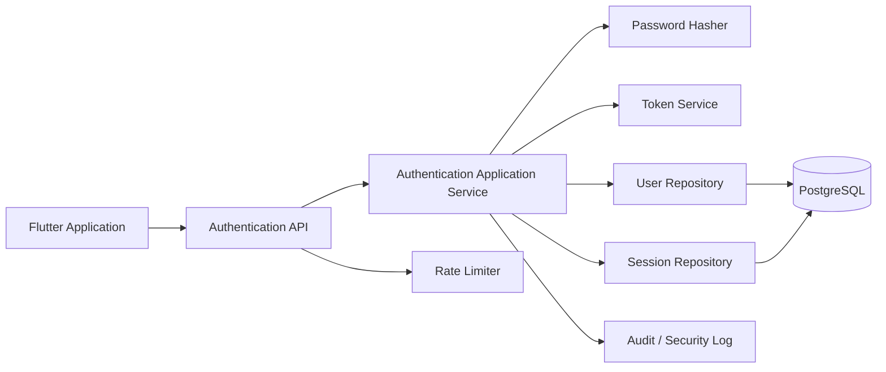
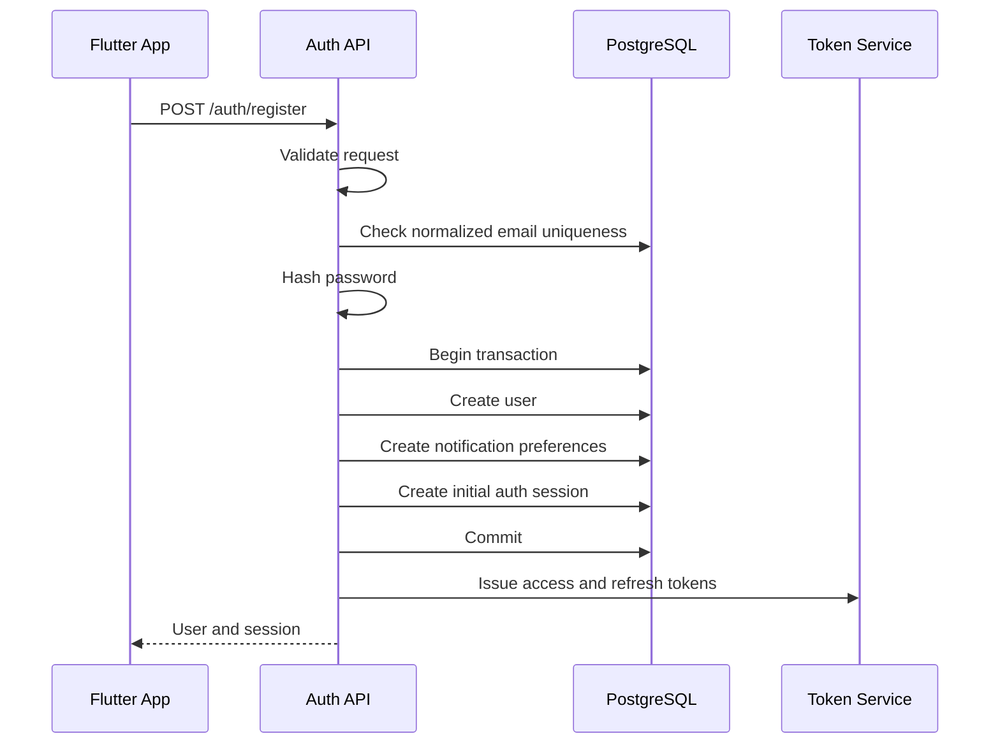
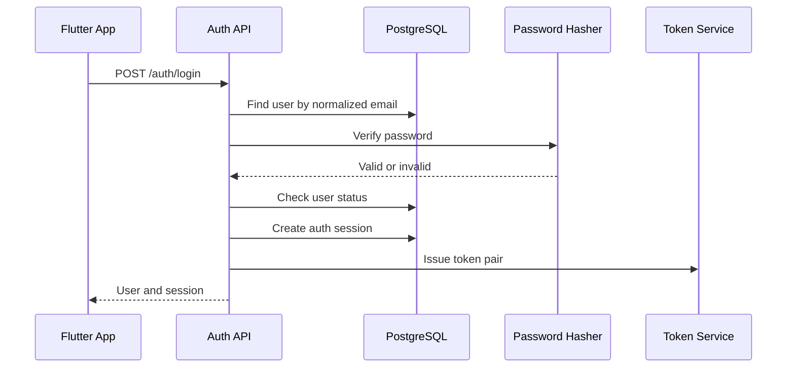
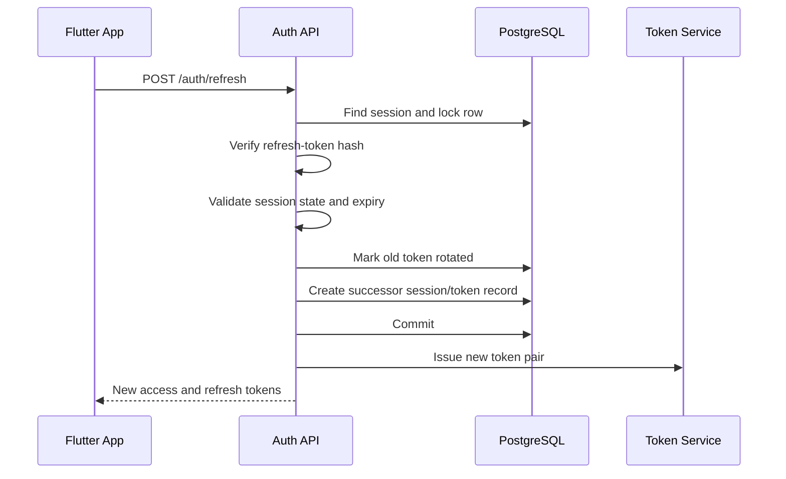

# AntreIn — Authentication and Session Design

> **Document:** `docs/backend/authentication.md`  
> **Status:** Draft v1.0  
> **Product:** AntreIn  
> **Backend Framework:** NestJS  
> **Database:** PostgreSQL  
> **Authentication Model:** Short-lived access token with rotating refresh sessions  
> **Document Language:** English  
> **Last Updated:** 2026-07-21

---

## 1. Document Purpose

This document defines the authentication, session, credential, device, and account-security design for the AntreIn backend.

It translates the product, architecture, API contract, backend brief, and database design into concrete authentication rules and implementation responsibilities.

This document must be read together with:

- `docs/00-product-brief.md`
- `docs/01-system-architecture.md`
- `docs/02-api-contract.md`
- `docs/backend/backend-brief.md`
- `docs/backend/database-design.md`

This document answers:

- How does registration work?
- How are passwords stored?
- How are access and refresh tokens issued?
- How are refresh tokens rotated and revoked?
- How does the backend detect refresh-token reuse?
- How are sessions associated with devices?
- How are password-reset tokens handled?
- How does Flutter restore and refresh a session?
- How are rate limits and brute-force protection applied?
- Which authentication events require audit and monitoring?
- How should authentication failures be exposed through the API?

---

## 2. Authentication Goals

The authentication system must:

1. Keep user credentials secure.
2. Use short-lived access tokens.
3. Support revocable device sessions.
4. Rotate refresh tokens.
5. Detect refresh-token reuse.
6. Prevent token replay from creating uncontrolled long-lived access.
7. Support logout from one device.
8. Support account-wide session revocation.
9. Avoid exposing whether an account exists.
10. Be understandable and maintainable by a solo developer.
11. Integrate cleanly with Flutter secure storage.
12. Support REST and WebSocket authentication.
13. Be observable without logging secrets.
14. Remain extensible for future social login and multi-factor authentication.
15. Separate authentication from business membership authorization.

---

## 3. Non-Goals

The MVP does not include:

- Multi-factor authentication.
- Passkeys.
- Passwordless email login.
- Phone OTP login.
- Social login.
- Enterprise SSO.
- Device attestation.
- Risk-based adaptive authentication.
- Account recovery through support agents.
- Biometric authentication on the backend.
- Shared family accounts.
- Hardware security keys.

Flutter may use local biometrics to unlock locally stored credentials, but biometric verification is not treated as backend identity proof.

---

## 4. Authentication Principles

### 4.1 Authentication and Authorization Are Separate

Authentication answers:

> Who is the user?

Authorization answers:

> What may the user do?

A successfully authenticated user does not automatically have access to business resources.

Business access still requires:

- Active business membership.
- Required permission.
- Outlet assignment.
- Resource ownership.
- Resource state.

### 4.2 Access Tokens Are Short-Lived

Access tokens reduce repeated database authentication checks but are intentionally short-lived.

A stolen access token must have a limited useful lifetime.

### 4.3 Refresh Tokens Are Stateful

Refresh tokens are associated with durable server-side sessions.

This enables:

- Revocation.
- Rotation.
- Device-level logout.
- Reuse detection.
- Session-family invalidation.

### 4.4 Raw Secrets Are Never Persisted

The backend must not store raw:

- Passwords.
- Refresh tokens.
- Password-reset tokens.

Only secure hashes or safe references are persisted.

### 4.5 Public Responses Minimize Account Enumeration

Login and password-reset flows must avoid confirming whether an email address exists, except where product behavior explicitly requires it.

### 4.6 Security Events Are Observable

Authentication failures, token reuse, unusual refresh behavior, and repeated rate-limit violations must be recorded safely.

---

## 5. Authentication Architecture



---

## 6. Authentication Components

Recommended components:

```text
AuthController
AuthService
AccessTokenService
RefreshTokenService
PasswordHasher
SessionRepository
UserRepository
PasswordResetService
AuthenticationGuard
CurrentUserDecorator
PublicRouteDecorator
RateLimitService
SecurityEventLogger
```

Optional internal ports:

```text
ClockPort
IdGeneratorPort
EmailDeliveryPort
```

---

## 7. Authentication Module Structure

```text
modules/auth/
├── domain/
│   ├── entities/
│   │   └── auth-session.entity.ts
│   ├── value-objects/
│   │   ├── email-address.value-object.ts
│   │   └── password.value-object.ts
│   ├── policies/
│   │   ├── password-policy.ts
│   │   └── refresh-token-policy.ts
│   ├── errors/
│   └── events/
│
├── application/
│   ├── use-cases/
│   │   ├── register-user.use-case.ts
│   │   ├── login-user.use-case.ts
│   │   ├── refresh-session.use-case.ts
│   │   ├── logout-session.use-case.ts
│   │   ├── request-password-reset.use-case.ts
│   │   └── reset-password.use-case.ts
│   ├── dto/
│   ├── ports/
│   └── mappers/
│
├── infrastructure/
│   ├── hashing/
│   ├── tokens/
│   ├── repositories/
│   ├── rate-limit/
│   └── email/
│
├── presentation/
│   ├── controllers/
│   ├── guards/
│   ├── decorators/
│   └── swagger/
│
└── auth.module.ts
```

---

## 8. User Identity

The primary MVP login identifier is:

```text
email
```

Phone number is profile data and may become a future login identifier.

Rules:

- Email is normalized before uniqueness checks.
- Original email casing may be preserved for display.
- Login lookup uses normalized email.
- Email changes require future verification rules.
- A deleted or suspended account cannot create new sessions.

Recommended normalization:

```text
Trim whitespace
→ Convert domain and local comparison form to lowercase
→ Store normalized value
```

Do not apply destructive normalization beyond clearly supported behavior.

---

## 9. Password Policy

### 9.1 Minimum Requirements

Ratified MVP password policy (ADR 0034):

- Minimum 8 characters.
- Maximum 128 characters.
- Length-only — no composition rules (no required letter/number/symbol classes).
- Unicode accepted; leading and trailing whitespace rejected.

Argon2id (ADR 0039: 64 MiB / t=3 / p=4, rehash-on-login) plus rate limiting carry the security load. A stronger minimum may be adopted later.

### 9.2 Password Validation

Validation occurs:

- In Flutter for immediate UX.
- Again on the backend as authoritative validation.

Flutter validation does not replace backend validation.

### 9.3 Password Storage

Recommended algorithm:

```text
Argon2id
```

Stored value contains:

- Algorithm.
- Parameters.
- Salt.
- Hash.

Do not store a separate plain salt unless the hashing library requires it.

### 9.4 Rehashing

On successful login:

```text
Verify password
→ Check whether stored parameters are outdated
→ Rehash with current parameters
→ Persist updated hash
```

Rehash failure must not incorrectly reject a valid login if persistence can safely be retried later.

### 9.5 Password Logging

Never log:

- Raw password.
- Password length tied to user identity.
- Password-reset secret.
- Hash values.

---

## 10. Registration Flow



### 10.1 Registration Transaction

The transaction should create:

- User.
- Default notification preferences.
- Initial authentication session.
- Optional audit/security event.

### 10.2 Registration Rules

- Email must be unique.
- Password must satisfy policy.
- User status starts as `active` unless email verification is required.
- Default role is customer.
- Business roles are created through business membership.
- Registration is idempotent only when explicitly supported by a request idempotency strategy.
- Duplicate email returns a stable error.

### 10.3 Email Verification

Email verification is optional for the initial portfolio MVP.

If enabled later:

```text
Register
→ User status pending_verification
→ Send verification email
→ Verify token
→ Activate email
```

Business-critical actions may require verified email.

---

## 11. Login Flow



### 11.1 Login Rules

- Email lookup uses normalized value.
- Invalid email and invalid password return the same public error.
- Suspended and inactive users cannot log in.
- Session creation stores device metadata.
- Last login time is updated.
- Login success is logged as a security event.
- Login failure is rate-limited and logged without exposing the password.

### 11.2 Public Error

Use:

```text
AUTH_INVALID_CREDENTIALS
```

Do not distinguish:

```text
EMAIL_NOT_FOUND
PASSWORD_WRONG
```

in the public API.

---

## 12. Access Token Design

### 12.1 Token Type

Recommended:

```text
Signed JWT
```

### 12.2 Claims

Minimum claims:

```json
{
  "sub": "usr_01J...",
  "sid": "ses_01J...",
  "type": "access",
  "iat": 1784610000,
  "exp": 1784610900,
  "iss": "antrein-api",
  "aud": "antrein-mobile"
}
```

Optional claims:

```text
token version
email verification state
```

Avoid embedding:

- Full permission lists.
- Business membership lists.
- Sensitive profile data.
- Mutable role information that may become stale.

### 12.3 Lifetime

Recommended initial lifetime:

```text
15 minutes
```

This remains an open configuration decision.

### 12.4 Signature

Use a strong asymmetric or symmetric signing strategy.

Recommended production direction:

```text
Asymmetric keys
```

Benefits:

- Separate signing and verification.
- Safer multi-service evolution.
- Easier key distribution for verification.

For a single MVP service, a strong symmetric secret is acceptable if managed properly.

### 12.5 Validation

Access-token validation checks:

- Signature.
- Expiration.
- Issuer.
- Audience.
- Token type.
- Session ID format.
- User status where required.
- Session revocation strategy.

---

## 13. Access Token Revocation Strategy

JWT access tokens are normally valid until expiration.

Possible revocation approaches:

1. Short lifetime only.
2. Session lookup on every request.
3. Cached revocation list.
4. Token version check.
5. High-risk endpoint session revalidation.

MVP recommendation:

- Short access-token lifetime.
- Refresh sessions are stateful.
- User status and membership are checked for protected business actions.
- Critical operations may validate active session state.
- Logout primarily prevents future refresh.
- Existing access token expires within the configured short lifetime.

If immediate access-token revocation becomes required, introduce a session-status cache or token-version strategy.

---

## 14. Refresh Token Design

### 14.1 Token Type

Refresh token should be:

- Cryptographically random.
- Opaque to the client.
- High entropy.
- Bound to a server-side session.

Recommended structure:

```text
sessionId.randomSecret
```

The backend may parse the session ID and hash only the secret.

Alternative:

- Entire opaque token is hashed and looked up by a separate public token ID.

### 14.2 Storage

Flutter stores raw refresh token in platform secure storage.

Backend stores:

```text
refresh_token_hash
```

Never store the raw refresh token.

### 14.3 Lifetime

Recommended initial lifetime:

```text
30 days
```

The exact duration remains configurable.

### 14.4 Rotation

Each successful refresh:

```text
Valid active refresh token
→ Mark current session token as rotated
→ Create or update successor token record
→ Issue new access token
→ Issue new refresh token
```

The old refresh token becomes invalid immediately.

---

## 15. Refresh Session Data Model

Session fields:

```text
id
user_id
device_id
refresh_token_hash
token_family_id
parent_session_id
status
issued_at
expires_at
last_used_at
revoked_at
revoked_reason
ip_address
user_agent
created_at
updated_at
```

Session statuses:

```text
active
rotated
revoked
expired
compromised
```

---

## 16. Refresh Flow



### 16.1 Transaction Requirements

The refresh flow must be atomic.

Inside one transaction:

- Lock current session.
- Validate status.
- Validate hash.
- Detect previous rotation.
- Mark old token rotated.
- Create successor token state.
- Update last-used metadata.
- Commit.

### 16.2 Concurrency

Two simultaneous refresh requests using the same token must not both succeed.

Expected outcome:

- One succeeds.
- The second detects rotated/reused token.
- The session family may be revoked depending on reuse policy.

---

## 17. Refresh Token Reuse Detection

Reuse occurs when a refresh token already marked rotated is presented again.

Possible causes:

- Legitimate concurrent refresh race.
- Token theft.
- Delayed retry from an old client.
- Storage rollback.

Recommended policy:

```text
Rotated token reused
→ Mark token family compromised
→ Revoke active descendants in that family
→ Return AUTH_REFRESH_TOKEN_REUSED
→ Require full login
→ Record high-severity security event
```

To reduce false positives from a client race:

- Flutter must serialize refresh requests.
- Backend may support a very short grace result cache only if carefully designed.
- Simplicity and security favor strict reuse detection for MVP.

---

## 18. Flutter Refresh Coordination

Flutter must prevent refresh storms.

Required client behavior:

```text
First protected request receives 401
→ Start one refresh request
→ Pause other protected requests
→ Refresh succeeds
→ Persist new token pair atomically
→ Replay paused requests once
```

On refresh failure:

```text
Clear tokens
→ Disconnect WebSocket
→ Clear sensitive role-scoped state
→ Move to unauthenticated state
```

Mutation requests must not be replayed blindly unless idempotency is guaranteed.

---

## 19. Token Persistence in Flutter

Store in platform secure storage:

- Access token.
- Refresh token.
- Access-token expiration.
- Refresh-token expiration.
- Session ID if explicitly useful.
- Device ID.

Do not store tokens in:

- SharedPreferences.
- Plain SQLite.
- Logs.
- Crash reports.
- Analytics properties.

An in-memory token manager should reduce repeated secure-storage reads.

---

## 20. Atomic Token Replacement

Flutter should treat token replacement as one logical operation.

Preferred sequence:

```text
Receive new pair
→ Write refresh token
→ Write access token
→ Update in-memory state
→ Delete old values only after success
```

The exact secure-storage strategy must avoid leaving only an invalid old refresh token after a partial write failure.

A versioned token bundle is preferable:

```json
{
  "accessToken": "...",
  "refreshToken": "...",
  "accessTokenExpiresAt": "...",
  "refreshTokenExpiresAt": "...",
  "sessionId": "..."
}
```

---

## 21. Logout

### 21.1 Current Session Logout

```http
POST /auth/logout
```

Flow:

```text
Authenticate access token
→ Resolve session
→ Revoke refresh session
→ Deactivate device push token when requested
→ Record logout event
→ Return success
```

Logout is idempotent.

Repeated logout should return success.

### 21.2 Logout All Sessions

A future endpoint may support:

```http
POST /auth/logout-all
```

Flow:

```text
Revoke all active sessions for user
→ Deactivate related push tokens if policy requires
→ Preserve current audit event
```

This may be triggered after:

- Password reset.
- Suspected compromise.
- Account suspension.

---

## 22. Session Revocation

Revocation reasons:

```text
user_logout
password_reset
account_suspended
refresh_token_reuse
security_admin_action
device_removed
session_expired
```

Revocation writes:

- Status.
- Revoked timestamp.
- Reason.
- Security event.

---

## 23. Device Binding

A session may reference a client-generated device ID.

Device ID is not trusted as a secret.

It is used for:

- Session display.
- Push registration.
- Device-level logout.
- Security context.
- Troubleshooting.

Do not use device ID alone as proof of identity.

---

## 24. Device Registration

Device registration stores:

- Device ID.
- User ID.
- Platform.
- App version.
- Device name.
- Push provider.
- Push token.
- Locale.
- Timezone.
- Last-seen time.

Rules:

- A push token is associated with one active user/device context.
- Login may reassign or refresh the device record.
- Logout may deactivate push delivery for the session.
- Invalid provider tokens are marked invalid.

---

## 25. WebSocket Authentication

The WebSocket connection uses an access token.

Flow:

```text
Flutter obtains access token
→ Connects to secure WebSocket
→ Sends token in authentication payload
→ Backend validates token
→ Backend associates socket with user and session
→ Backend authorizes room subscriptions
```

Rules:

- Token must not be placed in a long-lived logged query string.
- Expired token rejects connection or requires reauthentication.
- Socket connection ID is not identity.
- Room access requires resource authorization.
- Logout disconnects active user socket where practical.
- Refresh may require reconnect with the new access token.

---

## 26. Password Reset Request

```http
POST /auth/password/forgot
```

Public response:

```json
{
  "accepted": true
}
```

The response is the same whether or not the email exists.

Flow for existing active user:

```text
Normalize email
→ Locate user
→ Invalidate previous unused reset tokens
→ Generate high-entropy token
→ Store token hash
→ Send reset email asynchronously
→ Record security event
```

Flow for unknown email:

```text
Perform timing-safe equivalent path where practical
→ Return accepted
```

---

## 27. Password Reset Token

Requirements:

- High entropy.
- Single use.
- Short lifetime.
- Stored hashed.
- Bound to one user.
- Invalidated after use.
- Invalidated when a newer token is created if policy requires.

Recommended lifetime:

```text
15–30 minutes
```

---

## 28. Reset Password

```http
POST /auth/password/reset
```

Flow:

```text
Hash incoming token
→ Find unused token
→ Validate expiration
→ Validate new password
→ Hash new password
→ Begin transaction
→ Update password hash
→ Mark reset token used
→ Revoke all active sessions
→ Insert security event
→ Commit
→ Send confirmation notification
```

Errors:

- `AUTH_RESET_TOKEN_INVALID`
- `AUTH_RESET_TOKEN_EXPIRED`
- `AUTH_PASSWORD_REUSE_NOT_ALLOWED`
- `VALIDATION_FAILED`

---

## 29. Password Reuse

MVP options:

1. Do not track previous hashes.
2. Prevent reuse only of the current password.
3. Track a small password history.

Recommended MVP:

- Verify new password is not equal to current password.
- Do not store extended password history initially.

Future security requirements may add a password-history table.

---

## 30. Account Status

User statuses:

```text
active
inactive
suspended
deleted
```

Behavior:

### Active

- Can authenticate.
- Can refresh.
- Can use authorized resources.

### Inactive

- Cannot create new sessions.
- Existing refresh sessions should be revoked.

### Suspended

- Authentication denied.
- Existing sessions revoked.
- Administrative reason audited.

### Deleted

- Authentication denied.
- Sessions revoked.
- Data handled by deletion/anonymization policy.

---

## 31. Authentication Guard

A global guard protects routes by default.

Public routes use an explicit decorator:

```ts
@Public()
```

The guard:

1. Reads bearer token.
2. Verifies token.
3. Validates token type.
4. Extracts user and session IDs.
5. Loads minimal current principal state when required.
6. Attaches principal to request.
7. Rejects invalid authentication.

---

## 32. Current Principal

Recommended request principal:

```ts
interface AuthenticatedPrincipal {
  userId: string;
  sessionId: string;
  userStatus: 'active';
  tokenIssuedAt: Date;
}
```

Business memberships are not permanently embedded into this object unless loaded by authorization policies.

---

## 33. Authentication Error Mapping

| Condition | Error Code | HTTP |
|---|---|---:|
| Missing bearer token | `AUTH_ACCESS_TOKEN_INVALID` | 401 |
| Invalid signature | `AUTH_ACCESS_TOKEN_INVALID` | 401 |
| Expired access token | `AUTH_ACCESS_TOKEN_EXPIRED` | 401 |
| Invalid credentials | `AUTH_INVALID_CREDENTIALS` | 401 |
| Suspended account | `AUTH_ACCOUNT_SUSPENDED` | 403 |
| Inactive account | `AUTH_ACCOUNT_INACTIVE` | 403 |
| Invalid refresh token | `AUTH_REFRESH_TOKEN_INVALID` | 401 |
| Expired refresh token | `AUTH_REFRESH_TOKEN_EXPIRED` | 401 |
| Revoked session | `AUTH_SESSION_REVOKED` | 401 |
| Reused refresh token | `AUTH_REFRESH_TOKEN_REUSED` | 401 |
| Invalid reset token | `AUTH_RESET_TOKEN_INVALID` | 400 |
| Expired reset token | `AUTH_RESET_TOKEN_EXPIRED` | 410 |

---

## 34. Rate Limiting

> Ratified values live in ADR 0034 (login 5/min/IP+email · register 3/min/IP ·
> forgot 3/15min/IP+email · reset 5/min/IP, env-configurable). The examples below
> are illustrative structure only.

Recommended rate-limit categories:

### Registration

Key:

```text
IP + normalized email
```

Example initial limit:

```text
5 attempts per hour per IP
```

### Login

Key:

```text
IP + normalized email
```

Example initial limits:

```text
5 failed attempts per 15 minutes per account key
20 attempts per 15 minutes per IP
```

### Refresh

Key:

```text
session ID + IP
```

### Forgot Password

Key:

```text
IP + normalized email
```

Example:

```text
3 requests per hour
```

### Reset Password

Key:

```text
reset token identifier + IP
```

Exact limits must be configuration, not hardcoded constants.

---

## 35. Brute-Force Protection

Controls:

- Rate limiting.
- Stable generic login error.
- Security event logging.
- Optional progressive delay.
- Optional temporary account-level cooldown.
- CAPTCHA only if abuse justifies it.

Avoid permanent account lockout from unauthenticated failures because attackers could deny access to legitimate users.

---

## 36. Timing Attack Reduction

The login path should reduce large timing differences between:

- Unknown email.
- Known email with wrong password.

Recommended approach:

- Use a constant fallback password hash for unknown users.
- Always perform one password-hash verification.
- Return the same public error.

Absolute timing equality is not guaranteed, but obvious differences should be avoided.

---

## 37. Security Events

Recommended event types:

```text
auth.registration_succeeded
auth.registration_failed
auth.login_succeeded
auth.login_failed
auth.refresh_succeeded
auth.refresh_failed
auth.refresh_token_reused
auth.logout
auth.password_reset_requested
auth.password_reset_succeeded
auth.password_reset_failed
auth.session_revoked
auth.account_suspended
```

Security event fields:

```text
event type
user ID when known
session ID when known
device ID
request ID
IP address
user agent
result
error code
timestamp
```

Never include raw credentials or tokens.

---

## 38. Authentication Audit vs Technical Logs

Technical logs:

- Debugging.
- Request failures.
- Provider errors.
- Latency.

Security/audit events:

- Login result.
- Token reuse.
- Session revocation.
- Password reset.
- Suspension.

These may use the same logging infrastructure but have different retention and access policies.

---

## 39. Suspicious Activity Signals

Potential signals:

- Refresh-token reuse.
- Many failed logins across many accounts from one IP.
- Many failed logins for one account from many IPs.
- Frequent device changes.
- Refresh from a materially different device context.
- Repeated password-reset requests.
- Login after account suspension attempt.

MVP response:

- Log and monitor.
- Revoke session family for token reuse.
- Apply rate limits.

Automated risk scoring is outside MVP.

---

## 40. Session Listing

A future endpoint may expose active sessions:

```http
GET /me/sessions
```

Response fields:

- Session ID.
- Device name.
- Platform.
- Last used.
- Created time.
- Current session flag.

A future revoke endpoint:

```http
DELETE /me/sessions/{sessionId}
```

This is useful but not required for the first implementation.

---

## 41. Email Delivery

Password-reset delivery should use an email-provider adapter.

```ts
interface EmailDeliveryPort {
  sendPasswordReset(input: PasswordResetEmailInput): Promise<void>;
  sendPasswordChanged(input: PasswordChangedEmailInput): Promise<void>;
}
```

Email delivery should be asynchronous through outbox/worker when practical.

Password-reset request must not fail publicly because email delivery is delayed after the request has been safely accepted.

---

## 42. Outbox Integration

Authentication events that may create outbox entries:

- Password reset requested.
- Password changed.
- Suspicious token reuse.
- New login alert in the future.
- Email verification in the future.

Flow:

```text
Persist auth state
→ Insert outbox event
→ Commit
→ Worker sends email or notification
```

---

## 43. Database Transaction Rules

Transactions are required for:

- Registration.
- Refresh-token rotation.
- Refresh-token-family revocation.
- Password reset.
- Account suspension and session revocation.
- Session logout with device update when coordinated.
- Accepting a staff invitation if it also creates membership and profile.

Network calls do not occur inside long-running database transactions.

---

## 44. Session Cleanup

Scheduled cleanup:

- Mark expired active sessions as expired.
- Delete or archive old expired sessions according to retention.
- Remove old used password-reset tokens.
- Remove expired unused reset tokens.
- Remove inactive device push tokens according to policy.

Cleanup is idempotent.

---

## 45. Token Key Management

Signing keys or secrets must:

- Come from protected configuration.
- Never be committed.
- Be different by environment.
- Be rotatable.
- Have documented ownership.
- Be included in incident-response planning.

Future key rotation may use:

- Key identifiers.
- Multiple active verification keys.
- One current signing key.
- Grace period for old access tokens.

---

## 46. Environment Separation

Each environment has separate:

- Token-signing keys.
- Database.
- Reset-token behavior.
- Email project.
- Push project.
- Allowed origins.
- API audience.
- Issuer values.

Tokens from development must not validate in production.

---

## 47. CORS and Mobile Clients

Native mobile applications are not protected by browser CORS.

CORS applies to:

- Swagger UI.
- Admin tools.
- Future web clients.

Configure explicit allowed origins for browser clients.

Do not treat CORS as authentication.

---

## 48. CSRF

Bearer tokens sent in the `Authorization` header are not normally vulnerable to cookie-based CSRF.

If future web clients use cookies:

- Add CSRF protection.
- Use secure, HTTP-only, same-site cookies.
- Revisit refresh-token transport.

The MVP mobile client uses secure storage and authorization headers.

---

## 49. Replay Protection

Controls:

- Short access-token lifetime.
- Rotating refresh tokens.
- Refresh-token reuse detection.
- Session revocation.
- TLS.
- Idempotency keys for critical business mutations.

Access JWT replay within its valid lifetime is not fully prevented in MVP.

High-risk actions may require active-session validation.

---

## 50. Session Fixation

Session IDs are generated only by the backend.

Login always creates a new session.

A pre-authentication identifier is never promoted into an authenticated session.

---

## 51. Account Enumeration

Avoid account enumeration through:

- Generic login error.
- Generic forgot-password response.
- Similar status codes.
- Similar response timing where practical.

Registration may return `AUTH_EMAIL_ALREADY_REGISTERED` because the user needs actionable feedback.

If stronger privacy becomes necessary, registration may offer a login/recovery suggestion without explicit disclosure.

---

## 52. Email Change

Email change is outside the first MVP.

Future secure flow:

```text
Authenticated user
→ Re-enter password
→ Submit new email
→ Send verification to new email
→ Verify
→ Update normalized email
→ Notify old email
→ Revoke sessions when policy requires
```

---

## 53. Phone Number Change

Phone is profile data in MVP.

Future verified phone flow requires:

- OTP.
- Expiration.
- Attempt limits.
- Anti-abuse controls.
- Unique normalized phone constraint.

---

## 54. Social Login Evolution

Future social login should add identity-provider records rather than replacing the user table.

Possible table:

```text
user_identities
- user_id
- provider
- provider_subject
- email
- created_at
```

Unique:

```text
provider + provider_subject
```

Account linking requires explicit security rules.

---

## 55. Multi-Factor Authentication Evolution

Future MFA may support:

- TOTP.
- Recovery codes.
- Platform authenticator.
- SMS only as fallback.

MFA state should remain separate from basic password credentials.

MFA is not included in MVP implementation.

---

## 56. Flutter Session State

Recommended states:

```text
unknown
authenticated
unauthenticated
refreshing
expired
locked
```

Startup flow:

```text
App starts
→ Read secure token bundle
→ If absent: unauthenticated
→ If access token valid: fetch /me
→ If access token expired and refresh valid: refresh
→ If refresh succeeds: fetch /me
→ If refresh fails: clear session
```

---

## 57. Flutter API Interceptor Behavior

Request interceptor:

- Attach access token.
- Attach request ID.
- Attach app metadata.
- Redact logs.

Response interceptor:

- Detect access-token expiration.
- Trigger one coordinated refresh.
- Replay safe requests.
- Convert API errors into typed failures.

Do not refresh on:

- Login.
- Register.
- Refresh endpoint.
- Public health endpoints.

---

## 58. Retry Rules

Safe automatic retries:

- Idempotent GET requests.
- Selected PUT requests.
- Mutations with stable idempotency keys.

Unsafe automatic retries:

- Login.
- Password reset completion.
- Mutations without idempotency.
- Payment-provider navigation callbacks.

Authentication refresh itself should have bounded retry.

---

## 59. Logout in Flutter

Flutter logout sequence:

```text
Call logout endpoint when possible
→ Clear token bundle
→ Clear sensitive local cache
→ Disconnect WebSocket
→ Reset role-specific Cubits
→ Remove or deactivate push registration
→ Navigate to login
```

Local logout should still complete if the backend is temporarily unavailable.

The server session may expire naturally or be revoked when connectivity returns if deferred logout is implemented.

---

## 60. WebSocket Session Refresh

When access token changes:

Options:

1. Disconnect and reconnect.
2. Send an authenticated reauthorization command.

MVP recommendation:

```text
Disconnect and reconnect with new access token
```

This is simpler and reduces stale authentication state.

---

## 61. API Endpoint Summary

```text
POST /auth/register
POST /auth/login
POST /auth/refresh
POST /auth/logout
POST /auth/password/forgot
POST /auth/password/reset
GET  /me
```

Future:

```text
POST   /auth/logout-all
GET    /me/sessions
DELETE /me/sessions/{sessionId}
POST   /auth/email/verify
POST   /auth/email/resend
```

---

## 62. Authentication Error Catalog

```text
AUTH_INVALID_CREDENTIALS
AUTH_EMAIL_ALREADY_REGISTERED
AUTH_PHONE_ALREADY_REGISTERED
AUTH_ACCOUNT_INACTIVE
AUTH_ACCOUNT_SUSPENDED
AUTH_ACCESS_TOKEN_INVALID
AUTH_ACCESS_TOKEN_EXPIRED
AUTH_REFRESH_TOKEN_INVALID
AUTH_REFRESH_TOKEN_EXPIRED
AUTH_REFRESH_TOKEN_REUSED
AUTH_SESSION_REVOKED
AUTH_RESET_TOKEN_INVALID
AUTH_RESET_TOKEN_EXPIRED
AUTH_PASSWORD_REUSE_NOT_ALLOWED
AUTH_SESSION_EXPIRED
RATE_LIMIT_EXCEEDED
VALIDATION_FAILED
```

---

## 63. Unit Tests

Required unit tests:

- Email normalization.
- Password policy.
- Password hash verification.
- Access-token claim validation.
- Refresh-token parsing.
- Refresh-token hashing.
- Session expiration.
- Session revocation.
- Token-family reuse policy.
- Password-reset eligibility.
- Authentication error mapping.

---

## 64. Integration Tests

Required integration tests:

- Unique normalized email.
- Session creation.
- Session rotation.
- Session-family revocation.
- Expired session rejection.
- Password-reset token uniqueness.
- Password-reset transaction.
- Account suspension revokes sessions.
- Device registration uniqueness.
- Rate-limit persistence if database-backed.

Use PostgreSQL, not SQLite.

---

## 65. Concurrency Tests

Required:

### Concurrent Refresh

```text
Two refresh requests use the same token
→ One succeeds
→ One fails with reuse or invalid-session behavior
→ Only one active successor remains
```

### Concurrent Registration

```text
Two registration requests use the same email
→ One succeeds
→ One receives duplicate-email error
```

### Concurrent Password Reset

```text
Two reset requests use the same reset token
→ One succeeds
→ One fails
→ Password updates once
```

---

## 66. End-to-End Tests

Required:

1. Register and receive session.
2. Login with correct password.
3. Login with incorrect password.
4. Refresh session.
5. Refresh-token reuse.
6. Logout and reject refresh.
7. Password-reset request.
8. Password-reset completion.
9. Suspended account login rejection.
10. Authenticated `/me`.
11. Expired access-token behavior.
12. WebSocket authentication.

---

## 67. Security Tests

Recommended:

- JWT algorithm confusion rejection.
- Wrong issuer rejection.
- Wrong audience rejection.
- Refresh token with modified bytes rejection.
- Reset token with modified bytes rejection.
- SQL injection attempts through email.
- Oversized input rejection.
- Brute-force rate limiting.
- Log redaction.
- Suspended user access denial.
- Session replay after logout.

---

## 68. Observability Metrics

Recommended metrics:

```text
auth_registration_success_total
auth_registration_failure_total
auth_login_success_total
auth_login_failure_total
auth_refresh_success_total
auth_refresh_failure_total
auth_refresh_reuse_total
auth_password_reset_requested_total
auth_password_reset_completed_total
auth_session_revoked_total
auth_rate_limited_total
```

Avoid labels containing raw email or user ID.

---

## 69. Alerting

Potential alerts:

- Sudden refresh-token reuse increase.
- Sudden login-failure increase.
- Password-reset delivery failure.
- Token-signing configuration failure.
- Session table growth anomaly.
- High refresh failure rate after release.
- Authentication latency degradation.

---

## 70. Retention

Initial direction:

| Data | Retention |
|---|---|
| Active sessions | Until expiration or revocation |
| Revoked sessions | Security review period |
| Expired sessions | Limited cleanup period |
| Password-reset tokens | Short period after expiration/use |
| Security events | Longer operational retention |
| Login technical logs | Logging-platform policy |
| Device records | While active plus cleanup period |

Exact production retention requires policy review.

---

## 71. Incident Response

Potential authentication incidents:

- Signing key leak.
- Refresh-token theft.
- Credential-stuffing attack.
- Password-reset abuse.
- Suspended user retains access.
- Provider email compromise.

Minimum response capabilities:

- Rotate signing secrets.
- Revoke all sessions.
- Revoke one token family.
- Suspend user.
- Disable reset flow temporarily.
- Increase rate limits or blocking.
- Audit affected sessions.
- Notify affected users when required.

---

## 72. Open Decisions

> **Resolution status (2026-07-22):** all items resolved — password length + rate values
> 0034 · Argon2id params, refresh representation, strict reuse, email verification (out),
> suspension window, logout push deactivation, reset-token policy 0039 · TTLs 0011 ·
> signing HS256 0025 · rotation new-row 0024 · session listing + login alerts out of MVP,
> device-metadata log-only, token bundle serialized (0039 context) · security-event
> retention deferred with global retention review. List retained for history.

- Final password minimum length.
- Final Argon2id parameters.
- Access-token lifetime.
- Refresh-token lifetime.
- Refresh-token representation.
- Strict versus grace-window reuse detection.
- Symmetric versus asymmetric JWT signing.
- Whether email verification is included in MVP.
- Whether current-session logout deactivates push token.
- Whether account suspension immediately invalidates access tokens.
- Whether active-session listing is included in MVP.
- Final rate-limit values.
- Password-reset token lifetime.
- Whether password reset revokes all sessions.
- Whether login alerts are sent.
- Whether device metadata changes trigger security action.
- Security-event retention duration.
- Whether token-bundle writes use one serialized secure-storage value.

---

## 73. Implementation Milestones

### A0 — Foundation

- Auth module.
- Configuration.
- Password hasher.
- Token services.
- Authentication guard.
- Current principal.
- Error mapping.

### A1 — Registration and Login

- User creation.
- Password hashing.
- Login.
- Initial session.
- `/me`.
- Rate limiting.
- Unit and E2E tests.

### A2 — Refresh Sessions

- Opaque refresh token.
- Session persistence.
- Rotation.
- Reuse detection.
- Concurrency tests.
- Flutter refresh coordination.

### A3 — Logout and Revocation

- Current-session logout.
- Account-status checks.
- Session revocation.
- Device update.
- Security events.

### A4 — Password Reset

- Reset request.
- Hashed reset token.
- Outbox email.
- Reset completion.
- Session revocation.
- Tests.

### A5 — Hardening

- Improved rate limiting.
- Security metrics.
- Key rotation preparation.
- WebSocket authentication.
- Redaction tests.
- Incident runbook.

---

## 74. Backend Completion Checklist

- [ ] Passwords use Argon2id or approved secure hashing.
- [ ] Email normalization is consistent.
- [ ] Access tokens are short-lived.
- [ ] Refresh tokens are opaque and hashed server-side.
- [ ] Refresh rotation is atomic.
- [ ] Concurrent refresh is safe.
- [ ] Reuse detection is implemented.
- [ ] Logout revokes the intended session.
- [ ] Account suspension blocks authentication.
- [ ] Password reset uses single-use hashed tokens.
- [ ] Password reset revokes sessions according to policy.
- [ ] Global authentication guard is enabled.
- [ ] Public routes are explicit.
- [ ] REST and WebSocket authentication are supported.
- [ ] Rate limits exist.
- [ ] Generic login and recovery responses prevent enumeration.
- [ ] Sensitive fields are redacted.
- [ ] Unit, integration, concurrency, E2E, and security tests pass.
- [ ] Flutter refresh coordination is documented and verified.
- [ ] OpenAPI matches the API contract.

---

## 75. Final Authentication Statement

AntreIn uses short-lived access tokens and stateful rotating refresh sessions.

The security model is:

```text
Password
→ Secure Hash

Login
→ New Device Session
→ Short-Lived Access Token
→ Opaque Refresh Token

Refresh
→ Lock Session
→ Verify Token Hash
→ Rotate Token
→ Detect Reuse
→ Issue New Pair

Logout or Compromise
→ Revoke Session or Token Family
```

The core guarantees are:

```text
Raw passwords are never stored
Raw refresh tokens are never stored
One refresh token cannot be successfully rotated twice
A revoked session cannot issue new access tokens
Password reset invalidates compromised sessions
Flutter serializes refresh operations
Authentication does not replace business authorization
```

The design prioritizes security, understandable implementation, and reliable Flutter integration without introducing unnecessary identity infrastructure for the MVP.
