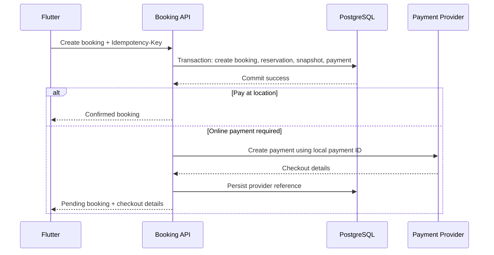
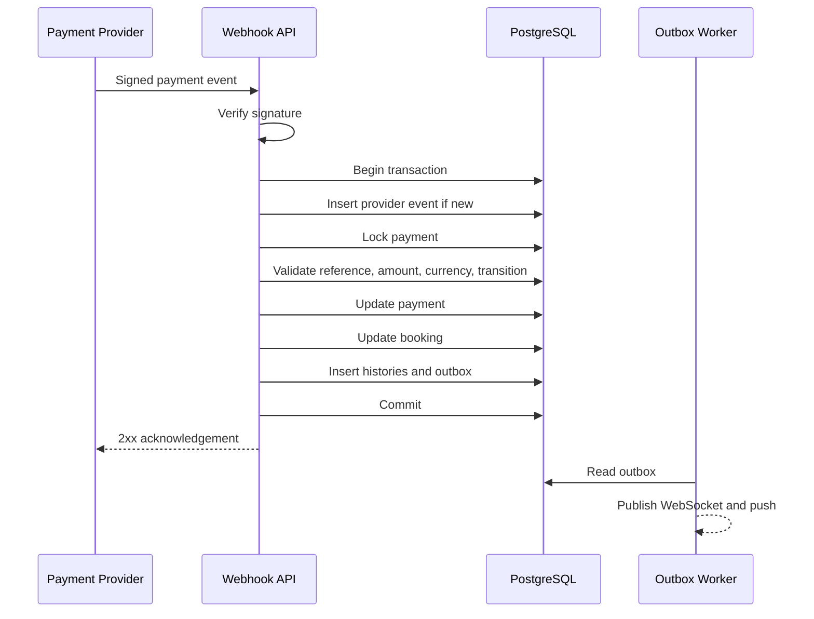
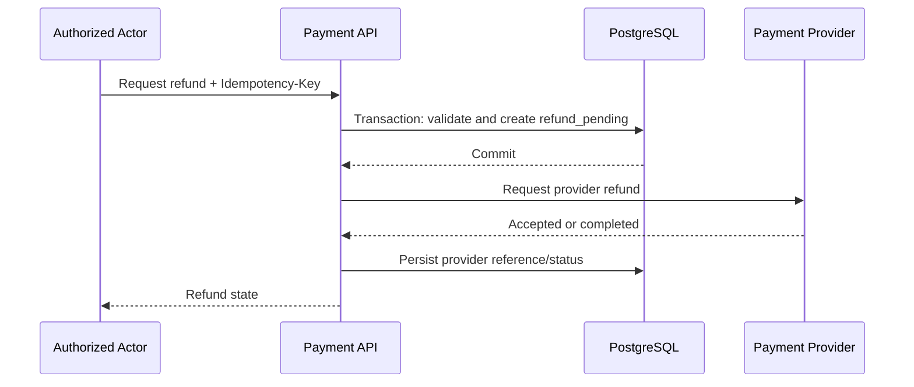

# AntreIn — Booking and Payment Design

> **Document:** `docs/backend/booking-payment.md`  
> **Status:** Draft v1.0  
> **Product:** AntreIn  
> **Backend Framework:** NestJS  
> **Database:** PostgreSQL  
> **ORM:** Prisma  
> **Payment Model:** Pay at location, full payment, and deposit  
> **Document Language:** English  
> **Last Updated:** 2026-07-21

---

## 1. Document Purpose

This document defines the backend design for the AntreIn booking and payment domains.

It translates the product brief, system architecture, API contract, backend brief, database design, and authentication design into concrete implementation rules for:

- Availability validation.
- Booking creation.
- Staff assignment.
- Booking snapshots.
- Booking lifecycle.
- Booking cancellation.
- Payment creation.
- Payment expiration.
- Pay-at-location confirmation.
- Payment gateway integration.
- Verified webhook processing.
- Refunds.
- Reconciliation.
- Idempotency.
- Concurrency.
- Audit history.
- Notifications.
- Testing.

This document must be read together with:

- `docs/00-product-brief.md`
- `docs/01-system-architecture.md`
- `docs/02-api-contract.md`
- `docs/backend/backend-brief.md`
- `docs/backend/database-design.md`
- `docs/backend/authentication.md`
- `docs/backend/realtime-queue.md`

This document answers:

- How is a booking created safely?
- How is staff availability revalidated?
- How are overlapping bookings prevented?
- How are price and policy snapshots preserved?
- How is payment amount calculated?
- How does the backend coordinate payment gateway calls?
- How are duplicate callbacks and webhooks handled?
- How do cancellation and refund policies work?
- Which state transitions are valid?
- Which operations must be transactional?
- Which failures can be retried safely?

---

## 2. Domain Goals

The booking and payment implementation must:

1. Prevent overlapping active bookings for the same staff member.
2. Keep Flutter from becoming the source of truth.
3. Preserve service price and policy history.
4. Support pay at location, full payment, and deposit.
5. Verify online payment through trusted server-side evidence.
6. Process provider webhooks idempotently.
7. Avoid duplicate bookings and payments.
8. Release unavailable or expired reservations safely.
9. Calculate cancellation and refunds consistently.
10. Support recovery when Flutter is closed or disconnected.
11. Keep network calls outside long database transactions.
12. Produce complete status history and audit records.
13. Support deterministic automated testing.
14. Remain simple enough for an MVP modular monolith.

---

## 3. Non-Goals

The MVP does not include:

- Subscription billing.
- Marketplace commission.
- Automated multi-merchant settlement.
- Split payments between staff.
- Multi-currency.
- Dynamic pricing.
- Complex coupons.
- Loyalty discounts.
- Installment payments.
- Saved card credentials.
- Chargeback management.
- Tax invoicing.
- Full point-of-sale functionality.
- Arbitrary rescheduling.
- Partial service fulfillment.
- Offline booking creation.
- Provider-independent universal payment abstractions.

---

## 4. Domain Principles

### 4.1 Backend Owns Booking Correctness

The backend determines:

- Whether a slot is valid.
- Which staff member is assigned.
- Service price.
- Deposit amount.
- Required payment amount.
- Booking status.
- Payment status.
- Cancellation eligibility.
- Refund eligibility.

Flutter submits intent, not final truth.

### 4.2 Availability Is Revalidated During Mutation

Availability returned by a read endpoint is informational.

Booking creation must always:

```text
Re-read current configuration
→ Recalculate availability
→ Recheck overlap
→ Attempt database-protected reservation
```

### 4.3 Prices Are Snapshotted

A booking stores:

- Service name.
- Duration.
- Price.
- Currency.
- Deposit type.
- Deposit value.
- Required payment amount.
- Staff display name.
- Outlet identity.
- Cancellation policy.

Future edits do not change historical bookings.

### 4.4 Payment Provider Is Not the Domain

Provider-specific concepts remain inside adapters.

The domain understands:

- Payment amount.
- Payment status.
- Expiration.
- Provider reference.
- Refund status.
- Verified external event.

### 4.5 Webhook Is the Primary Online Payment Evidence

A Flutter callback or redirect result is not final proof.

Online payment is confirmed through:

- Verified provider webhook.
- Verified provider status query during reconciliation.

### 4.6 Critical Mutations Are Idempotent

Idempotency applies to:

- Create booking.
- Create provider payment.
- Cancel booking.
- Confirm pay at location.
- Request refund.
- Process provider events.
- Reconcile payment.

### 4.7 Persist Before Notify

Booking and payment state must commit before:

- WebSocket events.
- Push notifications.
- Email.
- Analytics publication.

---

## 5. Domain Boundaries

### Booking Module Owns

- Booking identity.
- Booking type.
- Booking code.
- Customer ownership.
- Business, outlet, service, and staff references.
- Booking snapshots.
- Scheduling.
- Booking lifecycle.
- Cancellation.
- Check-in eligibility.
- No-show eligibility.
- Booking history.

### Payment Module Owns

- Payment identity.
- Payment option.
- Payment provider.
- Amount and currency.
- Provider reference.
- Payment lifecycle.
- Payment events.
- Expiration.
- Refunds.
- Reconciliation.
- Pay-at-location confirmation.

### Schedule Module Owns

- Operating hours.
- Staff schedules.
- Breaks.
- Closed dates.
- Slot generation.
- Availability calculation.

### Queue Module Owns

- Check-in queue entry.
- Queue lifecycle.
- Service start and completion.

Booking and queue status transitions must be coordinated transactionally.

---

## 6. Booking Types

Supported types:

```text
scheduled
walk_in
```

### Scheduled Booking

Requires:

- Customer.
- Business.
- Outlet.
- Service.
- Scheduled start.
- Scheduled end.
- Staff or `any_available`.
- Payment option.

### Walk-In Booking

Created by authorized business staff.

Requires:

- Business.
- Outlet.
- Service.
- Customer display data.
- Staff assignment strategy.
- Payment option.
- Immediate queue entry.

Walk-in behavior is further defined in `realtime-queue.md`.

---

## 7. Payment Options

Supported booking payment options:

```text
pay_at_location
full_payment
deposit
```

### 7.1 Pay at Location

Booking may become `confirmed` immediately.

Payment remains pending until authorized staff confirms receipt.

### 7.2 Full Payment

Customer pays the complete service price before confirmation.

### 7.3 Deposit

Customer pays only the required deposit before confirmation.

Remaining balance is paid at location.

---

## 8. Booking Status Model

Statuses:

```text
draft
pending_payment
confirmed
checked_in
waiting
called
in_service
completed
cancelled
expired
no_show
```

### 8.1 Terminal States

```text
completed
cancelled
expired
no_show
```

Terminal state changes require an audited administrative correction.

### 8.2 Allowed Transitions

```text
draft → pending_payment
draft → confirmed
pending_payment → confirmed
pending_payment → expired
pending_payment → cancelled
confirmed → checked_in
confirmed → cancelled
confirmed → no_show
checked_in → waiting
waiting → called
called → skipped
called → in_service
called → no_show
skipped → waiting
in_service → completed
```

`skipped` is primarily a queue state. If booking status mirrors queue state, the exact mapping must remain consistent across modules.

---

## 9. Payment Status Model

Statuses:

```text
pending
paid
failed
expired
cancelled
refund_pending
partially_refunded
refunded
```

Allowed transitions:

```text
pending → paid
pending → failed
pending → expired
pending → cancelled
paid → refund_pending
refund_pending → partially_refunded
refund_pending → refunded
partially_refunded → refund_pending
partially_refunded → refunded
```

Invalid transitions return a stable conflict error.

---

## 10. Refund Status Model

Recommended refund statuses:

```text
refund_pending
partially_refunded
refunded
failed
cancelled
```

A refund is separate from payment status.

Payment status reflects aggregate refund state.

---

## 11. Booking Creation Inputs

Required input:

```text
customer_user_id
business_id
outlet_id
service_id
staff_selection
scheduled_at
payment_option
customer_notes
idempotency_key
```

Staff selection:

```text
specific_staff
any_available
```

When `specific_staff`:

```text
staff_id required
```

When `any_available`:

```text
backend selects one eligible available staff member
```

---

## 12. Booking Creation Validation

Validation order:

1. Authenticate customer.
2. Validate request DTO.
3. Validate business exists and is active.
4. Validate outlet belongs to business and is active.
5. Validate service belongs to business and is active.
6. Validate payment option is enabled.
7. Validate date is not in the past.
8. Validate booking lead time.
9. Validate maximum booking horizon.
10. Resolve staff.
11. Validate staff membership and activity.
12. Validate staff service eligibility.
13. Calculate service end time.
14. Validate outlet operating hours.
15. Validate staff working hours.
16. Validate break periods.
17. Validate closed dates.
18. Validate customer active-booking limit.
19. Calculate price and payment.
20. Attempt transaction-safe reservation.

Validation before the database transaction improves error clarity.

The transaction must still enforce final correctness.

---

## 13. Date and Time Handling

Rules:

- Outlet timezone is authoritative.
- API accepts ISO 8601 timestamp with offset.
- Backend converts and validates against outlet timezone.
- `business_date` is derived in outlet timezone.
- Service end time is calculated by backend.
- Flutter does not submit authoritative `expectedEndsAt`.
- Booking cannot cross unsupported operating boundaries.
- Daylight-saving-safe logic should be retained for future expansion.

---

## 14. Staff Assignment

### 14.1 Specific Staff

Backend verifies:

- Staff is active.
- Staff belongs to business.
- Staff is assigned to outlet.
- Staff can perform service.
- Staff schedule covers requested interval.
- Staff has no overlapping active booking.

### 14.2 Any Available Staff

Candidate query filters:

- Active staff.
- Same business.
- Assigned outlet.
- Eligible for service.
- Working during interval.
- No active overlap.

Candidate selection strategy:

```text
Least scheduled load
→ Earliest available
→ Stable staff ID tie-breaker
```

MVP may use a simpler deterministic strategy:

```text
First eligible staff ordered by configured sort order and ID
```

The chosen strategy must be deterministic and documented.

---

## 15. Price Calculation

Authoritative total:

```text
service_price
```

Future additions may include:

```text
additional service
tax
platform fee
discount
```

MVP supports only service price.

Money uses integer IDR units.

```text
total_amount = service.price_amount
```

Flutter-submitted prices are ignored or rejected.

---

## 16. Deposit Calculation

Deposit types:

```text
none
fixed
percentage
```

### Fixed

```text
required_amount = deposit_value
```

Rules:

- Must not exceed total amount.
- Must be non-negative.

### Percentage

```text
required_amount = round(total_amount × percentage / 100)
```

The rounding rule must be explicit.

Recommended IDR rule:

```text
Round to nearest integer using half-up
```

Alternative:

```text
Always round down
```

One rule must be selected before implementation.

### None

```text
required_amount = 0
```

---

## 17. Payment Requirement Calculation

### Pay at Location

```text
required_now = 0
remaining = total_amount
```

### Full Payment

```text
required_now = total_amount
remaining after payment = 0
```

### Deposit

```text
required_now = calculated_deposit
remaining = total_amount - required_now
```

Booking snapshot stores:

- Total amount.
- Required amount.
- Remaining amount at creation.
- Currency.
- Payment option.
- Deposit calculation inputs.

---

## 18. Booking Snapshot

Snapshot fields:

```text
business_name
outlet_name
outlet_address
outlet_timezone
service_name
service_duration
service_price
currency
deposit_type
deposit_value
required_payment_amount
staff_name
cancellation_policy
```

Snapshot is created in the same transaction as booking.

Snapshot must not be reconstructed from mutable service data later.

---

## 19. Booking Code

Booking has:

- Opaque primary ID.
- Human-readable booking code.

Example:

```text
ANT-20260722-0012
```

Booking code is not authorization.

Generation must be unique.

Recommended MVP options:

1. Daily business sequence.
2. Random short code with date prefix.

Avoid using queue number as booking code.

---

## 20. Idempotent Booking Creation

Required header:

```text
Idempotency-Key
```

Scope:

```text
customer_user_id + create_booking + idempotency_key
```

Stored fingerprint includes:

- Business.
- Outlet.
- Service.
- Staff selection.
- Scheduled time.
- Payment option.
- Notes if considered material.

Behavior:

### Same Key, Same Request

Return original booking/payment response.

### Same Key, Different Request

Return:

```text
IDEMPOTENCY_KEY_REUSED
```

### Concurrent Same Key

Only one request executes.

Others receive:

- Stored result.
- Or `IDEMPOTENCY_REQUEST_IN_PROGRESS`.

---

## 21. Booking Transaction

The core booking transaction performs:

```text
Lock idempotency record
→ Revalidate critical resources
→ Resolve final staff
→ Recheck booking overlap
→ Create booking
→ Create snapshot
→ Create booking status history
→ Create local payment record if required
→ Create outbox event
→ Save idempotency processing state
→ Commit
```

Network calls must not hold scheduling locks.

---

## 22. Booking Overlap Protection

Active statuses blocking overlap:

```text
pending_payment
confirmed
checked_in
waiting
called
in_service
```

Database-safe options:

### Option A — Exclusion Constraint on Bookings

Use a `tstzrange` and GiST exclusion constraint.

Advantages:

- Strong database guarantee.
- Direct model.

Challenges:

- Partial predicate with mutable statuses.
- Prisma migration support.
- Status update behavior.

### Option B — Active Booking Reservations Table

Suggested table:

```text
booking_reservations
- booking_id
- staff_id
- schedule_range
- expires_at
```

Exclusion constraint applies only to reservation rows.

Reservation row exists while the booking blocks availability.

Advantages:

- Simpler active-only invariant.
- Easy release on cancellation/expiration.
- Clear payment timeout behavior.

Disadvantages:

- Additional table and coordination.

Recommended MVP direction:

> Use a dedicated `booking_reservations` table if Prisma handling of the partial exclusion constraint becomes fragile.

The final choice belongs in an ADR.

---

## 23. Booking Reservation Table

Recommended conceptual schema:

```sql
create table booking_reservations (
    booking_id text primary key references bookings(id) on delete cascade,
    staff_id text not null references staff_profiles(id),
    schedule_range tstzrange not null,
    expires_at timestamptz null,
    created_at timestamptz not null default now()
);
```

Constraint:

```sql
alter table booking_reservations
add constraint booking_reservations_staff_time_excl
exclude using gist (
    staff_id with =,
    schedule_range with &&
);
```

Lifecycle:

```text
Create active booking
→ Insert reservation

Cancel / expire / complete / no-show
→ Delete reservation when slot no longer needs protection
```

For future confirmed bookings, reservation remains until appointment ends or terminal transition.

---

## 24. Provider Payment Creation Challenge

Online payment requires external provider interaction.

A database transaction cannot safely include a long external call while holding a staff reservation lock.

Recommended orchestration:

```text
Transaction 1:
Create pending booking
Create reservation
Create local pending payment
Commit

External call:
Create provider payment

Transaction 2:
Persist provider reference and checkout instruction
Commit
```

If provider call fails:

- Booking remains pending for a short recoverable period.
- Retry provider creation idempotently.
- Or expire/cancel booking and release reservation.
- Return a recoverable provider-unavailable error.

---

## 25. Provider Payment Idempotency

Provider payment creation must use:

- AntreIn payment ID as merchant reference.
- Provider-supported idempotency key where available.
- One local payment record per payment attempt.
- Unique provider reference.

Repeated provider creation must not create multiple charges.

---

## 26. Booking Creation Orchestration

Recommended application flow:



---

## 27. Provider Creation Failure

Possible failure states:

### Temporary Failure

Examples:

- Timeout.
- Provider 5xx.
- Network error.

Behavior:

- Keep payment `pending`.
- Mark provider creation state as retryable.
- Worker may retry.
- Return `PAYMENT_PROVIDER_UNAVAILABLE`.
- Booking reservation remains until short expiration.

### Final Failure

Examples:

- Invalid merchant configuration.
- Unsupported amount.
- Invalid request.

Behavior:

- Mark payment failed.
- Expire or cancel booking.
- Release reservation.
- Record operational alert.

---

## 28. Payment Creation State

A separate internal state may be useful:

```text
provider_creation_pending
provider_created
provider_creation_failed
```

This may be:

- Columns on `payments`.
- Internal metadata.
- Payment event records.

Do not overload public payment status if it creates ambiguity.

Recommended fields:

```text
provider_creation_status
provider_creation_attempts
provider_creation_last_error
```

---

## 29. Payment Expiration

Online payments have `expires_at`.

Expiration worker:

```text
Find pending payments past expiration
→ Lock payment and booking
→ Recheck current state
→ Mark payment expired
→ Mark booking expired
→ Delete booking reservation
→ Insert history
→ Insert outbox events
→ Commit
```

Rules:

- Idempotent.
- Does not expire paid payment.
- Does not expire cancelled booking twice.
- Handles delayed provider webhook safely.

---

## 30. Late Payment Race

Race:

```text
Expiration worker marks payment expired
while
Provider webhook marks payment paid
```

Protection:

- Lock payment row.
- Validate provider event time and provider status.
- Define deterministic policy.

Recommended policy:

- Verified provider success before provider expiration may restore/confirm booking only if the slot is still reserved.
- If reservation has been released and rebooked, do not silently confirm conflicting booking.
- Move event to manual reconciliation.
- Refund the late payment if booking cannot be honored.

This edge case must be integration-tested.

---

## 31. Payment Checkout Response

The backend may return:

```text
redirect_url
deeplink
qr_string
virtual_account
instructions
```

Recommended normalized shape:

```json
{
  "type": "redirect_url",
  "url": "https://provider.example/checkout"
}
```

Provider-specific fields should be minimized in the public API.

---

## 32. Flutter Payment Behavior

Flutter:

1. Creates booking.
2. Opens provider checkout.
3. Returns to booking-payment screen.
4. Does not mark payment as paid.
5. Subscribes to payment/booking events.
6. Polls or refreshes payment status when necessary.
7. Displays pending state until backend confirms.

Provider return URL means:

```text
Payment flow returned to app
```

not:

```text
Payment succeeded
```

---

## 33. Payment Webhook Entry Point

Endpoint:

```text
POST /webhooks/payments/{provider}
```

Requirements:

- Public from authentication-token perspective.
- Protected by provider signature.
- Raw request body available.
- Request size limited.
- Provider-specific timeout respected.
- Fast acknowledgement after durable processing.

---

## 34. Payment Webhook Processing



---

## 35. Webhook Verification

Provider adapter verifies:

- Signature.
- Timestamp if applicable.
- Request body.
- Merchant/project identity.
- Event authenticity.

Never trust:

- Provider status only in query parameters.
- Flutter-submitted provider response.
- Unsigned callback.
- Client-supplied amount.

---

## 36. Webhook Idempotency

Unique key:

```text
provider + provider_event_id
```

Behavior:

- First event is processed.
- Duplicate event returns provider-compatible success.
- Business effects are not repeated.
- Duplicate event may update delivery metadata only if needed.

If provider has no stable event ID:

- Derive a deterministic fingerprint from provider reference, event type, status, and timestamp.
- Document limitations.

---

## 37. Webhook Validation

Before applying:

- Payment exists.
- Provider matches.
- Provider reference matches.
- Amount matches.
- Currency matches.
- Event status is supported.
- Transition is valid.
- Booking exists.
- Booking relationship matches.
- Event has not already been processed.

Mismatch behavior:

- Record event.
- Mark `manual_review` or failed.
- Do not corrupt payment.
- Emit alert/metric.

---

## 38. Payment Success Handling

Inside one transaction:

```text
Lock payment
→ Confirm payment is not already final
→ Mark payment paid
→ Set paid_at
→ Update booking pending_payment → confirmed
→ Preserve reservation
→ Write payment event
→ Write booking history
→ Write outbox events
→ Commit
```

Repeated success event is idempotent.

---

## 39. Payment Failure Handling

Possible provider states:

```text
failed
cancelled
expired
```

Behavior:

- Update payment state.
- Update booking state according to policy.
- Release reservation when booking no longer blocks slot.
- Create history.
- Create outbox event.

A failed payment may allow a new payment attempt only if product policy permits and slot reservation remains valid.

---

## 40. Multiple Payment Attempts

MVP preference:

- One active online payment attempt per booking.
- A failed/expired attempt may be replaced by one new attempt.
- Each attempt has its own payment row.
- Booking payment summary aggregates attempts.
- Only one attempt may be pending at a time.

Constraint may be enforced with a partial unique index:

```text
one pending payment per booking
```

Provider and Prisma support should be validated.

---

## 41. Payment Status Refresh

Endpoint:

```text
POST /payments/{paymentId}/refresh
```

Purpose:

- Reconcile when webhook is delayed.
- Recover after app resume.
- Support operational troubleshooting.

Flow:

```text
Authorize
→ Rate limit
→ Call provider status API
→ Verify response
→ Apply same transition logic as webhook
→ Return current state
```

Status refresh must use the same idempotent transition service as webhook handling.

---

## 42. Payment Reconciliation

Background reconciliation covers:

- Pending payment near or past expected provider update.
- Webhook delivery failure.
- Refund pending too long.
- Provider creation uncertain after timeout.

Reconciliation fields:

```text
last_reconciled_at
reconciliation_attempt_count
next_reconciliation_at
last_reconciliation_error
```

These may be stored on payment/refund or in job metadata.

---

## 43. Pay-at-Location Payment

Pay-at-location payment is represented as a payment record.

Recommended initial state:

```text
pending
```

Provider:

```text
pay_at_location
```

When staff receives payment:

```text
Authorize staff
→ Validate business and outlet
→ Lock booking/payment
→ Validate expected outstanding amount
→ Mark payment paid
→ Set method and paid_at
→ Write audit and history
→ Insert outbox
→ Commit
```

---

## 44. Pay-at-Location Methods

Allowed:

```text
cash
qris_manual
bank_transfer_manual
card_terminal
other
```

These methods record operational receipt only.

AntreIn does not independently verify manual channels unless integrated with a provider.

---

## 45. Outstanding Balance

Booking payment summary:

```text
gross_paid = sum(successful payment amounts)
refunded = sum(successful refund amounts)
net_paid = gross_paid - refunded
remaining = total_amount - net_paid
```

Status:

```text
unpaid
partially_paid
paid
overpaid
```

`overpaid` should be treated as an operational error requiring review.

---

## 46. Service Completion and Payment

Open product decision:

- Must outstanding balance be zero before service completion?

Recommended MVP policy:

```text
Service may be completed with outstanding pay-at-location balance,
but UI must show payment pending.
```

Alternative stricter policy:

```text
Require full payment before completion.
```

The selected policy must remain configurable or explicitly documented.

---

## 47. Cancellation Eligibility

Inputs:

- Current booking status.
- Appointment time.
- Current time.
- Business cancellation policy snapshot.
- Payment state.
- Check-in state.
- Service state.

Generally cancellable:

```text
pending_payment
confirmed
```

Normally not customer-cancellable:

```text
checked_in
waiting
called
in_service
completed
no_show
expired
```

Staff/admin may have additional controlled actions.

---

## 48. Cancellation Policy Evaluation

Snapshot fields:

```text
full_refund_before_minutes
partial_refund_before_minutes
partial_refund_percentage
no_show_refund_percentage
```

Example:

```text
Appointment: 18:00
Cancellation: 10:00
Difference: 480 minutes
Full refund threshold: 360 minutes
Result: Full eligible refund
```

Policy calculation uses outlet timezone and authoritative clock.

---

## 49. Customer Cancellation Flow

```text
Authenticate customer
→ Verify booking ownership
→ Lock booking
→ Validate cancellable status
→ Evaluate policy
→ Calculate refund
→ Mark booking cancelled
→ Remove reservation
→ Cancel pending payment if supported
→ Create refund when required
→ Write history
→ Insert outbox
→ Commit
```

External refund provider call occurs after local durable request creation.

---

## 50. Business Cancellation

Business-initiated cancellation may have different refund behavior.

Recommended policy:

- Customer receives full eligible refund.
- Reason is required.
- Audit record is required.
- Notification is required.
- Staff permission is required.

Endpoint may be added separately from customer cancellation.

---

## 51. Refund Calculation

Maximum refundable:

```text
net_paid_amount
```

Policy result:

```text
refundable_amount = net_paid_amount × refund_percentage
```

For deposit-only paid booking:

- Refund is capped at deposit paid.

For partial historical refunds:

```text
available_refundable = net_paid - already_refunded - pending_refunds
```

Transaction must lock payment/refund scope.

---

## 52. Refund Request Flow



If provider processes asynchronously, webhook or reconciliation completes the refund.

---

## 53. Refund Idempotency

Scope:

```text
payment_id + refund_action + idempotency_key
```

Rules:

- Same request returns same refund.
- Different amount with same key conflicts.
- Pending refunds count against refundable balance.
- Provider idempotency key uses local refund ID where supported.

---

## 54. Refund Provider Failure

Temporary failure:

- Keep refund `refund_pending`.
- Store error.
- Retry or reconcile.

Final failure:

- Mark refund `failed`.
- Payment status returns to appropriate aggregate state.
- Notify authorized business user.
- Record audit.

Do not mark funds refunded without trusted provider evidence.

---

## 55. Refund Webhook

Processing mirrors payment webhook:

- Verify signature.
- Detect duplicate event.
- Match refund reference.
- Validate amount/currency.
- Validate transition.
- Update refund.
- Recalculate payment aggregate state.
- Insert outbox events.
- Commit.

---

## 56. Booking Expiration

Pending-payment bookings expire when:

- Payment expiration passes.
- Payment is not paid.
- Booking remains `pending_payment`.

Expiration flow:

```text
Lock booking and active payment
→ Revalidate state
→ Mark payment expired
→ Mark booking expired
→ Delete reservation
→ Insert histories
→ Insert outbox
→ Commit
```

---

## 57. No-Show

No-show is normally handled by queue/booking operations.

Payment impact:

- Deposit may be retained.
- Full payment refund follows policy.
- Pay-at-location remains unpaid.
- Audit and notification are required.

No-show refund calculation uses booking policy snapshot.

---

## 58. Rescheduling

Rescheduling is outside the first MVP.

Future transactional model:

```text
Validate new slot
→ Create new reservation
→ Release old reservation
→ Update booking schedule
→ Recalculate price difference if needed
→ Adjust payment
→ Write status/history
→ Commit
```

Never release the old slot before securing the new slot.

---

## 59. Administrative Reconciliation

Restricted operations may support:

- Requery provider state.
- Retry provider creation.
- Link unknown provider event.
- Correct payment status.
- Trigger refund.
- Cancel impossible booking.
- Release stuck reservation.

Requirements:

- Platform-admin permission.
- Reason.
- Audit record.
- Before/after snapshot.
- Request ID.
- No direct silent database edits in normal operations.

---

## 60. Booking History

Every booking transition creates:

```text
booking_status_history
```

Fields:

- From status.
- To status.
- Actor.
- Actor type.
- Reason code.
- Reason.
- Request ID.
- Metadata.
- Timestamp.

History is append-only.

---

## 61. Payment Event History

Every provider event is stored once.

Internal/manual payment changes should also produce a payment history or audit event.

Do not depend only on mutable payment row state for troubleshooting.

---

## 62. Audit Requirements

Audit required for:

- Staff cancellation.
- Manual payment confirmation.
- Refund request.
- Administrative reconciliation.
- Booking terminal-state correction.
- Payment amount correction.
- Release of stuck reservation.

Audit should exclude secrets and full provider payloads.

---

## 63. Outbox Events

Booking events:

```text
booking.created.v1
booking.confirmed.v1
booking.cancelled.v1
booking.expired.v1
booking.no_show.v1
```

Payment events:

```text
payment.created.v1
payment.paid.v1
payment.failed.v1
payment.expired.v1
payment.refund_requested.v1
payment.refunded.v1
```

Outbox payload contains only necessary downstream data.

---

## 64. Notification Mapping

Examples:

### Booking Created

Customer:

```text
Booking created and awaiting payment.
```

Business:

```text
New booking received.
```

### Payment Paid

Customer:

```text
Payment successful. Booking confirmed.
```

Business:

```text
Booking payment received.
```

### Booking Expired

Customer:

```text
Payment time expired and the booking was released.
```

### Refund Updated

Customer:

```text
Refund status changed.
```

Notifications occur after commit.

---

## 65. Real-Time Mapping

WebSocket events:

```text
booking.updated.v1
payment.updated.v1
notification.created.v1
```

Event payloads include:

- Resource ID.
- Current status.
- Version.
- Updated time.
- Minimal summary.

Client fetches full state through REST.

---

## 66. Version Columns

Use optimistic versioning on:

- Booking.
- Payment.
- Refund.

Update example:

```sql
update payments
set status = $new_status,
    version = version + 1,
    updated_at = now()
where id = $payment_id
  and version = $expected_version;
```

Webhook processing may use row locking and current-state transition checks instead of client-supplied versions.

---

## 67. Row Locking

Use `SELECT ... FOR UPDATE` for:

- Payment transition.
- Refund availability calculation.
- Booking cancellation.
- Payment expiration.
- Late-payment race.
- Administrative correction.
- Payment status refresh.
- Reservation release.

Locks must be acquired in consistent order.

Recommended order:

```text
Booking
→ Payment
→ Refund
→ Reservation
```

The final ordering should be standardized to reduce deadlocks.

---

## 68. Deadlock Prevention

Rules:

- Lock rows in consistent order.
- Keep transactions short.
- Avoid provider calls inside locks.
- Avoid reading unrelated rows.
- Retry selected deadlock/serialization failures.
- Log conflict details safely.

Retry only when the entire operation is idempotent.

---

## 69. Provider Adapter

Recommended interface:

```ts
interface PaymentProviderPort {
  createPayment(
    input: CreatePaymentInput,
  ): Promise<CreatePaymentResult>;

  getPaymentStatus(
    input: GetPaymentStatusInput,
  ): Promise<GetPaymentStatusResult>;

  cancelPayment(
    input: CancelPaymentInput,
  ): Promise<CancelPaymentResult>;

  requestRefund(
    input: RequestRefundInput,
  ): Promise<RequestRefundResult>;

  getRefundStatus(
    input: GetRefundStatusInput,
  ): Promise<GetRefundStatusResult>;

  verifyWebhook(
    input: VerifyWebhookInput,
  ): Promise<VerifiedWebhookResult>;

  parseWebhook(
    input: ParseWebhookInput,
  ): Promise<ParsedPaymentEvent>;
}
```

---

## 70. Provider Adapter Rules

Adapter must:

- Map provider statuses to AntreIn statuses.
- Apply timeouts.
- Redact logs.
- Preserve provider reference.
- Support provider idempotency.
- Verify signatures.
- Reject unsupported currencies.
- Convert provider errors into typed infrastructure errors.

Adapter must not:

- Update booking directly.
- Send notifications.
- Decide cancellation policy.
- Decide refund amount.
- Expose provider SDK objects to controllers.

---

## 71. Provider Status Mapping

Example normalized mapping:

```text
provider pending → pending
provider success/settled → paid
provider deny/failure → failed
provider expire → expired
provider cancel → cancelled
provider refund pending → refund_pending
provider partial refund → partially_refunded
provider refunded → refunded
```

Exact mappings belong in provider-specific implementation documentation.

---

## 72. Provider Timeout Policy

Recommended:

```text
Connection timeout: short and explicit
Response timeout: provider-specific
Retry: only when provider idempotency is supported
```

On uncertain timeout:

- Do not assume failure.
- Persist uncertain state.
- Reconcile by provider reference.
- Avoid creating a second charge.

---

## 73. Raw Webhook Storage

Store:

- Provider.
- Provider event ID.
- Event type.
- Signature-valid flag.
- Payment reference.
- Amount/currency.
- Redacted payload.
- Processing status.
- Error code.
- Processed time.

Sensitive provider data must be redacted or encrypted according to policy.

---

## 74. API Error Mapping

Booking errors:

```text
BOOKING_NOT_FOUND
BOOKING_SLOT_UNAVAILABLE
BOOKING_DATE_IN_PAST
BOOKING_LEAD_TIME_NOT_MET
BOOKING_HORIZON_EXCEEDED
BOOKING_ACTIVE_LIMIT_REACHED
BOOKING_CANNOT_BE_CANCELLED
BOOKING_CANCELLATION_WINDOW_CLOSED
BOOKING_INVALID_STATUS_TRANSITION
```

Payment errors:

```text
PAYMENT_NOT_FOUND
PAYMENT_OPTION_NOT_AVAILABLE
PAYMENT_PROVIDER_UNAVAILABLE
PAYMENT_ALREADY_PAID
PAYMENT_ALREADY_PROCESSED
PAYMENT_AMOUNT_MISMATCH
PAYMENT_CURRENCY_MISMATCH
PAYMENT_STATUS_REFRESH_RATE_LIMITED
PAYMENT_NOT_REFUNDABLE
```

Refund errors:

```text
REFUND_NOT_ALLOWED
REFUND_ALREADY_PENDING
REFUND_AMOUNT_EXCEEDS_PAID_AMOUNT
REFUND_PROVIDER_UNAVAILABLE
```

---

## 75. HTTP Mapping

| Error | HTTP |
|---|---:|
| Booking not found | 404 |
| Slot unavailable | 409 |
| Invalid booking state | 409 |
| Cancellation not allowed | 422 |
| Payment provider unavailable | 502 or 503 |
| Payment mismatch | 409 |
| Refund not allowed | 422 |
| Idempotency key reused | 409 |
| Unauthorized ownership | 403 |

---

## 76. Security Requirements

- Customer can read only owned bookings/payments.
- Business staff can access only assigned business/outlet resources.
- Payment webhooks verify provider signature.
- Manual payment confirmation requires permission.
- Refund requires permission.
- Provider credentials remain secret.
- Raw provider payload is redacted.
- Payment amount comes from backend.
- Client cannot submit paid status.
- Booking IDs do not imply authorization.

---

## 77. Privacy Requirements

Customer booking response may include:

- Own booking data.
- Business.
- Service.
- Assigned staff.
- Payment summary.

Business response may include operational customer contact when required.

Do not expose:

- Other customer data.
- Full provider payload.
- Internal payment secrets.
- Staff-only notes to customer.
- Administrative audit data.

---

## 78. Logging

Structured fields:

```text
requestId
userId
businessId
outletId
bookingId
paymentId
refundId
provider
action
result
errorCode
durationMs
```

Never log:

- Provider secret.
- Webhook signature.
- Full checkout token.
- Access or refresh token.
- Full raw payment payload.
- Sensitive customer notes without redaction.

---

## 79. Metrics

Recommended:

```text
booking_create_total
booking_create_success_total
booking_conflict_total
booking_cancel_total
booking_expired_total
payment_create_total
payment_create_failure_total
payment_webhook_total
payment_webhook_duplicate_total
payment_webhook_failure_total
payment_paid_total
payment_expired_total
refund_requested_total
refund_completed_total
refund_failed_total
payment_reconciliation_total
```

Avoid user IDs as metric labels.

---

## 80. Alerts

Potential alerts:

- Payment webhook failures increase.
- Provider creation failures increase.
- Pending payments exceed expected age.
- Refund pending exceeds threshold.
- Booking reservation rows remain after terminal status.
- Payment amount mismatch occurs.
- Unknown provider events appear.
- Booking conflict rate spikes unexpectedly.
- Reconciliation backlog grows.

---

## 81. Scheduled Jobs

### Payment Expiration

Frequency:

```text
Every minute
```

### Provider Reconciliation

Frequency:

```text
Every few minutes
```

### Refund Reconciliation

Frequency:

```text
Every few minutes
```

### Reservation Consistency Check

Frequency:

```text
Daily or operationally triggered
```

Jobs are idempotent and use safe claiming.

---

## 82. Reservation Consistency Rules

Invariant:

```text
Every booking in a slot-blocking status has one reservation.
Every terminal/non-blocking booking has no active reservation.
```

Consistency job:

```text
Find missing reservation for active booking
Find orphan reservation for terminal booking
Record and alert
Repair only through audited logic
```

---

## 83. Testing Strategy

Required test levels:

- Unit tests.
- PostgreSQL integration tests.
- Concurrency tests.
- Provider adapter tests.
- Webhook tests.
- Worker tests.
- End-to-end tests.
- Contract tests.

---

## 84. Unit Tests

Required:

- Price calculation.
- Fixed deposit calculation.
- Percentage deposit calculation.
- Deposit cap.
- Payment requirement.
- Booking transition policy.
- Payment transition policy.
- Cancellation eligibility.
- Refund percentage.
- Refund cap.
- Provider status mapping.
- Late-payment policy.
- Staff selection ordering.
- Booking snapshot mapping.

Use a deterministic clock.

---

## 85. Integration Tests

Required:

- Booking transaction creates snapshot/history.
- Overlap protection rejects conflict.
- Different staff can accept same time.
- Non-overlapping same staff succeeds.
- Reservation releases on cancellation.
- Reservation releases on expiration.
- Webhook updates payment and booking atomically.
- Duplicate webhook has one effect.
- Refund amount is transactionally capped.
- Pay-at-location confirmation is idempotent.
- Outbox event commits with state.
- Payment expiration is idempotent.

Use real PostgreSQL.

---

## 86. Concurrency Tests

### Same Slot

```text
Two customers book same staff and interval
→ One succeeds
→ One receives BOOKING_SLOT_UNAVAILABLE
```

### Same Idempotency Key

```text
Two identical create requests
→ One booking
→ Both receive same logical result
```

### Duplicate Webhook

```text
Two identical events arrive concurrently
→ One payment transition
→ One booking confirmation
```

### Refund Race

```text
Two refunds attempt available balance
→ Total accepted refund never exceeds net paid
```

### Expiration vs Payment

```text
Expiration worker and success webhook race
→ Deterministic valid final state
→ No overlapping confirmed booking
```

### Manual Payment Race

```text
Two staff confirm same pay-at-location amount
→ One payment effect
```

---

## 87. Provider Adapter Tests

Use provider fixtures for:

- Successful payment creation.
- Provider timeout.
- Duplicate creation request.
- Invalid signature.
- Successful webhook.
- Failed payment.
- Expired payment.
- Refund accepted.
- Refund completed.
- Unknown event.
- Amount mismatch.
- Currency mismatch.

Do not call live provider in standard CI.

---

## 88. End-to-End Tests

### Deposit Flow

```text
Customer registers
→ Selects slot
→ Creates deposit booking
→ Receives checkout
→ Provider webhook succeeds
→ Booking confirmed
→ Remaining balance displayed
```

### Full Payment Flow

```text
Create booking
→ Pay full amount
→ Webhook confirms
→ Booking confirmed
→ Remaining amount zero
```

### Pay-at-Location Flow

```text
Create confirmed booking
→ Service completed
→ Staff confirms cash payment
→ Payment summary paid
```

### Cancellation and Refund

```text
Paid booking
→ Customer cancels within policy
→ Refund created
→ Provider confirms refund
→ Payment aggregate updated
```

### Expired Payment

```text
Create pending booking
→ No payment
→ Expiration job runs
→ Booking expires
→ Reservation releases
```

---

## 89. Failure Injection Tests

Recommended:

- Provider timeout after charge creation.
- Database failure after provider creation.
- Worker crash after claiming event.
- Webhook duplicate after process restart.
- Network failure during Flutter return.
- Refund provider timeout.
- Outbox delivery failure.
- Reservation deletion failure inside transaction.

Tests should prove recovery paths.

---

## 90. API Contract Tests

Verify:

- Create booking request/response.
- Pending payment checkout shape.
- Pay-at-location response.
- Payment status.
- Cancellation response.
- Refund response.
- Stable error codes.
- Date and money formats.
- Idempotency header.
- WebSocket event schemas.

---

## 91. Test Fixtures

Provide:

- Active business.
- Active outlet.
- Active service.
- Deposit service.
- Full-payment service.
- Staff schedule.
- Closed date.
- Existing overlapping booking.
- Pending payment.
- Paid payment.
- Refundable payment.
- Fake provider event.
- Deterministic clock.
- Deterministic ID generator.

---

## 92. Implementation Structure

Recommended:

```text
modules/bookings/
├── domain/
│   ├── booking-status.policy.ts
│   ├── booking-pricing.service.ts
│   ├── cancellation-policy.ts
│   ├── booking.errors.ts
│   └── booking.events.ts
├── application/
│   ├── create-booking.use-case.ts
│   ├── cancel-booking.use-case.ts
│   ├── expire-booking.use-case.ts
│   ├── get-booking.query.ts
│   └── list-bookings.query.ts
└── infrastructure/
    ├── prisma-booking.repository.ts
    └── prisma-booking-reservation.repository.ts
```

```text
modules/payments/
├── domain/
│   ├── payment-status.policy.ts
│   ├── refund-policy.ts
│   ├── payment.errors.ts
│   └── payment.events.ts
├── application/
│   ├── create-provider-payment.use-case.ts
│   ├── process-payment-webhook.use-case.ts
│   ├── refresh-payment-status.use-case.ts
│   ├── confirm-pay-at-location.use-case.ts
│   ├── request-refund.use-case.ts
│   └── reconcile-payment.use-case.ts
└── infrastructure/
    ├── payment-provider.port.ts
    ├── sandbox-payment.adapter.ts
    └── prisma-payment.repository.ts
```

---

## 93. Application Services

Recommended core services:

```text
BookingPricingService
BookingAvailabilityService
BookingReservationService
BookingTransitionService
CancellationPolicyService
PaymentTransitionService
PaymentReconciliationService
RefundCalculationService
```

Avoid one oversized `BookingService` or `PaymentService`.

---

## 94. Repository Interfaces

Booking repository:

```ts
interface BookingRepository {
  findById(id: string, db?: DbClient): Promise<Booking | null>;
  create(input: CreateBookingPersistenceInput, db: DbClient): Promise<Booking>;
  updateStatus(
    input: UpdateBookingStatusInput,
    db: DbClient,
  ): Promise<Booking>;
  listCustomerBookings(
    input: ListCustomerBookingsInput,
  ): Promise<CursorPage<BookingSummary>>;
}
```

Reservation repository:

```ts
interface BookingReservationRepository {
  reserve(input: ReserveBookingInput, db: DbClient): Promise<void>;
  releaseByBookingId(bookingId: string, db: DbClient): Promise<void>;
}
```

Payment repository:

```ts
interface PaymentRepository {
  create(input: CreatePaymentInput, db: DbClient): Promise<Payment>;
  findForUpdate(id: string, db: DbClient): Promise<Payment | null>;
  updateStatus(input: UpdatePaymentInput, db: DbClient): Promise<Payment>;
}
```

---

## 95. Transaction Coordinator

Use cases should receive a transaction manager abstraction.

```ts
interface TransactionManager {
  run<T>(
    operation: (db: DbClient) => Promise<T>,
  ): Promise<T>;
}
```

Provider network calls remain outside database transaction callbacks.

---

## 96. Sandbox Payment Adapter

The first implementation should include a deterministic sandbox provider.

Capabilities:

- Create checkout session.
- Simulate paid.
- Simulate failed.
- Simulate expired.
- Simulate duplicate webhook.
- Simulate refund.
- Generate signed fake webhook.

This enables full local and CI testing before a real provider.

---

## 97. Provider Selection Criteria

When selecting an Indonesian provider, evaluate:

- QRIS.
- Virtual accounts.
- E-wallets.
- Sandbox quality.
- Webhook documentation.
- Refund support.
- Idempotency support.
- Flutter checkout options.
- Pricing.
- Settlement model.
- Merchant onboarding.
- SDK lock-in.
- Operational dashboard.

Provider selection belongs in an ADR and implementation document.

---

## 98. Migration Requirements

Likely tables:

```text
bookings
booking_snapshots
booking_status_history
booking_reservations
payments
payment_events
refunds
refund_events
idempotency_keys
outbox_events
```

Likely PostgreSQL features:

```text
btree_gist
tstzrange
GiST exclusion constraint
partial indexes
row locks
```

Prisma migrations may require manual SQL.

---

## 99. Rollout Strategy

Recommended feature rollout:

### Phase 1

```text
Pay at location
```

Proves:

- Booking.
- Availability.
- Reservation.
- Confirmation.
- Operational payment receipt.

### Phase 2

```text
Sandbox full payment
```

Proves:

- Provider adapter.
- Webhook.
- Expiration.
- App resume.

### Phase 3

```text
Deposit
```

Adds:

- Partial payment summary.
- Remaining balance.
- Deposit policy.

### Phase 4

```text
Refunds
```

Adds:

- Cancellation calculation.
- Provider refund.
- Reconciliation.

---

## 100. Implementation Milestones

### BP0 — Domain Foundation

- Status enums.
- Transition policies.
- Pricing.
- Deposit calculation.
- Cancellation policy.
- Typed errors.

### BP1 — Availability and Reservation

- Availability query.
- Staff assignment.
- Reservation table or exclusion constraint.
- Concurrency tests.

### BP2 — Pay at Location Booking

- Create booking.
- Snapshot.
- Confirmed status.
- Payment record.
- Customer booking APIs.

### BP3 — Online Payment Creation

- Payment provider port.
- Sandbox adapter.
- Pending booking.
- Checkout response.
- Provider creation retry.

### BP4 — Webhook

- Signature verification.
- Event idempotency.
- Payment confirmation.
- Booking confirmation.
- Outbox events.

### BP5 — Expiration and Recovery

- Payment expiration worker.
- Reservation release.
- Payment refresh.
- Reconciliation.

### BP6 — Deposit and Balance

- Deposit policy.
- Partial paid summary.
- Remaining pay-at-location amount.
- Staff payment confirmation.

### BP7 — Cancellation and Refund

- Cancellation eligibility.
- Refund calculation.
- Refund provider flow.
- Refund webhook.
- Audit.

### BP8 — Hardening

- Race tests.
- Failure injection.
- Metrics.
- Alerts.
- Admin reconciliation.
- Runbooks.

---

## 101. Operational Runbooks

Required:

- Payment creation timeout.
- Webhook delayed.
- Webhook signature failure.
- Unknown provider payment.
- Payment amount mismatch.
- Pending booking stuck.
- Reservation stuck.
- Refund stuck.
- Late payment after expiration.
- Duplicate customer charge.
- Provider outage.
- Manual payment correction.

---

## 102. Open Decisions

> **Resolution status (2026-07-22):** all items resolved — overlap/reservations 0027 ·
> any_available out 0019 · rounding dormant 0017 · provider 0016 · expiration 0033 ·
> one-pending-payment, provider-retry, late-payment, business-cancel, PAL methods,
> job cadence 0040 · completion balance 0032 · thresholds + no-show 0018 · payload
> retention + booking codes 0038 · rescheduling excluded (brief §14.4) · verification
> gating moot (0013). List retained for history.

- Booking overlap strategy.
- Reservation-table use.
- Staff-selection algorithm for `any_available`.
- Deposit percentage rounding.
- Payment provider.
- Payment expiration duration.
- Whether one pending payment attempt per booking is enforced.
- Provider creation retry behavior.
- Whether booking stays reserved during provider outage.
- Late-payment policy.
- Whether service completion requires full payment.
- Customer cancellation thresholds.
- Business cancellation refund behavior.
- No-show refund behavior.
- Whether rescheduling remains excluded from MVP.
- Whether pay-at-location manual QRIS is allowed.
- Payment/reconciliation retry schedule.
- Raw webhook payload retention and encryption.
- Booking-code generation strategy.
- Whether online payment is enabled only after business verification.

---

## 103. Completion Checklist

- [ ] Booking status transitions are centralized.
- [ ] Payment transitions are centralized.
- [ ] Price and policy snapshots are immutable.
- [ ] Flutter-submitted prices are ignored.
- [ ] Availability is revalidated during booking creation.
- [ ] Staff overlap is protected by PostgreSQL.
- [ ] Booking creation is idempotent.
- [ ] Provider payment creation is idempotent.
- [ ] Provider calls do not hold long database locks.
- [ ] Payment webhook signature is verified.
- [ ] Duplicate webhook has one business effect.
- [ ] Amount and currency are verified.
- [ ] Payment success confirms booking transactionally.
- [ ] Expiration releases reservation.
- [ ] Late-payment race has a deterministic policy.
- [ ] Pay-at-location confirmation requires permission.
- [ ] Refund calculation is capped.
- [ ] Concurrent refunds cannot exceed paid balance.
- [ ] History and audit records exist.
- [ ] Outbox events are written with state changes.
- [ ] Unit, integration, concurrency, provider, E2E, and failure tests pass.
- [ ] OpenAPI matches the API contract.
- [ ] Metrics and operational runbooks exist.

---

## 104. Final Booking and Payment Statement

AntreIn treats booking and payment as two coordinated but separate domains.

The booking flow is:

```text
Validate Intent
→ Calculate Authoritative Price
→ Revalidate Availability
→ Reserve Staff Slot
→ Create Booking Snapshot
→ Create Payment Requirement
→ Commit Durable State
```

The online payment flow is:

```text
Create Local Payment
→ Create Provider Checkout
→ Receive Verified Webhook
→ Update Payment
→ Confirm Booking
→ Publish Outbox Events
```

The cancellation and refund flow is:

```text
Evaluate Snapshot Policy
→ Cancel Booking
→ Release Reservation
→ Create Refund Request
→ Verify Provider Refund
→ Update Aggregate Payment State
```

The critical guarantees are:

```text
One active reservation per staff time interval
No duplicate booking from retries
No payment confirmation from Flutter
No duplicate provider event effects
No refund above net paid amount
No released slot silently reconfirmed after a late payment
No notification before durable state is committed
```

The design prioritizes correctness, recoverability, clear business history, and production-like payment handling while remaining achievable for the AntreIn MVP.
