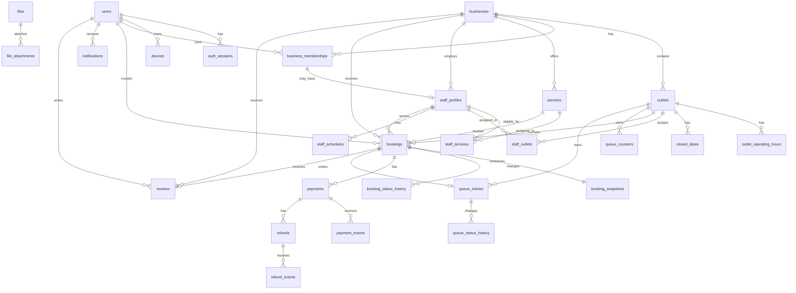

# AntreIn — Database Design

> **Document:** `docs/backend/database-design.md`  
> **Status:** Draft v1.0  
> **Product:** AntreIn  
> **Database:** PostgreSQL  
> **ORM:** Prisma  
> **Architecture:** Modular Monolith  
> **Primary Currency:** IDR  
> **Primary Timezone:** `Asia/Jakarta`  
> **Document Language:** English  
> **Last Updated:** 2026-07-21

---

## 1. Document Purpose

This document defines the relational database design for the AntreIn backend.

It translates the product, architecture, API contract, and backend brief into concrete data structures, relationships, constraints, indexes, concurrency controls, migration rules, and retention expectations.

This document must be read together with:

- `docs/00-product-brief.md`
- `docs/01-system-architecture.md`
- `docs/02-api-contract.md`
- `docs/backend/backend-brief.md`
- `docs/backend/authentication.md`
- `docs/backend/booking-payment.md`
- `docs/backend/realtime-queue.md`

This document answers:

- Which tables are required?
- Which module owns each table?
- Which relationships and constraints protect correctness?
- How are booking conflicts prevented?
- How are queue numbers generated safely?
- How are idempotency, outbox delivery, and audit history stored?
- Which indexes support the MVP query patterns?
- How should Prisma map to PostgreSQL?
- How should migrations evolve safely?

---

## 2. Database Goals

The database design must:

1. Preserve booking, payment, and queue correctness.
2. Remain understandable for a solo developer.
3. Support the modular-monolith boundaries.
4. Enforce critical invariants at database level.
5. Support concurrency-safe transactions.
6. Preserve historical records when configuration changes.
7. Support reliable audit and webhook processing.
8. Support predictable API query patterns.
9. Avoid premature denormalization.
10. Remain compatible with future multi-outlet growth.
11. Support safe migration and backup.
12. Prevent accidental exposure across businesses.

---

## 3. Design Principles

### 3.1 PostgreSQL Is the Durable Source of Truth

Durable state is stored in PostgreSQL, including:

- Authentication sessions.
- Business configuration.
- Booking state.
- Payment state.
- Queue state.
- Notification records.
- Audit records.
- Idempotency records.
- Outbox events.

Redis is never the only copy of durable business state.

### 3.2 Database Constraints Protect Business Invariants

Application validation improves error messages, but database constraints remain the final protection against race conditions.

Critical examples:

- Unique email.
- Unique active staff membership.
- Unique provider event ID.
- Unique queue number per outlet and business date.
- One active queue entry per booking.
- One review per booking.
- Refund amount cannot be negative.
- Monetary values cannot be negative.
- Duplicate idempotency keys cannot execute twice.

### 3.3 Historical Records Use Snapshots

Bookings preserve service and price snapshots.

Historical data must not change when:

- Service price changes.
- Service duration changes.
- Staff display name changes.
- Business address changes.
- Deposit policy changes.

### 3.4 Derived State Is Not Persisted Without Need

Do not persist every possible appointment slot.

Availability is derived from:

- Operating hours.
- Staff schedules.
- Breaks.
- Closed dates.
- Active bookings.

Persist derived aggregates only after measured performance need.

### 3.5 Soft Delete Is Selective

Soft deletion is used only when records must disappear from active workflows while preserving history.

Prefer explicit states such as:

```text
active
inactive
archived
cancelled
revoked
```

### 3.6 Money Uses Integer Values

All monetary values use integer IDR units.

```text
IDR 50,000 → 50000
```

No floating-point money columns.

### 3.7 Time Is Explicit

Use:

- `timestamptz` for event timestamps.
- `date` for business dates.
- `time` for recurring operating periods.
- IANA timezone strings for outlets.

---

## 4. Naming Conventions

### 4.1 Tables and Columns

Use `snake_case`.

Examples:

```text
business_memberships
payment_events
created_at
provider_reference
```

### 4.2 Primary Keys

Public IDs use opaque strings or UUID-compatible values.

Recommended logical format:

```text
usr_...
biz_...
out_...
svc_...
bkg_...
pay_...
que_...
```

Database column type options:

```text
text
uuid
```

For the MVP, one consistent strategy must be chosen before implementation.

### 4.3 Foreign Keys

Use:

```text
<resource>_id
```

Examples:

```text
business_id
outlet_id
booking_id
```

### 4.4 Timestamps

Common timestamps:

```text
created_at
updated_at
deleted_at
archived_at
revoked_at
processed_at
```

### 4.5 Boolean Columns

Use clear positive names:

```text
is_active
is_read
is_verified
```

Avoid double-negative names.

---

## 5. Schema Ownership by Module

| Module | Tables |
|---|---|
| Auth | `auth_sessions`, `password_reset_tokens` |
| Users | `users`, `user_notification_preferences`, `devices` |
| Businesses | `businesses`, `business_policies`, `outlets` |
| Memberships | `business_memberships`, `staff_invitations` |
| Services | `services`, `staff_services` |
| Staff | `staff_profiles`, `staff_outlets` |
| Schedules | `outlet_operating_hours`, `staff_schedules`, `staff_schedule_breaks`, `closed_dates` |
| Bookings | `bookings`, `booking_snapshots`, `booking_status_history` |
| Payments | `payments`, `payment_events`, `refunds`, `refund_events` |
| Queues | `queue_counters`, `queue_entries`, `queue_status_history`, `queue_reorders` |
| Notifications | `notifications`, `notification_deliveries` |
| Reviews | `reviews` |
| Files | `files`, `file_attachments` |
| Audit | `audit_logs` |
| Platform | `idempotency_keys`, `outbox_events` |
| Reporting | Primarily read queries; no mandatory MVP table |

---

## 6. High-Level Entity Relationship Diagram



---

## 7. Common Column Pattern

Most mutable entities should include:

```sql
id text primary key,
created_at timestamptz not null default now(),
updated_at timestamptz not null default now()
```

Where optimistic concurrency is useful:

```sql
version integer not null default 1
```

Where archival is required:

```sql
archived_at timestamptz null
```

`updated_at` should be maintained by application logic or a database trigger, but one strategy must be used consistently.

---

# Part I — Identity and Authentication

## 8. Users Table

```sql
create table users (
    id text primary key,
    email text not null,
    email_normalized text not null,
    phone_number text null,
    phone_number_normalized text null,
    password_hash text not null,
    name text not null,
    avatar_file_id text null,
    status text not null default 'active',
    email_verified_at timestamptz null,
    phone_verified_at timestamptz null,
    last_login_at timestamptz null,
    created_at timestamptz not null default now(),
    updated_at timestamptz not null default now()
);
```

Recommended status values:

```text
active
inactive
suspended
deleted
```

Constraints:

```sql
alter table users
add constraint users_status_check
check (status in ('active', 'inactive', 'suspended', 'deleted'));
```

Unique indexes:

```sql
create unique index users_email_normalized_uq
on users(email_normalized);

create unique index users_phone_normalized_uq
on users(phone_number_normalized)
where phone_number_normalized is not null;
```

Rules:

- Preserve original email for display.
- Use normalized email for uniqueness.
- Password hash is never exposed.
- Deleted accounts should follow a retention/anonymization policy.
- Avatar reference is validated through the file module.

---

## 9. User Notification Preferences

```sql
create table user_notification_preferences (
    user_id text primary key references users(id) on delete cascade,
    booking_updates boolean not null default true,
    payment_updates boolean not null default true,
    queue_updates boolean not null default true,
    marketing boolean not null default false,
    created_at timestamptz not null default now(),
    updated_at timestamptz not null default now()
);
```

One row per user.

The application may create this row during registration or lazily on first read.

---

## 10. Authentication Sessions

```sql
create table auth_sessions (
    id text primary key,
    user_id text not null references users(id) on delete cascade,
    device_id text null,
    refresh_token_hash text not null,
    token_family_id text not null,
    parent_session_id text null references auth_sessions(id),
    status text not null default 'active',
    issued_at timestamptz not null,
    expires_at timestamptz not null,
    last_used_at timestamptz null,
    revoked_at timestamptz null,
    revoked_reason text null,
    ip_address inet null,
    user_agent text null,
    created_at timestamptz not null default now(),
    updated_at timestamptz not null default now()
);
```

Status values:

```text
active
rotated
revoked
expired
compromised
```

Constraints:

```sql
alter table auth_sessions
add constraint auth_sessions_status_check
check (status in ('active', 'rotated', 'revoked', 'expired', 'compromised'));

alter table auth_sessions
add constraint auth_sessions_expiry_check
check (expires_at > issued_at);
```

Indexes:

```sql
create index auth_sessions_user_status_idx
on auth_sessions(user_id, status);

create index auth_sessions_family_idx
on auth_sessions(token_family_id);

create index auth_sessions_expires_idx
on auth_sessions(expires_at)
where status = 'active';
```

Rules:

- Store refresh-token hashes, not raw tokens.
- Rotation creates a new session record or updates a chain according to the chosen strategy.
- Reuse detection can revoke the token family.
- Access-token revocation may depend on session status.

---

## 11. Password Reset Tokens

```sql
create table password_reset_tokens (
    id text primary key,
    user_id text not null references users(id) on delete cascade,
    token_hash text not null,
    expires_at timestamptz not null,
    used_at timestamptz null,
    created_at timestamptz not null default now()
);
```

Unique index:

```sql
create unique index password_reset_tokens_hash_uq
on password_reset_tokens(token_hash);
```

Cleanup index:

```sql
create index password_reset_tokens_expires_idx
on password_reset_tokens(expires_at)
where used_at is null;
```

Rules:

- Token is single-use.
- Token is stored hashed.
- Password reset should revoke relevant sessions.

---

## 12. Devices

```sql
create table devices (
    id text primary key,
    user_id text not null references users(id) on delete cascade,
    platform text not null,
    app_version text null,
    device_name text null,
    push_provider text null,
    push_token text null,
    locale text null,
    timezone text null,
    status text not null default 'active',
    last_seen_at timestamptz null,
    created_at timestamptz not null default now(),
    updated_at timestamptz not null default now()
);
```

Constraints:

```sql
alter table devices
add constraint devices_platform_check
check (platform in ('android', 'ios'));

alter table devices
add constraint devices_status_check
check (status in ('active', 'inactive', 'invalid'));
```

Indexes:

```sql
create index devices_user_status_idx
on devices(user_id, status);

create unique index devices_provider_token_uq
on devices(push_provider, push_token)
where push_token is not null;
```

Rules:

- A device ID belongs to one current user.
- Logout may remove or deactivate the push token.
- Invalid provider tokens are marked `invalid`.

---

# Part II — Business and Membership

## 13. Businesses

```sql
create table businesses (
    id text primary key,
    owner_user_id text not null references users(id),
    name text not null,
    slug text not null,
    description text null,
    logo_file_id text null,
    status text not null default 'pending_verification',
    timezone text not null default 'Asia/Jakarta',
    verified_at timestamptz null,
    suspended_at timestamptz null,
    created_at timestamptz not null default now(),
    updated_at timestamptz not null default now()
);
```

Status values:

```text
pending_verification
active
suspended
rejected
inactive
```

Constraints:

```sql
alter table businesses
add constraint businesses_status_check
check (status in (
    'pending_verification',
    'active',
    'suspended',
    'rejected',
    'inactive'
));
```

Unique index:

```sql
create unique index businesses_slug_uq
on businesses(slug);
```

Indexes:

```sql
create index businesses_status_idx
on businesses(status);

create index businesses_owner_idx
on businesses(owner_user_id);
```

Rules:

- `owner_user_id` identifies the original owner.
- Permissions still come through memberships.
- Business verification status controls public discovery according to policy.

---

## 14. Business Policies

```sql
create table business_policies (
    business_id text primary key references businesses(id) on delete cascade,
    minimum_lead_minutes integer not null default 60,
    maximum_advance_days integer not null default 30,
    automatic_confirmation boolean not null default true,
    allow_pay_at_location boolean not null default true,
    allow_full_payment boolean not null default false,
    allow_deposit boolean not null default false,
    default_deposit_type text not null default 'none',
    default_deposit_value integer not null default 0,
    full_refund_before_minutes integer not null default 360,
    partial_refund_before_minutes integer not null default 120,
    partial_refund_percentage integer not null default 50,
    no_show_refund_percentage integer not null default 0,
    check_in_early_minutes integer not null default 30,
    check_in_late_minutes integer not null default 15,
    created_at timestamptz not null default now(),
    updated_at timestamptz not null default now()
);
```

Constraints:

```sql
alter table business_policies
add constraint business_policies_non_negative_check
check (
    minimum_lead_minutes >= 0
    and maximum_advance_days >= 0
    and default_deposit_value >= 0
    and full_refund_before_minutes >= 0
    and partial_refund_before_minutes >= 0
    and check_in_early_minutes >= 0
    and check_in_late_minutes >= 0
);

alter table business_policies
add constraint business_policies_percentage_check
check (
    partial_refund_percentage between 0 and 100
    and no_show_refund_percentage between 0 and 100
);

alter table business_policies
add constraint business_policies_deposit_type_check
check (default_deposit_type in ('none', 'fixed', 'percentage'));
```

Rules:

- Service-specific deposit configuration may override default policy.
- Policy changes do not retroactively alter booking snapshots.

---

## 15. Outlets

```sql
create table outlets (
    id text primary key,
    business_id text not null references businesses(id) on delete cascade,
    name text not null,
    phone_number text null,
    timezone text not null default 'Asia/Jakarta',
    address_formatted text not null,
    latitude numeric(9,6) null,
    longitude numeric(9,6) null,
    status text not null default 'active',
    queue_prefix text not null default 'A',
    created_at timestamptz not null default now(),
    updated_at timestamptz not null default now()
);
```

Constraints:

```sql
alter table outlets
add constraint outlets_status_check
check (status in ('active', 'inactive'));

alter table outlets
add constraint outlets_latitude_check
check (latitude is null or latitude between -90 and 90);

alter table outlets
add constraint outlets_longitude_check
check (longitude is null or longitude between -180 and 180);
```

Indexes:

```sql
create index outlets_business_status_idx
on outlets(business_id, status);
```

MVP rule:

- One active outlet per business initially.
- The schema supports more outlets later.

Optional MVP constraint:

```sql
create unique index outlets_one_active_mvp_uq
on outlets(business_id)
where status = 'active';
```

This constraint should be removed before multi-outlet release.

---

## 16. Business Memberships

```sql
create table business_memberships (
    id text primary key,
    business_id text not null references businesses(id) on delete cascade,
    user_id text not null references users(id) on delete cascade,
    role text not null,
    permissions jsonb not null default '[]'::jsonb,
    status text not null default 'active',
    joined_at timestamptz null,
    created_at timestamptz not null default now(),
    updated_at timestamptz not null default now()
);
```

Role values:

```text
owner
manager
barber
front_desk
cashier
```

Status values:

```text
invited
active
inactive
suspended
```

Constraints:

```sql
alter table business_memberships
add constraint business_memberships_role_check
check (role in ('owner', 'manager', 'barber', 'front_desk', 'cashier'));

alter table business_memberships
add constraint business_memberships_status_check
check (status in ('invited', 'active', 'inactive', 'suspended'));
```

Unique index:

```sql
create unique index business_memberships_business_user_uq
on business_memberships(business_id, user_id);
```

Indexes:

```sql
create index business_memberships_user_status_idx
on business_memberships(user_id, status);

create index business_memberships_business_status_idx
on business_memberships(business_id, status);
```

Permission storage options:

1. `jsonb` array for MVP simplicity.
2. Normalized permission tables for more complex future needs.

MVP preference: `jsonb` plus application validation.

---

## 17. Staff Invitations

```sql
create table staff_invitations (
    id text primary key,
    business_id text not null references businesses(id) on delete cascade,
    email_normalized text not null,
    display_name text not null,
    role text not null,
    permissions jsonb not null default '[]'::jsonb,
    token_hash text not null,
    status text not null default 'pending',
    invited_by_user_id text not null references users(id),
    expires_at timestamptz not null,
    accepted_at timestamptz null,
    accepted_by_user_id text null references users(id),
    created_at timestamptz not null default now(),
    updated_at timestamptz not null default now()
);
```

Status values:

```text
pending
accepted
expired
revoked
```

Constraints and indexes:

```sql
create unique index staff_invitations_token_hash_uq
on staff_invitations(token_hash);

create unique index staff_invitations_pending_business_email_uq
on staff_invitations(business_id, email_normalized)
where status = 'pending';

create index staff_invitations_expires_idx
on staff_invitations(expires_at)
where status = 'pending';
```

---

# Part III — Staff and Services

## 18. Staff Profiles

```sql
create table staff_profiles (
    id text primary key,
    business_id text not null references businesses(id) on delete cascade,
    membership_id text not null unique references business_memberships(id) on delete cascade,
    display_name text not null,
    avatar_file_id text null,
    staff_type text not null default 'barber',
    status text not null default 'active',
    rating_average numeric(3,2) not null default 0,
    rating_count integer not null default 0,
    created_at timestamptz not null default now(),
    updated_at timestamptz not null default now()
);
```

Constraints:

```sql
alter table staff_profiles
add constraint staff_profiles_status_check
check (status in ('active', 'inactive', 'suspended'));

alter table staff_profiles
add constraint staff_profiles_rating_check
check (
    rating_average between 0 and 5
    and rating_count >= 0
);
```

Indexes:

```sql
create index staff_profiles_business_status_idx
on staff_profiles(business_id, status);
```

Rules:

- Staff profile and membership are separate.
- Membership owns authorization.
- Staff profile owns service-facing staff information.

---

## 19. Staff Outlet Assignments

```sql
create table staff_outlets (
    staff_id text not null references staff_profiles(id) on delete cascade,
    outlet_id text not null references outlets(id) on delete cascade,
    created_at timestamptz not null default now(),
    primary key (staff_id, outlet_id)
);
```

The application must verify both records belong to the same business.

A database trigger could enforce same-business ownership, but MVP may enforce it transactionally in the application.

---

## 20. Services

```sql
create table services (
    id text primary key,
    business_id text not null references businesses(id) on delete cascade,
    name text not null,
    name_normalized text not null,
    description text null,
    image_file_id text null,
    duration_minutes integer not null,
    price_amount integer not null,
    currency text not null default 'IDR',
    deposit_type text not null default 'none',
    deposit_value integer not null default 0,
    status text not null default 'active',
    sort_order integer not null default 0,
    created_at timestamptz not null default now(),
    updated_at timestamptz not null default now()
);
```

Constraints:

```sql
alter table services
add constraint services_duration_check
check (duration_minutes > 0);

alter table services
add constraint services_price_check
check (price_amount >= 0);

alter table services
add constraint services_currency_check
check (currency = 'IDR');

alter table services
add constraint services_deposit_type_check
check (deposit_type in ('none', 'fixed', 'percentage'));

alter table services
add constraint services_deposit_value_check
check (
    deposit_value >= 0
    and (
        deposit_type <> 'percentage'
        or deposit_value between 0 and 100
    )
);

alter table services
add constraint services_status_check
check (status in ('active', 'inactive', 'archived'));
```

Unique index:

```sql
create unique index services_business_name_active_uq
on services(business_id, name_normalized)
where status <> 'archived';
```

Indexes:

```sql
create index services_business_status_sort_idx
on services(business_id, status, sort_order);
```

---

## 21. Staff Service Eligibility

```sql
create table staff_services (
    staff_id text not null references staff_profiles(id) on delete cascade,
    service_id text not null references services(id) on delete cascade,
    created_at timestamptz not null default now(),
    primary key (staff_id, service_id)
);
```

The application must verify both belong to the same business.

---

# Part IV — Scheduling

## 22. Outlet Operating Hours

```sql
create table outlet_operating_hours (
    id text primary key,
    outlet_id text not null references outlets(id) on delete cascade,
    day_of_week smallint not null,
    period_order smallint not null default 0,
    opens_at time null,
    closes_at time null,
    is_closed boolean not null default false,
    created_at timestamptz not null default now(),
    updated_at timestamptz not null default now()
);
```

Day values:

```text
0 = Sunday
1 = Monday
...
6 = Saturday
```

Constraints:

```sql
alter table outlet_operating_hours
add constraint outlet_operating_hours_day_check
check (day_of_week between 0 and 6);

alter table outlet_operating_hours
add constraint outlet_operating_hours_time_check
check (
    (is_closed = true and opens_at is null and closes_at is null)
    or
    (is_closed = false and opens_at is not null and closes_at is not null and opens_at < closes_at)
);
```

Unique index:

```sql
create unique index outlet_operating_hours_period_uq
on outlet_operating_hours(outlet_id, day_of_week, period_order);
```

Overlapping periods must be rejected by application validation or a future exclusion constraint.

---

## 23. Staff Schedules

```sql
create table staff_schedules (
    id text primary key,
    staff_id text not null references staff_profiles(id) on delete cascade,
    day_of_week smallint not null,
    period_order smallint not null default 0,
    starts_at time null,
    ends_at time null,
    is_available boolean not null default true,
    created_at timestamptz not null default now(),
    updated_at timestamptz not null default now()
);
```

Constraints:

```sql
alter table staff_schedules
add constraint staff_schedules_day_check
check (day_of_week between 0 and 6);

alter table staff_schedules
add constraint staff_schedules_time_check
check (
    (is_available = false and starts_at is null and ends_at is null)
    or
    (is_available = true and starts_at is not null and ends_at is not null and starts_at < ends_at)
);
```

Unique index:

```sql
create unique index staff_schedules_period_uq
on staff_schedules(staff_id, day_of_week, period_order);
```

---

## 24. Staff Schedule Breaks

```sql
create table staff_schedule_breaks (
    id text primary key,
    staff_schedule_id text not null references staff_schedules(id) on delete cascade,
    starts_at time not null,
    ends_at time not null,
    created_at timestamptz not null default now()
);
```

Constraint:

```sql
alter table staff_schedule_breaks
add constraint staff_schedule_breaks_time_check
check (starts_at < ends_at);
```

Breaks must remain inside their parent schedule period.

Application validation is required.

---

## 25. Closed Dates

```sql
create table closed_dates (
    id text primary key,
    outlet_id text not null references outlets(id) on delete cascade,
    closed_date date not null,
    reason text null,
    created_by_user_id text not null references users(id),
    created_at timestamptz not null default now()
);
```

Unique index:

```sql
create unique index closed_dates_outlet_date_uq
on closed_dates(outlet_id, closed_date);
```

Index:

```sql
create index closed_dates_date_idx
on closed_dates(closed_date);
```

Rules:

- Creating a closed date that affects active bookings requires explicit product behavior.
- Do not silently invalidate confirmed bookings.

---

# Part V — Bookings

## 26. Bookings

```sql
create table bookings (
    id text primary key,
    booking_code text not null,
    customer_user_id text null references users(id),
    business_id text not null references businesses(id),
    outlet_id text not null references outlets(id),
    service_id text not null references services(id),
    staff_id text null references staff_profiles(id),
    booking_type text not null,
    status text not null,
    scheduled_at timestamptz null,
    expected_ends_at timestamptz null,
    checked_in_at timestamptz null,
    customer_notes text null,
    internal_notes text null,
    walk_in_customer_name text null,
    walk_in_phone_number text null,
    payment_option text not null,
    business_date date not null,
    version integer not null default 1,
    cancelled_at timestamptz null,
    completed_at timestamptz null,
    no_show_at timestamptz null,
    created_by_user_id text null references users(id),
    created_at timestamptz not null default now(),
    updated_at timestamptz not null default now()
);
```

Booking type values:

```text
scheduled
walk_in
```

Status values:

```text
draft
pending_payment
confirmed
checked_in
waiting
called
in_service
completed
cancelled
expired
no_show
```

Payment option values:

```text
pay_at_location
full_payment
deposit
```

Constraints:

```sql
alter table bookings
add constraint bookings_type_check
check (booking_type in ('scheduled', 'walk_in'));

alter table bookings
add constraint bookings_status_check
check (status in (
    'draft',
    'pending_payment',
    'confirmed',
    'checked_in',
    'waiting',
    'called',
    'in_service',
    'completed',
    'cancelled',
    'expired',
    'no_show'
));

alter table bookings
add constraint bookings_payment_option_check
check (payment_option in ('pay_at_location', 'full_payment', 'deposit'));

alter table bookings
add constraint bookings_schedule_check
check (
    (booking_type = 'walk_in')
    or
    (booking_type = 'scheduled' and scheduled_at is not null and expected_ends_at is not null)
);

alter table bookings
add constraint bookings_time_order_check
check (
    scheduled_at is null
    or expected_ends_at is null
    or scheduled_at < expected_ends_at
);
```

Unique indexes:

```sql
-- Per-business uniqueness: booking codes are per-business daily sequences with
-- a shared ANT- prefix (ADR 0038), so identical codes across businesses are
-- expected. Codes are display-only and never authorization.
create unique index bookings_code_uq
on bookings(business_id, booking_code);
```

Core indexes:

```sql
create index bookings_customer_created_idx
on bookings(customer_user_id, created_at desc);

create index bookings_business_date_idx
on bookings(business_id, business_date, status);

create index bookings_outlet_date_idx
on bookings(outlet_id, business_date, status);

create index bookings_staff_schedule_idx
on bookings(staff_id, scheduled_at, expected_ends_at)
where staff_id is not null;

create index bookings_status_scheduled_idx
on bookings(status, scheduled_at);
```

---

## 27. Booking Active Statuses

Statuses that block staff overlap:

```text
pending_payment
confirmed
checked_in
waiting
called
in_service
```

Terminal statuses:

```text
completed
cancelled
expired
no_show
```

This active-status definition must be centralized in code and migrations.

---

## 28. Booking Overlap Protection

PostgreSQL exclusion constraints are recommended for staff overlap.

Required extension:

```sql
create extension if not exists btree_gist;
```

Recommended derived range column:

```sql
alter table bookings
add column schedule_range tstzrange
generated always as (
    case
        when scheduled_at is null or expected_ends_at is null then null
        else tstzrange(scheduled_at, expected_ends_at, '[)')
    end
) stored;
```

Recommended exclusion constraint:

```sql
alter table bookings
add constraint bookings_staff_schedule_excl
exclude using gist (
    staff_id with =,
    schedule_range with &&
)
where (
    staff_id is not null
    and schedule_range is not null
    and status in (
        'pending_payment',
        'confirmed',
        'checked_in',
        'waiting',
        'called',
        'in_service'
    )
);
```

Important implementation note:

PostgreSQL partial exclusion constraints with mutable status values may require careful migration and ORM handling.

Alternative implementation:

- Separate `booking_reservations` table containing only active reservations.
- Insert/remove reservation rows transactionally with booking state changes.
- Apply exclusion constraint on that table.

Recommended MVP choice should be validated with Prisma migration support before implementation.

---

## 29. Booking Snapshots

```sql
create table booking_snapshots (
    booking_id text primary key references bookings(id) on delete cascade,
    business_name text not null,
    outlet_name text not null,
    outlet_address_formatted text not null,
    outlet_timezone text not null,
    service_name text not null,
    service_duration_minutes integer not null,
    service_price_amount integer not null,
    currency text not null,
    deposit_type text not null,
    deposit_value integer not null,
    required_payment_amount integer not null,
    staff_name text null,
    cancellation_policy jsonb not null,
    created_at timestamptz not null default now()
);
```

Constraints:

```sql
alter table booking_snapshots
add constraint booking_snapshots_amount_check
check (
    service_price_amount >= 0
    and deposit_value >= 0
    and required_payment_amount >= 0
);

alter table booking_snapshots
add constraint booking_snapshots_currency_check
check (currency = 'IDR');
```

Snapshot rows are immutable after booking creation except for strictly defined corrections.

---

## 30. Booking Status History

```sql
create table booking_status_history (
    id text primary key,
    booking_id text not null references bookings(id) on delete cascade,
    from_status text null,
    to_status text not null,
    actor_user_id text null references users(id),
    actor_type text not null,
    reason_code text null,
    reason text null,
    metadata jsonb not null default '{}'::jsonb,
    request_id text null,
    created_at timestamptz not null default now()
);
```

Actor types:

```text
customer
staff
system
admin
payment_provider
```

Indexes:

```sql
create index booking_status_history_booking_created_idx
on booking_status_history(booking_id, created_at);

create index booking_status_history_request_idx
on booking_status_history(request_id)
where request_id is not null;
```

History is append-only.

---

## 31. Booking Code Strategy

Booking code example:

```text
ANT-20260722-0012
```

Do not rely on booking code for authorization.

Options:

1. Daily sequence per platform.
2. Daily sequence per business.
3. Random human-readable code.

Recommended MVP:

- Opaque ID for system identity.
- Separate human-readable booking code.
- Unique database constraint.

---

# Part VI — Payments and Refunds

## 32. Payments

```sql
create table payments (
    id text primary key,
    booking_id text not null references bookings(id),
    business_id text not null references businesses(id),
    customer_user_id text null references users(id),
    provider text not null,
    provider_reference text null,
    payment_option text not null,
    method text null,
    status text not null,
    amount integer not null,
    currency text not null default 'IDR',
    checkout jsonb null,
    provider_creation_attempts integer not null default 0,
    provider_creation_last_error text null,
    expires_at timestamptz null,
    paid_at timestamptz null,
    failed_at timestamptz null,
    cancelled_at timestamptz null,
    version integer not null default 1,
    created_at timestamptz not null default now(),
    updated_at timestamptz not null default now()
);
```

Provider-creation columns (ADR 0040): `checkout` stores the normalized checkout
instruction (`{"type": "redirect_url", "url": ...}`) persisted after provider
creation; `provider_creation_attempts`/`provider_creation_last_error` track
customer-driven retries. A payment with attempts > 0 and no
`provider_reference` is a retryable creation failure — there is no separate
`provider_creation_status` column because the state is derivable.

Provider values:

```text
pay_at_location
midtrans
xendit
sandbox
```

Status values:

```text
pending
paid
failed
expired
cancelled
refund_pending
partially_refunded
refunded
```

Constraints:

```sql
alter table payments
add constraint payments_status_check
check (status in (
    'pending',
    'paid',
    'failed',
    'expired',
    'cancelled',
    'refund_pending',
    'partially_refunded',
    'refunded'
));

alter table payments
add constraint payments_amount_check
check (amount >= 0);

alter table payments
add constraint payments_currency_check
check (currency = 'IDR');

alter table payments
add constraint payments_option_check
check (payment_option in ('pay_at_location', 'full_payment', 'deposit'));
```

Unique indexes:

```sql
create unique index payments_provider_reference_uq
on payments(provider, provider_reference)
where provider_reference is not null;
```

Indexes:

```sql
create index payments_booking_created_idx
on payments(booking_id, created_at);

create index payments_business_status_idx
on payments(business_id, status, created_at);

create index payments_expiry_idx
on payments(expires_at)
where status = 'pending' and expires_at is not null;
```

---

## 33. Payment Events

```sql
create table payment_events (
    id text primary key,
    payment_id text null references payments(id),
    provider text not null,
    provider_event_id text not null,
    event_type text not null,
    signature_valid boolean not null,
    amount integer null,
    currency text null,
    payload jsonb not null,
    processing_status text not null default 'received',
    processing_error_code text null,
    processed_at timestamptz null,
    created_at timestamptz not null default now()
);
```

Processing statuses:

```text
received
processed
ignored
failed
manual_review
```

Unique index:

```sql
create unique index payment_events_provider_event_uq
on payment_events(provider, provider_event_id);
```

Indexes:

```sql
create index payment_events_payment_created_idx
on payment_events(payment_id, created_at);

create index payment_events_status_created_idx
on payment_events(processing_status, created_at);
```

Rules:

- Duplicate provider events are prevented by unique constraint.
- Raw payload must be redacted or encrypted when necessary.
- Invalid-signature payloads may be logged minimally rather than fully retained.

---

## 34. Refunds

```sql
create table refunds (
    id text primary key,
    payment_id text not null references payments(id),
    booking_id text not null references bookings(id),
    business_id text not null references businesses(id),
    requested_by_user_id text null references users(id),
    provider_reference text null,
    status text not null,
    amount integer not null,
    currency text not null default 'IDR',
    reason_code text not null,
    reason text null,
    requested_at timestamptz not null,
    processed_at timestamptz null,
    failed_at timestamptz null,
    version integer not null default 1,
    created_at timestamptz not null default now(),
    updated_at timestamptz not null default now()
);
```

Status values:

```text
refund_pending
partially_refunded
refunded
failed
cancelled
```

Constraints:

```sql
alter table refunds
add constraint refunds_amount_check
check (amount > 0);

alter table refunds
add constraint refunds_currency_check
check (currency = 'IDR');

alter table refunds
add constraint refunds_status_check
check (status in (
    'refund_pending',
    'partially_refunded',
    'refunded',
    'failed',
    'cancelled'
));
```

Unique index:

```sql
create unique index refunds_provider_reference_uq
on refunds(provider_reference)
where provider_reference is not null;
```

Indexes:

```sql
create index refunds_payment_created_idx
on refunds(payment_id, created_at);

create index refunds_business_status_idx
on refunds(business_id, status, created_at);
```

The application must ensure total successful/pending refunds do not exceed paid amount.

This may require transaction locking on the payment row.

---

## 35. Refund Events

```sql
create table refund_events (
    id text primary key,
    refund_id text null references refunds(id),
    provider text not null,
    provider_event_id text not null,
    event_type text not null,
    payload jsonb not null,
    processing_status text not null default 'received',
    processed_at timestamptz null,
    created_at timestamptz not null default now()
);
```

Unique index:

```sql
create unique index refund_events_provider_event_uq
on refund_events(provider, provider_event_id);
```

---

## 36. Payment Balance Calculation

Booking payment summary is derived from:

```text
Total service price
- successful paid payment amounts
+ successful refund amounts
```

Recommended query concept:

```text
paid_amount = sum(payments.amount where status in paid/refund states as applicable)
refunded_amount = sum(refunds.amount where status in refunded states)
net_paid = paid_amount - refunded_amount
remaining = total - net_paid
```

The exact status accounting must be centralized in the payment module.

Do not store a mutable `remaining_amount` unless performance requires it.

---

# Part VII — Queue

## 37. Queue Counters

```sql
create table queue_counters (
    outlet_id text not null references outlets(id) on delete cascade,
    business_date date not null,
    last_number integer not null default 0,
    version integer not null default 1,
    updated_at timestamptz not null default now(),
    primary key (outlet_id, business_date)
);
```

Constraint:

```sql
alter table queue_counters
add constraint queue_counters_number_check
check (last_number >= 0);
```

Generation flow:

```sql
insert into queue_counters(outlet_id, business_date, last_number)
values ($1, $2, 1)
on conflict (outlet_id, business_date)
do update set
    last_number = queue_counters.last_number + 1,
    version = queue_counters.version + 1,
    updated_at = now()
returning last_number;
```

This supports atomic queue-number generation.

---

## 38. Queue Entries

```sql
create table queue_entries (
    id text primary key,
    booking_id text not null references bookings(id),
    business_id text not null references businesses(id),
    outlet_id text not null references outlets(id),
    staff_id text null references staff_profiles(id),
    business_date date not null,
    queue_number integer not null,
    display_number text not null,
    status text not null,
    sort_order integer not null,
    checked_in_at timestamptz not null,
    called_at timestamptz null,
    last_recalled_at timestamptz null,
    recall_count integer not null default 0,
    service_started_at timestamptz null,
    completed_at timestamptz null,
    no_show_at timestamptz null,
    cancelled_at timestamptz null,
    version integer not null default 1,
    created_at timestamptz not null default now(),
    updated_at timestamptz not null default now()
);
```

Status values:

```text
waiting
called
skipped
in_service
completed
cancelled
no_show
```

Constraints:

```sql
alter table queue_entries
add constraint queue_entries_status_check
check (status in (
    'waiting',
    'called',
    'skipped',
    'in_service',
    'completed',
    'cancelled',
    'no_show'
));

alter table queue_entries
add constraint queue_entries_number_check
check (queue_number > 0);

alter table queue_entries
add constraint queue_entries_recall_check
check (recall_count >= 0);
```

Unique indexes:

```sql
create unique index queue_entries_outlet_date_number_uq
on queue_entries(outlet_id, business_date, queue_number);

create unique index queue_entries_booking_uq
on queue_entries(booking_id);
```

Operational indexes:

```sql
create index queue_entries_outlet_date_status_idx
on queue_entries(outlet_id, business_date, status, sort_order, checked_in_at);

create index queue_entries_staff_status_idx
on queue_entries(staff_id, status)
where staff_id is not null;

create index queue_entries_updated_idx
on queue_entries(updated_at);
```

---

## 39. Queue Ordering

Default ordering:

```text
sort_order asc
checked_in_at asc
queue_number asc
```

**Resolved (ADR 0038): `sort_order integer`.** Initial `sort_order = queue_number`;
reorder rewrites the affected active rows transactionally and bumps
`queue_counters.version` (the aggregate queue version). Fractional/normalized
keys were rejected as unnecessary for barbershop-sized queues.

---

## 40. Queue Status History

```sql
create table queue_status_history (
    id text primary key,
    queue_entry_id text not null references queue_entries(id) on delete cascade,
    from_status text null,
    to_status text not null,
    actor_user_id text null references users(id),
    actor_type text not null,
    reason text null,
    metadata jsonb not null default '{}'::jsonb,
    request_id text null,
    created_at timestamptz not null default now()
);
```

Indexes:

```sql
create index queue_status_history_entry_created_idx
on queue_status_history(queue_entry_id, created_at);
```

History is append-only.

---

## 41. Queue Reorder Audit

```sql
create table queue_reorders (
    id text primary key,
    business_id text not null references businesses(id),
    outlet_id text not null references outlets(id),
    business_date date not null,
    actor_user_id text not null references users(id),
    previous_order jsonb not null,
    new_order jsonb not null,
    reason text not null,
    request_id text null,
    created_at timestamptz not null default now()
);
```

Indexes:

```sql
create index queue_reorders_outlet_date_idx
on queue_reorders(outlet_id, business_date, created_at);
```

---

# Part VIII — Notifications and Reviews

## 42. Notifications

```sql
create table notifications (
    id text primary key,
    user_id text not null references users(id) on delete cascade,
    notification_type text not null,
    title text not null,
    body text not null,
    resource_type text null,
    resource_id text null,
    is_read boolean not null default false,
    read_at timestamptz null,
    created_at timestamptz not null default now()
);
```

Indexes:

```sql
create index notifications_user_created_idx
on notifications(user_id, created_at desc);

create index notifications_user_unread_idx
on notifications(user_id, created_at desc)
where is_read = false;
```

Rules:

- Notification history is not the source of booking/payment truth.
- Notification resource references are intentionally not strict foreign keys because resource types vary.

---

## 43. Notification Deliveries

```sql
create table notification_deliveries (
    id text primary key,
    notification_id text not null references notifications(id) on delete cascade,
    device_id text null references devices(id) on delete set null,
    provider text not null,
    provider_message_id text null,
    status text not null,
    attempt_count integer not null default 0,
    last_error_code text null,
    sent_at timestamptz null,
    delivered_at timestamptz null,
    failed_at timestamptz null,
    created_at timestamptz not null default now(),
    updated_at timestamptz not null default now()
);
```

Status values:

```text
pending
sent
delivered
failed
invalid_device
```

Indexes:

```sql
create index notification_deliveries_status_idx
on notification_deliveries(status, created_at);

create index notification_deliveries_notification_idx
on notification_deliveries(notification_id);
```

---

## 44. Reviews

```sql
create table reviews (
    id text primary key,
    booking_id text not null references bookings(id),
    business_id text not null references businesses(id),
    customer_user_id text not null references users(id),
    staff_id text null references staff_profiles(id),
    rating smallint not null,
    comment text null,
    status text not null default 'published',
    moderated_at timestamptz null,
    moderated_by_user_id text null references users(id),
    created_at timestamptz not null default now(),
    updated_at timestamptz not null default now()
);
```

Constraints:

```sql
alter table reviews
add constraint reviews_rating_check
check (rating between 1 and 5);

alter table reviews
add constraint reviews_status_check
check (status in ('published', 'hidden', 'removed'));
```

Unique index:

```sql
create unique index reviews_booking_uq
on reviews(booking_id);
```

Indexes:

```sql
create index reviews_business_status_created_idx
on reviews(business_id, status, created_at desc);

create index reviews_staff_status_idx
on reviews(staff_id, status)
where staff_id is not null;
```

Rating aggregates may be recalculated transactionally or asynchronously.

---

# Part IX — Files

## 45. Files

```sql
create table files (
    id text primary key,
    owner_user_id text not null references users(id),
    purpose text not null,
    storage_provider text not null,
    storage_key text not null,
    mime_type text not null,
    size_bytes bigint not null,
    checksum text null,
    visibility text not null default 'private',
    status text not null default 'pending',
    original_filename text null,
    width integer null,
    height integer null,
    created_at timestamptz not null default now(),
    updated_at timestamptz not null default now(),
    deleted_at timestamptz null
);
```

Purpose values:

```text
customer_avatar
business_logo
business_gallery
staff_avatar
service_image
```

Status values:

```text
pending
ready
attached
failed
deleted
```

Constraints:

```sql
alter table files
add constraint files_size_check
check (size_bytes >= 0);

alter table files
add constraint files_visibility_check
check (visibility in ('private', 'public'));

alter table files
add constraint files_status_check
check (status in ('pending', 'ready', 'attached', 'failed', 'deleted'));
```

Unique index:

```sql
create unique index files_storage_key_uq
on files(storage_provider, storage_key);
```

Cleanup index:

```sql
create index files_unattached_cleanup_idx
on files(status, created_at)
where status in ('pending', 'ready', 'failed');
```

---

## 46. File Attachments

```sql
create table file_attachments (
    id text primary key,
    file_id text not null references files(id),
    resource_type text not null,
    resource_id text not null,
    attachment_role text not null,
    created_at timestamptz not null default now()
);
```

Unique index:

```sql
create unique index file_attachments_resource_role_uq
on file_attachments(resource_type, resource_id, attachment_role);
```

Examples:

```text
resource_type = business
attachment_role = logo
```

Application validation must enforce compatible purpose and ownership.

---

# Part X — Audit, Idempotency, and Outbox

## 47. Audit Logs

```sql
create table audit_logs (
    id text primary key,
    actor_user_id text null references users(id),
    actor_type text not null,
    actor_role text null,
    business_id text null references businesses(id),
    outlet_id text null references outlets(id),
    action text not null,
    resource_type text not null,
    resource_id text not null,
    before_data jsonb null,
    after_data jsonb null,
    reason text null,
    request_id text null,
    ip_address inet null,
    user_agent text null,
    created_at timestamptz not null default now()
);
```

Indexes:

```sql
create index audit_logs_resource_idx
on audit_logs(resource_type, resource_id, created_at);

create index audit_logs_business_created_idx
on audit_logs(business_id, created_at desc);

create index audit_logs_actor_created_idx
on audit_logs(actor_user_id, created_at desc)
where actor_user_id is not null;

create index audit_logs_request_idx
on audit_logs(request_id)
where request_id is not null;
```

Audit records are append-only.

Do not store secrets in `before_data` or `after_data`.

---

## 48. Idempotency Keys

```sql
create table idempotency_keys (
    id text primary key,
    scope_type text not null,
    scope_id text not null,
    action text not null,
    idempotency_key text not null,
    request_fingerprint text not null,
    status text not null,
    response_status integer null,
    response_body jsonb null,
    resource_type text null,
    resource_id text null,
    error_code text null,
    expires_at timestamptz not null,
    created_at timestamptz not null default now(),
    updated_at timestamptz not null default now()
);
```

Status values:

```text
processing
succeeded
failed_retryable
failed_final
```

Unique index:

```sql
create unique index idempotency_keys_scope_action_key_uq
on idempotency_keys(scope_type, scope_id, action, idempotency_key);
```

Cleanup index:

```sql
create index idempotency_keys_expiry_idx
on idempotency_keys(expires_at);
```

Rules:

- Response bodies may require size limits.
- Sensitive responses must not be stored unredacted.
- Processing rows must have timeout recovery.

---

## 49. Outbox Events

```sql
create table outbox_events (
    id text primary key,
    event_type text not null,
    aggregate_type text not null,
    aggregate_id text not null,
    payload jsonb not null,
    status text not null default 'pending',
    attempt_count integer not null default 0,
    next_attempt_at timestamptz not null default now(),
    claimed_at timestamptz null,
    claimed_by text null,
    processed_at timestamptz null,
    last_error text null,
    created_at timestamptz not null default now()
);
```

Status values:

```text
pending
processing
processed
failed
dead_letter
```

Constraints:

```sql
alter table outbox_events
add constraint outbox_events_attempt_check
check (attempt_count >= 0);

alter table outbox_events
add constraint outbox_events_status_check
check (status in ('pending', 'processing', 'processed', 'failed', 'dead_letter'));
```

Worker index:

```sql
create index outbox_events_due_idx
on outbox_events(status, next_attempt_at, created_at)
where status in ('pending', 'failed');
```

Aggregate index:

```sql
create index outbox_events_aggregate_idx
on outbox_events(aggregate_type, aggregate_id, created_at);
```

---

## 50. Outbox Claim Query

Conceptual query:

```sql
with claimed as (
    select id
    from outbox_events
    where status in ('pending', 'failed')
      and next_attempt_at <= now()
    order by created_at
    for update skip locked
    limit 100
)
update outbox_events o
set status = 'processing',
    claimed_at = now(),
    claimed_by = $1,
    attempt_count = attempt_count + 1
from claimed
where o.id = claimed.id
returning o.*;
```

The worker must recover stale `processing` rows.

---

# Part XI — Cross-Table Integrity

## 51. Same-Business Integrity

Several relationships require same-business validation:

- Outlet belongs to booking business.
- Service belongs to booking business.
- Staff belongs to booking business.
- Staff service belongs to one business.
- Staff outlet belongs to one business.
- Queue entry belongs to booking business and outlet.
- Payment business matches booking business.
- Refund business matches payment business.

Foreign keys alone do not guarantee these cross-column invariants.

Options:

1. Application transaction validation.
2. Composite foreign keys with duplicated business IDs.
3. Database triggers.

MVP recommendation:

- Duplicate `business_id` where query and scope benefit.
- Validate same-business relationships in application transactions.
- Add integration tests.
- Introduce composite constraints only where implementation remains manageable.

---

## 52. Ownership Integrity

Customer-owned resources:

- Booking.
- Payment.
- Notification.
- Review.

Authorization queries must include ownership checks.

Example:

```sql
select *
from bookings
where id = $1
  and customer_user_id = $2;
```

Do not fetch by ID and authorize only in Flutter.

---

## 53. Version Columns

Recommended on mutable concurrency-sensitive rows:

- `bookings`
- `payments`
- `refunds`
- `queue_entries`
- `queue_counters`

Update pattern:

```sql
update queue_entries
set status = $new_status,
    version = version + 1,
    updated_at = now()
where id = $id
  and version = $expected_version;
```

Zero rows updated means version conflict.

---

# Part XII — Index Strategy

## 54. Index Principles

Add indexes for:

- Foreign-key joins.
- Common filters.
- Pagination ordering.
- Active-state lookups.
- Worker queues.
- Expiration jobs.
- Concurrency constraints.

Avoid:

- Indexing every column.
- Large unused multi-column indexes.
- Duplicating indexes already covered by unique constraints.
- Indexing low-selectivity booleans without partial conditions.

---

## 55. Primary MVP Query Patterns

### Customer Booking History

```text
customer_user_id
created_at desc
status
```

Index:

```sql
create index bookings_customer_history_idx
on bookings(customer_user_id, created_at desc);
```

### Business Daily Bookings

```text
business_id
business_date
status
```

Index:

```sql
create index bookings_business_day_idx
on bookings(business_id, business_date, status);
```

### Staff Schedule Conflict

```text
staff_id
scheduled_at
expected_ends_at
active status
```

Use exclusion constraint or supporting GiST index.

### Active Outlet Queue

```text
outlet_id
business_date
status
position
```

Index:

```sql
create index queue_entries_active_queue_idx
on queue_entries(outlet_id, business_date, sort_order, checked_in_at)
where status in ('waiting', 'called', 'skipped', 'in_service');
```

### Pending Payment Expiration

```sql
create index payments_pending_expiry_idx
on payments(expires_at)
where status = 'pending' and expires_at is not null;
```

### Unread Notifications

```sql
create index notifications_unread_idx
on notifications(user_id, created_at desc)
where is_read = false;
```

### Outbox Worker

```sql
create index outbox_due_idx
on outbox_events(next_attempt_at, created_at)
where status in ('pending', 'failed');
```

---

## 56. Cursor Pagination

Cursor fields should use stable ordering.

Examples:

### Booking History

```text
created_at desc, id desc
```

### Notifications

```text
created_at desc, id desc
```

### Reviews

```text
created_at desc, id desc
```

Indexes should follow the same order.

---

## 57. Search Indexes

MVP search may use PostgreSQL `ILIKE` initially.

For better performance:

```sql
create extension if not exists pg_trgm;
```

Example:

```sql
create index businesses_name_trgm_idx
on businesses using gin (name gin_trgm_ops)
where status = 'active';
```

Service search:

```sql
create index services_name_trgm_idx
on services using gin (name gin_trgm_ops)
where status = 'active';
```

Do not introduce full-text search until query needs are clear.

---

# Part XIII — Prisma Mapping

## 58. Prisma Schema Principles

Prisma schema should:

- Use model names in PascalCase.
- Map to snake_case tables.
- Map fields to snake_case columns.
- Preserve database indexes and constraints where supported.
- Use raw SQL migrations for unsupported PostgreSQL features.
- Keep generated client types inside infrastructure.

Example:

```prisma
model User {
  id              String   @id
  email           String
  emailNormalized String   @unique @map("email_normalized")
  name            String
  status          String
  createdAt       DateTime @default(now()) @map("created_at") @db.Timestamptz(6)
  updatedAt       DateTime @updatedAt @map("updated_at") @db.Timestamptz(6)

  @@map("users")
}
```

---

## 59. PostgreSQL Features Outside Prisma DSL

The following may require raw SQL migrations:

- Exclusion constraints.
- Partial indexes.
- `btree_gist`.
- `pg_trgm`.
- Generated range columns.
- Advanced check constraints.
- `FOR UPDATE SKIP LOCKED` queries.
- Certain expression indexes.

Rules:

- Raw SQL migrations are committed.
- Prisma schema remains synchronized with table shape.
- Integration tests verify the feature.
- Do not assume Prisma alone protects concurrency.

---

## 60. Enum Strategy

Options:

### PostgreSQL Enums

Advantages:

- Strong database validation.

Disadvantages:

- More complex enum migrations.

### Text Columns with Check Constraints

Advantages:

- Easier controlled evolution.
- Explicit migration SQL.

MVP recommendation:

- Use `text` plus check constraints for business statuses.
- Use application enums in TypeScript.
- Keep allowed values synchronized through migration tests.

---

## 61. Decimal Strategy

Use:

- `integer` for money.
- `numeric` only for latitude, longitude, ratings, or fractional position keys.

Avoid Prisma `Float` for money.

---

## 62. Transaction Client Pattern

Repository methods involved in one transaction must accept a transaction-scoped Prisma client.

Concept:

```ts
type DbClient = PrismaClient | Prisma.TransactionClient;
```

Example:

```ts
createBooking(input, db: DbClient)
```

Avoid hidden nested transactions.

---

# Part XIV — Migration Strategy

## 63. Migration Rules

- Every schema change uses a committed migration.
- Migration names describe intent.
- Destructive changes use expand-and-contract.
- Production migration runs as a controlled release step.
- Migrations are tested against representative data.
- Seed data is separate.
- Rollback or forward-fix strategy is documented.

---

## 64. Expand-and-Contract Example

Changing a required booking field:

```text
1. Add new nullable column.
2. Deploy code writing old and new columns.
3. Backfill existing rows.
4. Deploy code reading new column.
5. Add not-null constraint.
6. Stop writing old column.
7. Remove old column later.
```

---

## 65. Migration Safety Checklist

Before release:

- Does the migration lock a large table?
- Does it rewrite all rows?
- Does it add a unique constraint that existing data violates?
- Does it require downtime?
- Is application code backward-compatible?
- Can old and new app versions run together?
- Is a backfill needed?
- Is there enough disk space?
- Is the migration tested in staging?

---

## 66. Seed Strategy

Seed categories:

### Reference Seed

- Permission catalog.
- Default platform configuration.

### Demo Seed

- Demo customer.
- Demo owner.
- Demo staff.
- Demo business.
- Demo outlet.
- Demo services.
- Demo schedules.
- Optional bookings and queue.

Demo seed must never run automatically in production.

---

# Part XV — Retention and Cleanup

## 67. Retention Categories

| Data | Initial Retention Direction |
|---|---|
| Auth sessions | Until expiry plus security review period |
| Password reset tokens | Short period after expiry |
| Idempotency records | At least 24 hours; longer for payments |
| Payment events | Long-term reconciliation retention |
| Audit logs | Long-term operational retention |
| Outbox processed events | Limited operational retention |
| Notifications | User-history retention policy |
| Technical logs | Separate logging platform policy |
| Unattached files | Short cleanup window |
| Deleted account data | Production privacy policy required |

Exact values require production policy review.

---

## 68. Cleanup Jobs

Scheduled cleanup candidates:

- Expired password reset tokens.
- Expired auth sessions.
- Old idempotency records.
- Processed outbox events.
- Failed unattached files.
- Invalid device tokens.
- Old notification-delivery attempts.
- Stale invitation records.

Cleanup jobs must be idempotent and observable.

---

# Part XVI — Backup and Recovery

## 69. Backup Requirements

Production:

- Automated PostgreSQL backups.
- Point-in-time recovery when available.
- Separate backup credentials.
- Encrypted backup storage where available.
- Documented restore procedure.
- Periodic restore test.

Object storage has its own durability and retention policy.

Redis backup is not required for correctness.

---

## 70. Recovery Priorities

Priority order:

1. Users and authentication sessions.
2. Businesses, services, and schedules.
3. Bookings.
4. Payments and refunds.
5. Queues.
6. Audit and webhook events.
7. Notifications.
8. Reviews.
9. Operational outbox history.

Payment and booking consistency must be verified after recovery.

---

# Part XVII — Security and Privacy

## 71. Database Access

Use separate credentials for:

- Application.
- Migration.
- Read-only reporting when introduced.
- Backup.

Application credentials should not own the database.

Use least privilege.

---

## 72. Sensitive Columns

Sensitive examples:

- `password_hash`
- `refresh_token_hash`
- `token_hash`
- `push_token`
- Payment-event payloads
- IP addresses
- User-agent data

Controls:

- Never return through public API.
- Redact from logs.
- Encrypt selected values at application level if needed.
- Restrict administrative access.

---

## 73. Row-Level Security

PostgreSQL Row-Level Security is not required for the MVP because authorization is handled in the application layer.

RLS may be evaluated later for:

- Stronger tenant isolation.
- Reporting access.
- Administrative read separation.

Introducing RLS requires careful Prisma compatibility testing.

---

## 74. Data Minimization

Do not store:

- Full card data.
- Payment credentials.
- Unnecessary provider secrets.
- Raw mobile access tokens.
- Excessive customer identity data.

Store provider references and verified status only.

---

# Part XVIII — Reporting and Aggregation

## 75. MVP Reporting Queries

Daily summary derives from:

- `bookings`
- `payments`
- `refunds`
- `queue_entries`

Examples:

```text
Total bookings by status.
Completed service count.
No-show count.
Gross paid amount.
Refunded amount.
Active queue count.
Average waiting duration.
```

No dedicated summary table is required initially.

---

## 76. Future Aggregation Tables

Consider later:

```text
business_daily_metrics
staff_daily_metrics
service_daily_metrics
```

Only introduce when:

- Report queries become expensive.
- Data volume grows.
- Dashboard latency becomes unacceptable.
- Historical analytics needs stabilize.

---

# Part XIX — Testing the Database Design

## 77. Constraint Tests

Required:

- Duplicate normalized email fails.
- Duplicate business membership fails.
- Invalid service duration fails.
- Invalid money fails.
- Duplicate queue number fails.
- Duplicate review fails.
- Duplicate provider event fails.
- Duplicate idempotency key fails.
- Invalid status fails.

---

## 78. Transaction Tests

Required:

- Booking creation rolls back fully on conflict.
- Payment webhook updates payment and booking atomically.
- Check-in creates one queue entry.
- Queue counter and queue entry remain consistent.
- Refund request cannot exceed available amount.
- Queue reorder updates all rows or none.
- Refresh rotation is atomic.
- Outbox event is created with business state.

---

## 79. Concurrency Tests

Required:

1. Same staff and overlapping booking times.
2. Concurrent queue-number generation.
3. Duplicate check-in.
4. Duplicate payment webhook.
5. Concurrent refund requests.
6. Concurrent queue commands with same version.
7. Duplicate idempotency key.
8. Concurrent refresh-token rotation.

---

## 80. Query Plan Tests

For critical queries:

- Run `EXPLAIN ANALYZE`.
- Confirm intended indexes are used.
- Test representative row counts.
- Avoid accidental sequential scans on high-frequency queries.
- Record slow-query thresholds.

Critical queries:

- Availability.
- Booking history.
- Daily business bookings.
- Active outlet queue.
- Payment expiration.
- Outbox claiming.

---

# Part XX — Open Database Decisions

## 81. Decisions Required Before Implementation

> **Resolution status (2026-07-22):** all items resolved — ID type 0010 · overlap +
> reservations table 0027 · queue position (integer), booking codes (per-business daily
> sequence), one-active-outlet (applied), rating aggregates (stored), payload redaction
> (redact-at-write, no encryption), outbox archival (delete processed after 30 d),
> permissions jsonb, RLS rejected, manual SQL in migrations, pg_trgm in 015 — all ADR 0038 ·
> retention periods remain deferred to production policy review. List retained for history.

- Exact ID storage type: `text`, `uuid`, or generated ULID string.
- Final booking overlap implementation.
- Whether to use exclusion constraints directly on `bookings`.
- Whether to create a separate active reservation table.
- Integer versus fractional queue position strategy.
- Whether business permissions remain `jsonb`.
- Whether one-active-outlet MVP constraint is enforced.
- Whether review rating aggregates are stored or calculated.
- Exact retention periods.
- Exact payload redaction/encryption policy.
- Whether processed outbox events are archived or deleted.
- Whether RLS is explicitly rejected through an ADR.
- Whether generated Prisma migrations may include manual SQL edits.
- Whether public search uses `pg_trgm` in MVP.
- Whether payment event raw payloads are encrypted.
- Whether booking codes use daily sequences or random codes.

---

# Part XXI — Recommended Initial Migration Order

## 82. Migration Sequence

```text
001_extensions
002_users_and_auth
003_devices_and_preferences
004_businesses_and_outlets
005_memberships_and_staff
006_services
007_schedules
008_bookings_and_snapshots
009_booking_overlap_protection
010_payments_and_refunds
011_queue
012_notifications_and_reviews
013_files
014_audit_idempotency_outbox
015_indexes_and_search
```

Each migration should be small enough to review and test.

---

# Part XXII — Database Acceptance Criteria

## 83. Acceptance Criteria

The database design is ready for MVP implementation when:

- Table ownership is clear.
- Core relationships are defined.
- Foreign keys exist.
- Status constraints exist.
- Monetary constraints exist.
- Booking snapshots preserve history.
- Booking overlap has a database-safe strategy.
- Queue numbers are generated atomically.
- Queue numbers are unique.
- Payment provider events are idempotent.
- Refund totals are transactionally protected.
- One review per booking is enforced.
- Idempotency keys are durable.
- Outbox events are claimable safely.
- Required query indexes exist.
- Prisma mapping rules are documented.
- Raw SQL migration needs are identified.
- Concurrency tests are defined.
- Backup and retention expectations are documented.

---

## 84. Final Database Statement

AntreIn uses PostgreSQL as the durable source of truth for authentication, business configuration, bookings, payments, queues, notifications, and audit history.

The database protects correctness through:

```text
Foreign Keys
+ Check Constraints
+ Unique Constraints
+ Transactions
+ Version Columns
+ Exclusion or Reservation Constraints
+ Idempotency Records
+ Append-Only History
```

The most critical guarantees are:

```text
No overlapping active booking for the same staff member
No duplicate queue number for one outlet and business date
No duplicate payment-provider event processing
No duplicate active queue entry for one booking
No refund above the paid amount
No critical state change without history or audit where required
```

Application validation provides clear errors, but PostgreSQL remains the final guard against concurrent invalid state.
