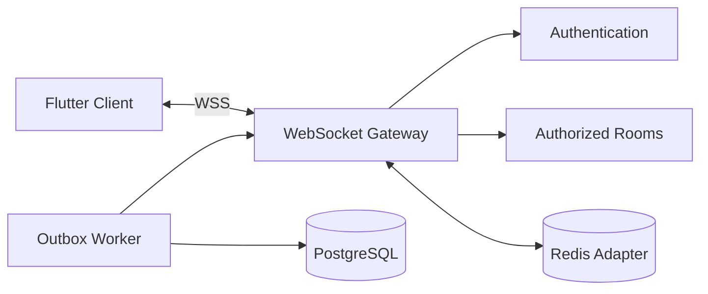

# AntreIn — Real-Time Queue Design

> **Document:** `docs/backend/realtime-queue.md`  
> **Status:** Draft v1.0  
> **Product:** AntreIn  
> **Backend Framework:** NestJS  
> **Database:** PostgreSQL  
> **Real-Time Transport:** Socket.IO-compatible WebSocket  
> **Document Language:** English  
> **Last Updated:** 2026-07-21

---

## 1. Document Purpose

This document defines the backend design for AntreIn real-time queue management.

It translates the product brief, architecture, API contract, backend brief, database design, authentication design, and booking-payment design into concrete queue behavior and implementation rules.

This document covers:

- Queue creation.
- Scheduled and walk-in queue entries.
- Queue-number generation.
- Queue ordering.
- Check-in.
- Call, recall, skip, return-to-waiting, service start, completion, cancellation, and no-show.
- Booking and queue status synchronization.
- Real-time event delivery.
- WebSocket authentication and subscription.
- Redis fan-out.
- Notification delivery.
- Optimistic concurrency.
- Transactional outbox.
- Recovery after disconnect.
- Failure handling.
- Testing and observability.

This document must be read together with:

- `docs/00-product-brief.md`
- `docs/01-system-architecture.md`
- `docs/02-api-contract.md`
- `docs/backend/backend-brief.md`
- `docs/backend/database-design.md`
- `docs/backend/authentication.md`
- `docs/backend/booking-payment.md`

---

## 2. Queue Goals

The queue system must:

1. Generate unique queue numbers safely.
2. Support scheduled and walk-in customers.
3. Keep queue state durable in PostgreSQL.
4. Deliver low-latency updates to Flutter.
5. Recover from missed WebSocket events through REST.
6. Prevent duplicate check-in and duplicate queue entry.
7. Prevent conflicting staff actions.
8. Keep booking and queue state synchronized.
9. Preserve audit and status history.
10. Protect customer privacy.
11. Support staff operations on shared devices.
12. Continue safely when Redis or push notifications fail.
13. Remain simple enough for a modular-monolith MVP.
14. Support future horizontal scaling.

---

## 3. Non-Goals

The MVP does not include:

- Voice announcements.
- Digital signage integration.
- Hardware kiosk integration.
- Bluetooth beacon check-in.
- Geofenced check-in enforcement.
- Multi-branch cross-outlet queues.
- Complex service-priority rules.
- Emergency priority categories.
- AI waiting-time prediction.
- Queue auction or paid priority.
- Offline queue mutation.
- Cross-business queue aggregation.
- Exactly-once WebSocket delivery.
- Event-sourcing-based queue reconstruction.

---

## 4. Queue Principles

### 4.1 PostgreSQL Is the Queue Source of Truth

Durable queue state lives in PostgreSQL.

Redis and WebSocket are delivery and coordination mechanisms only.

### 4.2 Queue Mutations Are Transactional

Every queue action that changes business state must:

```text
Validate
→ Lock relevant rows
→ Apply queue transition
→ Apply booking transition
→ Append history
→ Insert outbox event
→ Commit
```

### 4.3 WebSocket Events Are Hints, Not Final Truth

Clients use events for responsiveness.

REST remains authoritative after:

- Reconnect.
- Version conflict.
- Missing event.
- Background resume.
- Event deserialization failure.

### 4.4 Versioned Commands Prevent Stale Staff Actions

Staff commands include an expected version.

The backend rejects stale mutations with:

```text
QUEUE_VERSION_CONFLICT
```

### 4.5 Privacy Is Role-Specific

Customer queue views must not expose other customers.

Staff views may expose operational identification only.

### 4.6 Persist Before Publish

No queue event or push notification is published before durable commit.

---

## 5. Domain Boundaries

### Queue Module Owns

- Queue entries.
- Queue counters.
- Queue status.
- Queue order.
- Queue version.
- Queue actions.
- Queue snapshots.
- Queue history.
- Queue reorder audit.
- Real-time event creation.

### Booking Module Owns

- Booking identity.
- Booking status.
- Booking ownership.
- Check-in eligibility.
- Service lifecycle.

### Schedule Module Owns

- Check-in window calculation support.
- Business date derivation.
- Outlet timezone.

### Notification Module Owns

- Push delivery.
- In-app notification history.
- Delivery retries.

### Realtime Infrastructure Owns

- WebSocket transport.
- Connection authentication.
- Room subscription.
- Redis adapter.
- Event publication.

---

## 6. Queue Scope

A queue is scoped by:

```text
outlet_id + business_date
```

A queue entry belongs to:

- One booking.
- One outlet.
- One business date.
- One queue number.
- Optional assigned staff.

The business date is calculated in the outlet timezone.

---

## 7. Queue Entry Sources

### 7.1 Scheduled Booking

A confirmed scheduled booking enters the queue after successful check-in.

### 7.2 Walk-In Booking

Authorized staff creates a walk-in booking and queue entry in one transaction.

### 7.3 Future Sources

Possible later sources:

- Kiosk.
- QR walk-in.
- Reception web dashboard.
- Partner integration.

All future sources must use the same queue application service.

---

## 8. Queue Status Model

Statuses:

```text
waiting
called
skipped
in_service
completed
cancelled
no_show
```

### 8.1 Terminal States

```text
completed
cancelled
no_show
```

### 8.2 Allowed Transitions

```text
waiting → called
called → skipped
called → in_service
called → no_show
skipped → waiting
waiting → cancelled
called → cancelled
in_service → completed
```

Potential administrative correction transitions require audit and are outside normal flow.

---

## 9. Booking and Queue Status Mapping

Recommended synchronization:

| Queue Status | Booking Status |
|---|---|
| `waiting` | `waiting` |
| `called` | `called` |
| `skipped` | `waiting` or explicit skipped metadata |
| `in_service` | `in_service` |
| `completed` | `completed` |
| `cancelled` | `cancelled` |
| `no_show` | `no_show` |

`skipped` remains a queue-only state in the preferred model.

The booking remains `waiting` while the queue entry is `skipped`.

This avoids adding unnecessary booking states.

---

## 10. Check-In Eligibility

A booking may check in when:

- Booking exists.
- Booking status is `confirmed`.
- Booking belongs to the authenticated customer or authorized business staff.
- Current time is within check-in window.
- Outlet queue is open.
- Booking has no queue entry.
- Booking is not cancelled, expired, completed, or no-show.
- Staff assignment remains valid or can be resolved.

Check-in window is derived from booking policy snapshot or business policy.

Example:

```text
Allowed from 30 minutes before
until 15 minutes after
scheduled time
```

---

## 11. Check-In Methods

Supported methods:

```text
customer_app
staff_assisted
qr
```

MVP implementation:

```text
customer_app
staff_assisted
```

QR may be reserved for a later milestone.

The method is recorded in queue history metadata.

---

## 12. Check-In Flow

```mermaid
sequenceDiagram
    participant Actor as Customer or Staff
    participant API as Queue API
    participant DB as PostgreSQL
    participant Worker as Outbox Worker

    Actor->>API: Check in booking + Idempotency-Key
    API->>DB: Begin transaction
    API->>DB: Lock booking
    API->>DB: Validate eligibility
    API->>DB: Generate queue number atomically
    API->>DB: Create queue entry
    API->>DB: Update booking status
    API->>DB: Insert history
    API->>DB: Insert outbox events
    API->>DB: Commit
    API-->>Actor: Queue state

    Worker->>DB: Read outbox
    Worker-->>Worker: Publish real-time and push
```

---

## 13. Check-In Idempotency

Scope:

```text
booking_id + check_in + idempotency_key
```

Behavior:

- Same key and same request returns the existing queue entry.
- Same key and different request conflicts.
- A second check-in with a different key still returns `QUEUE_ENTRY_ALREADY_EXISTS` or the existing result according to endpoint policy.
- Concurrent check-in creates one queue entry.

Database protection:

```text
UNIQUE(booking_id)
```

---

## 14. Queue Number Generation

Queue numbers are unique per:

```text
outlet_id + business_date
```

Counter table:

```text
queue_counters
```

Atomic operation:

```sql
insert into queue_counters(outlet_id, business_date, last_number)
values ($1, $2, 1)
on conflict (outlet_id, business_date)
do update set
    last_number = queue_counters.last_number + 1,
    version = queue_counters.version + 1,
    updated_at = now()
returning last_number;
```

The returned number is used to create the queue entry.

Required unique constraint:

```text
UNIQUE(outlet_id, business_date, queue_number)
```

---

## 15. Queue Display Number

Human-readable format:

```text
A012
```

Components:

- Outlet queue prefix.
- Zero-padded queue number.

Display number is not the primary key.

Example:

```text
prefix = A
queue_number = 12
display_number = A012
```

Formatting occurs on the backend and is snapshotted on the queue entry.

---

## 16. Queue Ordering

Default queue order:

1. Explicit position.
2. Check-in time.
3. Queue number.
4. Queue-entry ID as deterministic tie-breaker.

Recommended MVP field:

```text
sort_order integer
```

Initial assignment:

```text
sort_order = queue_number
```

Reorder updates the affected waiting entries transactionally.

This is simpler than fractional ordering for small barbershop queues.

---

## 17. Scheduled vs Walk-In Priority

Default MVP policy:

- Queue order is determined by check-in and explicit staff-approved order.
- A scheduled booking does not enter the active queue before check-in.
- Scheduled customers arriving within their window may be placed according to business policy.
- Walk-ins use check-in creation time.

Recommended simple policy:

```text
All checked-in entries join the end of the active waiting queue.
Authorized staff may reorder with a required reason.
```

This avoids hidden priority rules.

---

## 18. Queue Snapshot

A queue snapshot represents current outlet state.

Staff snapshot includes:

- Business date.
- Outlet.
- Current in-service entry.
- Called entry.
- Waiting entries.
- Skipped entries.
- Counts.
- Queue version.
- Updated timestamp.

Customer snapshot includes only:

- Own queue entry.
- People ahead.
- Current public display number.
- Estimated waiting time.
- Queue status.

---

## 19. Queue Version

Two version levels may exist:

### Entry Version

Used for:

- Call.
- Skip.
- Start service.
- Complete.
- No-show.

### Queue Aggregate Version

Used for:

- Reorder.
- Full outlet snapshot consistency.
- Real-time snapshot ordering.

Recommended storage:

- `queue_entries.version`
- `queue_counters.version` or a separate `outlet_queue_versions` table.

For MVP, queue aggregate version may be stored in `queue_counters.version`.

---

## 20. Optimistic Concurrency

Staff command request:

```json
{
  "expectedVersion": 5
}
```

Update:

```sql
update queue_entries
set status = $new_status,
    version = version + 1,
    updated_at = now()
where id = $id
  and version = $expected_version;
```

Zero rows updated:

```text
QUEUE_VERSION_CONFLICT
```

Flutter then refetches the queue snapshot.

---

## 21. Call Next Entry

Preferred endpoint may support calling a specific entry.

Flow:

```text
Authorize staff
→ Lock queue entry
→ Validate waiting status
→ Validate expected version
→ Optionally validate no conflicting called entry
→ Set queue status called
→ Set booking status called
→ Set called_at
→ Append history
→ Insert outbox
→ Commit
```

Business policy may allow only one called entry per outlet at a time.

If enforced, use a transaction-safe query or partial unique strategy.

---

## 22. One Called Entry Policy

Recommended MVP:

```text
One currently called entry per outlet and business date
```

Benefits:

- Clear customer experience.
- Simpler staff operation.

Possible database approach:

- Partial unique index on outlet/date for `status = 'called'`.

Example:

```sql
create unique index queue_entries_one_called_uq
on queue_entries(outlet_id, business_date)
where status = 'called';
```

Prisma migration may require raw SQL.

If multiple barbers call independently, scope may instead be:

```text
one called entry per staff member
```

The final choice is an open decision.

---

## 23. Recall Entry

Recall keeps status `called`.

It updates:

- `last_recalled_at`.
- `recall_count`.
- Version.
- History metadata.
- Notification outbox.

Recall is idempotent only with an idempotency key.

Multiple recalls may legitimately create multiple notification events.

---

## 24. Skip Entry

Flow:

```text
Lock called entry
→ Validate expected version
→ Set status skipped
→ Keep booking status waiting
→ Record reason
→ Increment version
→ Insert history
→ Insert outbox
→ Commit
```

Skipped entry no longer blocks the current called slot.

---

## 25. Return Skipped Entry to Waiting

Flow:

```text
Lock skipped entry
→ Validate expected version
→ Set status waiting
→ Assign new sort order or preserve policy
→ Increment version
→ Insert history
→ Insert outbox
→ Commit
```

Recommended policy:

```text
Return to end of waiting queue
```

Alternative:

```text
Restore previous position
```

The final policy must be documented.

---

## 26. Start Service

Preconditions:

- Queue entry status is `called`.
- Booking status is `called`.
- Staff is active.
- Staff belongs to business.
- Staff is assigned to outlet.
- Staff is eligible for service.
- Staff is not currently serving another entry if that restriction is enabled.
- Expected version matches.

Transaction:

```text
Lock queue entry
→ Lock booking
→ Validate staff
→ Set queue in_service
→ Set booking in_service
→ Set service_started_at
→ Update assigned staff if needed
→ Append histories
→ Insert outbox
→ Commit
```

---

## 27. Staff Active Service Constraint

Recommended MVP:

```text
One in-service queue entry per staff member
```

Possible partial unique index:

```sql
create unique index queue_entries_one_in_service_per_staff_uq
on queue_entries(staff_id)
where status = 'in_service' and staff_id is not null;
```

This is only valid if each staff serves one customer at a time.

---

## 28. Complete Service

Preconditions:

- Queue entry is `in_service`.
- Booking is `in_service`.
- Expected version matches.
- Actor has permission.

Transaction:

```text
Lock queue entry
→ Lock booking
→ Update queue completed
→ Update booking completed
→ Set completed timestamps
→ Release booking reservation if still present
→ Append histories
→ Insert outbox
→ Commit
```

Payment policy may allow completion with remaining pay-at-location balance.

---

## 29. No-Show

Possible no-show sources:

- Confirmed booking never checks in.
- Called customer does not respond.
- Skipped customer never returns.

No-show flow:

```text
Lock booking and queue entry if present
→ Validate eligible status
→ Set queue no_show when present
→ Set booking no_show
→ Release reservation
→ Evaluate payment/refund policy
→ Append history and audit
→ Insert outbox
→ Commit
```

Payment effects are coordinated with booking-payment logic.

---

## 30. Queue Cancellation

Cancellation may occur when:

- Customer cancellation occurs after check-in but before service, if policy allows.
- Staff cancels an operational entry.
- Business closes unexpectedly.

Flow:

```text
Lock booking and queue
→ Validate cancellation permission
→ Set queue cancelled
→ Set booking cancelled
→ Release reservation
→ Trigger refund logic when required
→ Append history and audit
→ Insert outbox
→ Commit
```

---

## 31. Walk-In Creation

Walk-in creation combines booking and queue creation.

Transaction:

```text
Authorize staff
→ Validate business, outlet, service, and payment option
→ Resolve staff if required
→ Generate walk-in booking
→ Create booking snapshot
→ Create pending pay-at-location payment
→ Generate queue number
→ Create waiting queue entry
→ Append histories
→ Insert outbox
→ Commit
```

No external provider call is required for MVP walk-ins.

---

## 32. Walk-In Customer Identity

Walk-in may have:

- Existing user ID.
- Name.
- Phone number.
- Anonymous operational identity.

Recommended MVP fields on booking:

```text
customer_user_id nullable
walk_in_customer_name nullable
walk_in_phone_number nullable
```

Customer contact should be minimized and protected.

---

## 33. Reorder Queue

Reorder applies only to active entries:

```text
waiting
skipped
```

Request includes:

- Business date.
- Expected queue version.
- Ordered queue-entry IDs.
- Reason.

Transaction:

```text
Lock queue aggregate/version
→ Validate expected version
→ Validate all IDs belong to outlet/date
→ Validate all entries are reorderable
→ Save previous order
→ Update sort_order
→ Increment queue version
→ Insert queue_reorders audit
→ Insert outbox
→ Commit
```

---

## 34. Reorder Authorization

Recommended permission:

```text
queue.reorder
```

Default assignment:

- Owner.
- Manager.
- Front desk when explicitly granted.

Barbers should not reorder by default unless product policy requires it.

---

## 35. People Ahead Calculation

Customer `peopleAhead` includes queue entries before the customer that are:

```text
waiting
called
in_service
```

Skipped entries may be excluded until returned to waiting.

Calculation must follow current sort order and service policy.

---

## 36. Estimated Waiting Time

MVP formula:

```text
Estimated wait =
remaining time of current service
+ sum(estimated durations of entries ahead)
```

Simpler fallback:

```text
people ahead × average service duration
```

Inputs may include:

- Booking snapshot duration.
- Service start timestamp.
- Staff assignment.
- Parallel staff capacity.

For one shared queue with multiple staff, estimation is complex.

Recommended MVP:

- Estimate per assigned staff when staff is known.
- Otherwise use a simple outlet average and label as an estimate.

---

## 37. Estimate Accuracy

Estimated wait is informational.

API should return:

```text
estimatedWaitMinutes
estimateQuality
```

Possible quality values:

```text
low
medium
high
```

MVP may omit quality until implemented.

Do not guarantee exact time.

---

## 38. REST Queue Endpoints

Customer:

```text
POST /bookings/{bookingId}/check-in
GET  /bookings/{bookingId}/queue
```

Business:

```text
GET  /businesses/{businessId}/outlets/{outletId}/queue
POST /businesses/{businessId}/walk-ins
POST /businesses/{businessId}/queue/{queueEntryId}/call
POST /businesses/{businessId}/queue/{queueEntryId}/recall
POST /businesses/{businessId}/queue/{queueEntryId}/skip
POST /businesses/{businessId}/queue/{queueEntryId}/return-to-waiting
POST /businesses/{businessId}/queue/{queueEntryId}/start-service
POST /businesses/{businessId}/queue/{queueEntryId}/complete
POST /businesses/{businessId}/queue/{queueEntryId}/no-show
POST /businesses/{businessId}/outlets/{outletId}/queue/reorder
```

---

## 39. WebSocket Architecture



---

## 40. WebSocket Authentication

Connection uses a valid access token.

Handshake payload:

```json
{
  "auth": {
    "accessToken": "access-token"
  }
}
```

Validation:

- Signature.
- Expiration.
- Issuer.
- Audience.
- User state.
- Session context where required.

Expired tokens cause rejection or disconnect.

---

## 41. Automatic Rooms

Every authenticated connection joins:

```text
user:{userId}
```

Business user may also join after authorization:

```text
business:{businessId}
outlet:{outletId}
queue:{outletId}:{businessDate}
```

Customer may join:

```text
booking:{bookingId}
queue-entry:{queueEntryId}
```

Room names are server-generated.

Client requests semantic subscriptions, not arbitrary room names.

---

## 42. Subscription Command

Client event:

```text
subscription.join.v1
```

Input:

```json
{
  "requestId": "ws_req_01J...",
  "channels": [
    {
      "type": "booking",
      "resourceId": "bkg_01J..."
    },
    {
      "type": "outlet_queue",
      "resourceId": "out_01J...",
      "businessDate": "2026-07-22"
    }
  ]
}
```

Server authorizes every requested subscription.

---

## 43. Event Envelope

```json
{
  "eventId": "evt_01J...",
  "type": "queue.entry.updated.v1",
  "occurredAt": "2026-07-22T09:55:00+07:00",
  "resource": {
    "type": "queue_entry",
    "id": "que_01J..."
  },
  "version": 5,
  "data": {}
}
```

---

## 44. Queue Events

Recommended:

```text
queue.entry.created.v1
queue.entry.updated.v1
queue.snapshot.updated.v1
queue.reordered.v1
queue.customer.called.v1
service.started.v1
service.completed.v1
```

The API contract may expose a smaller stable subset.

Internal event names and external event names may differ.

---

## 45. Customer Queue Event

Payload:

```json
{
  "eventId": "evt_01J...",
  "type": "queue.entry.updated.v1",
  "occurredAt": "2026-07-22T09:55:00+07:00",
  "resource": {
    "type": "queue_entry",
    "id": "que_01J..."
  },
  "version": 5,
  "data": {
    "bookingId": "bkg_01J...",
    "displayNumber": "A012",
    "status": "called",
    "peopleAhead": 0,
    "currentServingNumber": "A012",
    "estimatedWaitMinutes": 0,
    "calledAt": "2026-07-22T09:55:00+07:00"
  }
}
```

No other customer identity is included.

---

## 46. Staff Queue Snapshot Event

Payload should remain compact:

```json
{
  "eventId": "evt_01J...",
  "type": "queue.snapshot.updated.v1",
  "occurredAt": "2026-07-22T09:55:00+07:00",
  "resource": {
    "type": "outlet_queue",
    "id": "out_01J...:2026-07-22"
  },
  "version": 19,
  "data": {
    "outletId": "out_01J...",
    "businessDate": "2026-07-22",
    "currentServingDisplayNumber": "A012",
    "waitingCount": 4,
    "skippedCount": 1
  }
}
```

Flutter fetches full REST snapshot after relevant changes.

---

## 47. Delivery Semantics

MVP:

```text
At least once where retry is used
```

Therefore:

- Event IDs may repeat.
- Clients deduplicate where practical.
- Resource versions prevent stale updates.
- Missed events are recovered by REST.
- Exactly-once delivery is not promised.

---

## 48. Event Ordering

Event ordering is reliable only within practical limits.

Clients should:

- Compare resource version.
- Ignore older versions.
- Refetch when version jumps unexpectedly.
- Avoid applying status regression.

Example:

```text
Local version: 5
Incoming version: 4
→ Ignore

Local version: 5
Incoming version: 8
→ Refetch REST
```

---

## 49. Transactional Outbox

Queue mutation transaction inserts an outbox event.

Example:

```text
queue.entry.updated.v1
```

Worker:

```text
Claim outbox
→ Resolve customer and business audiences
→ Publish WebSocket
→ Create notification when required
→ Mark processed
```

If publication fails:

- Retry.
- Do not roll back queue mutation.

---

## 50. Redis Adapter

Redis enables WebSocket fan-out across API instances.

Uses:

- Socket.IO adapter.
- Ephemeral presence.
- Optional rate limiting.

Redis does not store authoritative queue state.

If Redis fails:

- REST remains available.
- Single-instance local WebSocket may remain available.
- Multi-instance fan-out degrades.
- Clients recover through REST.
- Alerts should fire.

---

## 51. Presence

Presence data may indicate:

- Connected user.
- Active business dashboard.
- Active queue subscriber.

Presence is ephemeral and optional.

Do not use presence to determine:

- Booking status.
- Whether customer was called.
- Whether notification was received.
- Whether service can start.

---

## 52. Push Notifications

Push events:

- Check-in successful.
- Queue nearly reached.
- Customer called.
- Booking no-show.
- Service completed.

Push is complementary.

Customer queue state remains available through REST and WebSocket.

---

## 53. Near-Turn Notification

Possible rule:

```text
Notify when peopleAhead <= 2
```

Requirements:

- Send once per threshold event.
- Avoid repeated notifications on reorder.
- Track notification intent or derived state.
- Make threshold configurable later.

MVP may notify only:

- Check-in.
- Called.

Near-turn notification can be a later enhancement.

---

## 54. Customer Called Notification

When queue transitions to `called`:

```text
Commit queue and booking update
→ Insert outbox
→ Publish WebSocket
→ Create push notification
```

Recall may create another push notification.

Rate limit repeated recalls to avoid abuse.

---

## 55. Reconnect Flow

Flutter reconnect sequence:

```text
WebSocket disconnects
→ Backoff
→ Obtain valid access token
→ Reconnect
→ Join subscriptions
→ Fetch latest REST state
→ Replace local queue snapshot
```

No event replay is required in MVP.

---

## 56. App Background and Resume

When application backgrounds:

- WebSocket may disconnect.
- Push notification remains available.
- Local queue state becomes potentially stale.

On resume:

```text
Validate session
→ Reconnect WebSocket
→ Fetch active booking
→ Fetch current queue state
```

---

## 57. Shared Staff Device

A shared business device may be used by staff.

Security requirements:

- User session is still personal.
- Role and permission are validated.
- Sensitive customer data is minimized.
- Logout clears local business data.
- Device ID is not identity.
- Audit records identify the authenticated actor.

Future quick staff switching requires a separate security design.

---

## 58. Error Codes

```text
QUEUE_ENTRY_NOT_FOUND
QUEUE_ENTRY_ALREADY_EXISTS
QUEUE_ENTRY_NOT_WAITING
QUEUE_ENTRY_NOT_CALLED
QUEUE_ENTRY_ALREADY_COMPLETED
QUEUE_VERSION_CONFLICT
QUEUE_REORDER_INVALID_ENTRIES
QUEUE_REORDER_REASON_REQUIRED
OUTLET_QUEUE_CLOSED
FORBIDDEN_QUEUE_RESOURCE
FORBIDDEN_QUEUE_REORDER
BOOKING_CHECK_IN_TOO_EARLY
BOOKING_CHECK_IN_TOO_LATE
BOOKING_NOT_CONFIRMED
```

---

## 59. HTTP Mapping

| Condition | HTTP |
|---|---:|
| Queue entry not found | 404 |
| Queue version conflict | 409 |
| Duplicate queue entry | 409 |
| Invalid transition | 409 |
| Check-in window invalid | 422 |
| Queue closed | 422 |
| Forbidden queue | 403 |
| Invalid reorder payload | 422 |

---

## 60. Logging

Structured fields:

```text
requestId
userId
businessId
outletId
bookingId
queueEntryId
businessDate
queueNumber
action
fromStatus
toStatus
expectedVersion
actualVersion
durationMs
result
errorCode
```

Do not log:

- Full customer contact.
- Access token.
- Push token.
- Private notes.
- WebSocket auth payload.

---

## 61. Metrics

Recommended:

```text
queue_check_in_total
queue_check_in_conflict_total
queue_entry_created_total
queue_call_total
queue_recall_total
queue_skip_total
queue_start_service_total
queue_complete_total
queue_no_show_total
queue_reorder_total
queue_version_conflict_total
queue_websocket_connections
queue_event_publish_failure_total
queue_snapshot_fetch_duration
queue_estimated_wait_error
```

Avoid high-cardinality resource IDs as labels.

---

## 62. Alerts

Potential alerts:

- Queue-number uniqueness violation.
- Queue counter update failure.
- High queue-version conflict rate.
- Outbox queue-event backlog.
- WebSocket publication failures.
- Queue entry and booking status mismatch.
- Multiple in-service entries for one staff.
- Orphan queue entry.
- Active queue entry for terminal booking.

---

## 63. Consistency Checks

Scheduled consistency job verifies:

```text
One queue entry per booking
Queue business/outlet matches booking
Queue status maps to booking status
Completed queue has completed booking
Active queue belongs to non-terminal booking
Queue number unique
Called-entry policy valid
In-service staff policy valid
```

Repairs require audited application logic.

---

## 64. Unit Tests

Required:

- Queue transition policy.
- Booking-to-queue status mapping.
- Check-in window calculation.
- Display-number formatting.
- People-ahead calculation.
- Waiting-time estimate.
- Reorder validation.
- Recall policy.
- No-show eligibility.
- Event mapping.

---

## 65. Integration Tests

Required:

- Check-in creates booking and queue state atomically.
- Duplicate check-in creates one entry.
- Queue number increments atomically.
- Unique queue number constraint works.
- Call updates queue and booking.
- Skip keeps booking waiting.
- Start service updates both states.
- Complete service releases reservation.
- Reorder updates all entries atomically.
- Outbox event commits with mutation.
- One-called-entry constraint works if enabled.
- One-in-service-per-staff constraint works if enabled.

Use PostgreSQL.

---

## 66. Concurrency Tests

### Queue Number Generation

```text
100 concurrent check-ins
→ 100 unique queue numbers
→ No gaps are required only if transaction policy guarantees it
```

Gaps are acceptable after rolled-back allocation unless product requires strict no-gap numbering.

### Duplicate Check-In

```text
Two concurrent requests
→ One queue entry
```

### Call Conflict

```text
Two staff call same entry at same version
→ One succeeds
→ One receives QUEUE_VERSION_CONFLICT
```

### Reorder Conflict

```text
Two reorder commands use same aggregate version
→ One succeeds
→ One conflicts
```

### Start Service Conflict

```text
Two staff start same entry
→ One succeeds
```

---

## 67. WebSocket Tests

Required:

- Valid token connects.
- Invalid token rejects.
- Expired token rejects.
- Unauthorized room subscription rejects.
- Authorized customer receives own event.
- Customer does not receive another customer’s private event.
- Staff receives outlet snapshot event.
- Duplicate event handling is safe.
- Reconnect and refetch recover state.
- Redis fan-out works in multi-instance integration test when enabled.

---

## 68. Failure Tests

Recommended:

- Redis unavailable.
- Worker unavailable.
- WebSocket publish failure.
- Push provider failure.
- Database deadlock.
- Outbox duplicate processing.
- API restart during staff command.
- Event received out of order.
- Client misses several events.
- Staff device resumes from stale snapshot.

---

## 69. End-to-End Customer Flow

```text
Customer has confirmed booking
→ Opens booking detail
→ Checks in
→ Receives queue number
→ Watches people ahead decrease
→ Receives called event
→ Service starts
→ Service completes
```

Assertions:

- No other customer identity exposed.
- Status remains recoverable after reconnect.
- Push and WebSocket are consistent with REST.

---

## 70. End-to-End Staff Flow

```text
Staff logs in
→ Opens outlet queue
→ Creates walk-in
→ Calls next entry
→ Recalls
→ Starts service
→ Completes service
→ Calls next
```

Assertions:

- Version checks work.
- Queue order updates.
- Booking status remains synchronized.
- Audit and history exist.

---

## 71. API Contract Tests

Verify:

- Customer queue representation.
- Staff queue snapshot.
- Check-in response.
- Command request versions.
- Stable error codes.
- WebSocket envelope.
- Event versions.
- Privacy filtering.
- Date and time formats.

---

## 72. Implementation Structure

Recommended:

```text
modules/queues/
├── domain/
│   ├── queue-entry.entity.ts
│   ├── queue-status.policy.ts
│   ├── queue-ordering.service.ts
│   ├── waiting-time.service.ts
│   ├── queue.errors.ts
│   └── queue.events.ts
│
├── application/
│   ├── check-in-booking.use-case.ts
│   ├── create-walk-in.use-case.ts
│   ├── call-queue-entry.use-case.ts
│   ├── recall-queue-entry.use-case.ts
│   ├── skip-queue-entry.use-case.ts
│   ├── return-to-waiting.use-case.ts
│   ├── start-service.use-case.ts
│   ├── complete-service.use-case.ts
│   ├── mark-no-show.use-case.ts
│   ├── reorder-queue.use-case.ts
│   ├── get-customer-queue.query.ts
│   └── get-outlet-queue.query.ts
│
├── infrastructure/
│   ├── prisma-queue.repository.ts
│   ├── prisma-queue-counter.repository.ts
│   └── realtime-queue.publisher.ts
│
└── presentation/
    ├── queue.controller.ts
    └── queue.gateway.ts
```

---

## 73. Queue Repository Interface

```ts
interface QueueRepository {
  findEntryForUpdate(
    queueEntryId: string,
    db: DbClient,
  ): Promise<QueueEntry | null>;

  createEntry(
    input: CreateQueueEntryInput,
    db: DbClient,
  ): Promise<QueueEntry>;

  updateEntry(
    input: UpdateQueueEntryInput,
    db: DbClient,
  ): Promise<QueueEntry>;

  getCustomerQueue(
    bookingId: string,
    customerUserId: string,
  ): Promise<CustomerQueueView | null>;

  getOutletSnapshot(
    input: GetOutletQueueInput,
  ): Promise<OutletQueueSnapshot>;
}
```

---

## 74. Queue Counter Repository

```ts
interface QueueCounterRepository {
  nextNumber(
    outletId: string,
    businessDate: LocalDate,
    db: DbClient,
  ): Promise<number>;

  incrementVersion(
    outletId: string,
    businessDate: LocalDate,
    db: DbClient,
  ): Promise<number>;
}
```

---

## 75. Realtime Publisher Port

```ts
interface RealtimePublisherPort {
  publishToUser(
    userId: string,
    event: RealtimeEvent,
  ): Promise<void>;

  publishToOutletQueue(
    outletId: string,
    businessDate: string,
    event: RealtimeEvent,
  ): Promise<void>;
}
```

The application writes outbox events instead of calling this port directly inside mutations.

---

## 76. Queue Milestones

### Q0 — Domain Foundation

- Status model.
- Transition policy.
- Queue errors.
- Booking mapping.
- Deterministic clock.

### Q1 — Check-In and Counter

- Check-in validation.
- Atomic counter.
- Queue entry.
- Booking update.
- Concurrency tests.

### Q2 — Staff Queue Operations

- Queue snapshot.
- Call.
- Recall.
- Skip.
- Return to waiting.
- Version checks.

### Q3 — Service Lifecycle

- Start service.
- Complete service.
- No-show.
- Reservation release.
- Payment coordination.

### Q4 — Walk-In and Reorder

- Walk-in creation.
- Queue reorder.
- Audit.
- Permission model.

### Q5 — Real-Time

- WebSocket authentication.
- Subscription.
- Outbox events.
- Customer and staff events.
- Reconnect recovery.

### Q6 — Push and Hardening

- Push mapping.
- Failure recovery.
- Metrics.
- Alerts.
- Consistency jobs.
- Multi-instance Redis test.

---

## 77. Open Decisions

> **Resolution status (2026-07-22):** all items resolved — called scope (per outlet),
> in-service-per-staff (enforced), skip-return (end of queue), priority (check-in order),
> wait estimate (peopleAhead × outlet average), near-turn (deferred), snapshot PII
> (no phone), prefix/gaps/daily-reset/aggregate-version/backoff/dedup defaults — ADR 0041 ·
> reorder 0019 · self-check-in 0014 · window 0034 · namespace 0030 · Redis 0035 ·
> expectedVersion 0028. List retained for history.

- One called entry per outlet or per staff.
- One in-service entry per staff enforcement.
- End-of-queue versus previous-position behavior for skipped entries.
- Exact scheduled versus walk-in priority.
- Queue reorder included in first MVP or later.
- Customer self-check-in enabled in first demo.
- Check-in early/late window.
- Queue prefix format.
- Whether queue number resets daily.
- Whether gaps in queue numbers are acceptable.
- Waiting-time algorithm.
- Whether queue aggregate version uses `queue_counters`.
- Whether near-turn notifications are included.
- Whether staff sees customer phone number in queue snapshot.
- WebSocket namespace strategy.
- Redis mandatory in staging.
- Reconnect backoff configuration.
- Event deduplication retention on Flutter.

---

## 78. Completion Checklist

- [ ] Queue state is durable in PostgreSQL.
- [ ] Check-in is idempotent.
- [ ] One booking creates one queue entry.
- [ ] Queue numbers are atomically generated.
- [ ] Queue numbers are unique per outlet and business date.
- [ ] Booking and queue states update transactionally.
- [ ] Staff commands use expected versions.
- [ ] Reorder is transactional and audited.
- [ ] Customer payloads protect privacy.
- [ ] Staff access validates business and outlet scope.
- [ ] Queue mutations create outbox events.
- [ ] WebSocket authentication is implemented.
- [ ] Room subscriptions are authorized.
- [ ] Events are versioned.
- [ ] Clients can recover through REST.
- [ ] Redis is not the source of truth.
- [ ] Push failure does not fail queue mutation.
- [ ] Unit, integration, concurrency, WebSocket, E2E, and failure tests pass.
- [ ] Metrics and consistency checks exist.

---

## 79. Final Real-Time Queue Statement

AntreIn uses PostgreSQL for durable queue state and WebSocket for low-latency delivery.

The check-in flow is:

```text
Validate Booking
→ Generate Queue Number Atomically
→ Create Queue Entry
→ Update Booking
→ Commit
→ Publish Event
```

The staff-operation flow is:

```text
Read Current Version
→ Submit Command
→ Lock Queue Entry
→ Validate Transition
→ Update Queue and Booking
→ Commit
→ Publish Event
```

The client-recovery flow is:

```text
WebSocket Event
→ Apply Newer Version

Disconnect or Version Gap
→ Reconnect
→ Fetch REST Snapshot
→ Replace Local State
```

The critical guarantees are:

```text
One queue entry per booking
Unique queue number per outlet and business date
No stale staff command silently overwrites newer state
No real-time event before durable commit
No private customer data in public queue payloads
No dependency on Redis or push for queue correctness
```

The design prioritizes correctness, real-time responsiveness, privacy, and recoverability while remaining practical for the AntreIn MVP.
